# KMS 2.6 Technical Implementation Guide

**Document Type**: Technical Implementation & Sequence Diagrams
**Version**: KMS 2.6
**Last Updated**: November 12, 2025
**Status**: Complete Implementation Reference

---

## Table of Contents

1. [Overview](#overview)
2. [Complete Pipeline Sequence Diagram](#complete-pipeline-sequence-diagram)
3. [Detailed Component Diagrams](#detailed-component-diagrams)
   - [JSON Ingestion Flow](#1-json-ingestion-flow)
   - [PII Removal Pipeline](#2-pii-removal-pipeline-6-stages)
   - [Embedding Generation](#3-embedding-generation-flow)
   - [Weaviate Loading](#4-weaviate-loading-flow)
   - [Hybrid Search Query](#5-hybrid-search-query-flow)
   - [Reconciliation & Data Integrity](#6-reconciliation--data-integrity-flow)
4. [Component Architecture](#component-architecture)
5. [Data Flow Diagrams](#data-flow-diagrams)
6. [Error Handling & Retry Logic](#error-handling--retry-logic)
7. [Performance Metrics](#performance-metrics)

---

## Overview

KMS 2.6 is a vector-based semantic search system for HPE support cases. The system processes support cases from Salesforce through a 5-stage pipeline:

1. **Extract** - JSON ingestion from 6 SFDC tables
2. **PII Removal** - 6-stage context-aware PII detection and redaction
3. **ChatHPE Cleaning** - Metadata enrichment and text preparation
4. **Embeddings** - Single composite vector generation (3,072 dims)
5. **Load** - Weaviate vector database storage with hybrid search indexing

---

## Complete Pipeline Sequence Diagram

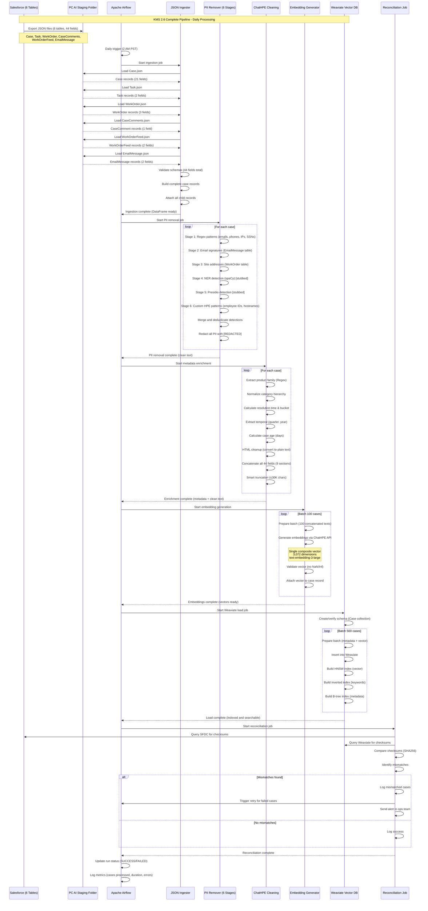

---

## Detailed Component Diagrams

### 1. JSON Ingestion Flow

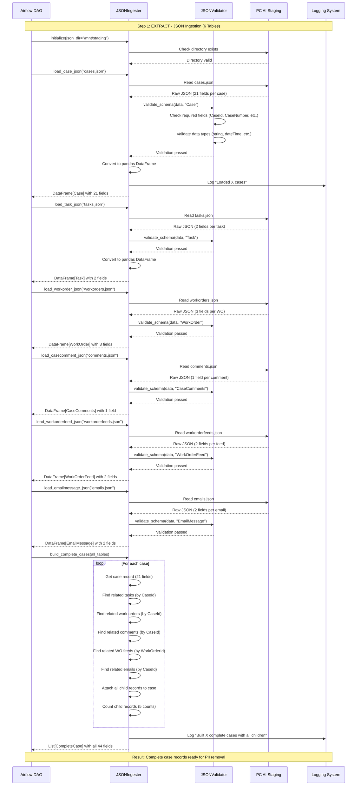

---

### 2. PII Removal Pipeline (6 Stages)

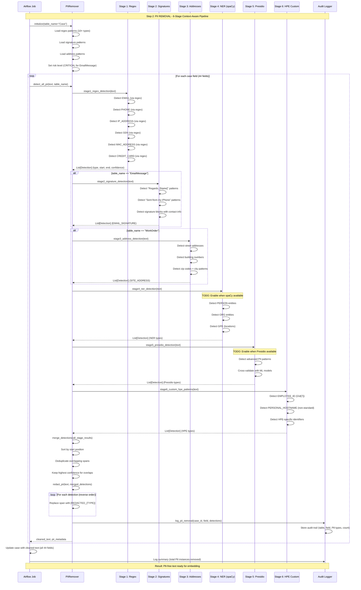

---

### 3. Embedding Generation Flow

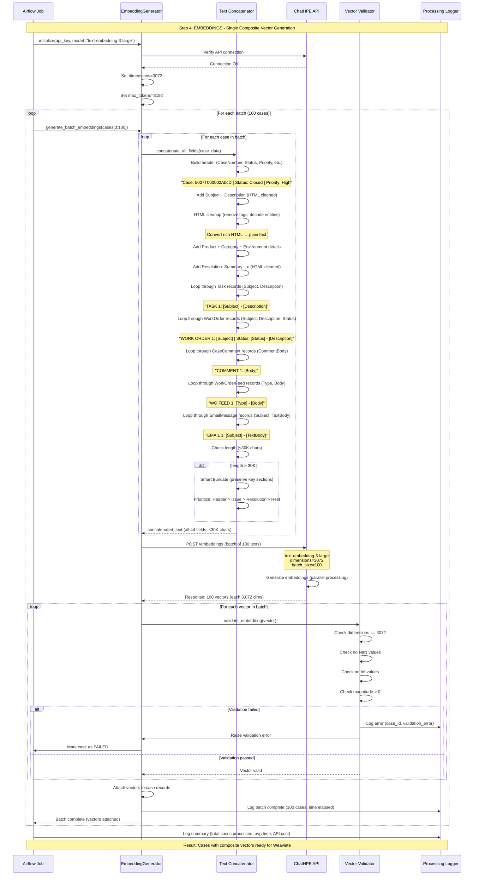

---

### 4. Weaviate Loading Flow

```mermaid
sequenceDiagram
    participant Client as Airflow Job
    participant Loader as WeaviateLoader
    participant Schema as Schema Manager
    participant Weaviate as Weaviate DB
    participant HNSW as HNSW Indexer
    participant Inverted as Inverted Index
    participant Logger as Load Logger

    Note over Client,Logger: Step 5: LOAD - Weaviate Vector Database Loading

    Client->>Loader: initialize(weaviate_url, api_key)
    Loader->>Weaviate: Connect to Weaviate
    Weaviate-->>Loader: Connection established

    %% Schema creation
    Client->>Loader: create_or_verify_schema()
    Loader->>Schema: build_case_schema()

    Schema->>Schema: Define properties (44+ fields)
    Note over Schema: caseId, caseNumber, status, priority,<br/>product, productFamily, compositeText, etc.

    Schema->>Schema: Define vector config
    Note over Schema: vectorizer: none (we provide vectors)<br/>dimensions: 3072<br/>distance: cosine

    Schema->>Schema: Define HNSW config
    Note over Schema: efConstruction: 256<br/>maxConnections: 64<br/>ef: 128

    Schema->>Schema: Define indexes (text, dateTime)
    Note over Schema: Index: caseNumber, status, priority,<br/>product, createdDate, etc.

    Schema-->>Loader: Case schema definition
    Loader->>Weaviate: GET /v1/schema (check if exists)

    alt Schema does not exist
        Loader->>Weaviate: POST /v1/schema (create schema)
        Weaviate->>Weaviate: Create Case collection
        Weaviate->>HNSW: Initialize HNSW index
        Weaviate->>Inverted: Initialize inverted index
        Weaviate-->>Loader: Schema created
    else Schema exists
        Loader->>Weaviate: Verify schema compatibility
        Weaviate-->>Loader: Schema compatible
    end

    %% Batch loading
    loop For each batch (500 cases)
        Client->>Loader: load_batch(cases[0:500])

        loop For each case in batch
            Loader->>Loader: Prepare Weaviate object

            %% Properties (metadata)
            Loader->>Loader: Extract caseId, caseNumber
            Loader->>Loader: Extract status, priority, product
            Loader->>Loader: Extract productFamily (enriched)
            Loader->>Loader: Extract categoryHierarchy (enriched)
            Loader->>Loader: Extract createdDate, closedDate
            Loader->>Loader: Extract resolutionTime, resolutionBucket (enriched)
            Loader->>Loader: Extract quarter, year (enriched)
            Loader->>Loader: Extract ageInDays (enriched)
            Loader->>Loader: Extract child counts (5 counts)
            Loader->>Loader: Add compositeText (all 44 fields concatenated)

            %% Vector
            Loader->>Loader: Extract composite vector (3,072 dims)

            %% Processing metadata
            Loader->>Loader: Add ingestedAt timestamp
            Loader->>Loader: Add pipelineVersion (2.6)
            Loader->>Loader: Add checksum (SHA256)

            Loader->>Loader: Add to batch buffer
        end

        %% Batch insert
        Loader->>Weaviate: POST /v1/batch/objects (500 objects)

        par Parallel Indexing
            Weaviate->>HNSW: Index vectors (HNSW)
            Note over HNSW: Build HNSW graph<br/>Connect nodes by similarity<br/>efConstruction=256, maxConnections=64

            Weaviate->>Inverted: Index keywords (BM25)
            Note over Inverted: Build inverted index<br/>Tokenize compositeText<br/>Calculate term frequencies

            Weaviate->>Weaviate: Index metadata (B-tree)
            Note over Weaviate: Index: product, status, priority,<br/>createdDate, productFamily, etc.
        end

        Weaviate-->>Loader: Batch inserted and indexed

        %% Validation
        Loader->>Weaviate: Query random sample (verify insertion)
        Weaviate-->>Loader: Sample records returned
        Loader->>Loader: Validate vectors present (3,072 dims)
        Loader->>Loader: Validate metadata complete

        alt Validation failed
            Loader->>Logger: Log batch error (details)
            Loader->>Client: Raise insertion error
        else Validation passed
            Loader->>Logger: Log batch success (500 cases, time)
        end

        Loader-->>Client: Batch complete
    end

    %% Final verification
    Client->>Loader: verify_load_complete()
    Loader->>Weaviate: GET /v1/schema/Case (get count)
    Weaviate-->>Loader: Total objects: N
    Loader->>Loader: Compare with expected count
    Loader->>Logger: Log final summary (total cases, duration, errors)

    Loader-->>Client: Load complete and verified

    Note over Client,Logger: Result: Cases indexed and searchable in Weaviate
```

---

### 5. Hybrid Search Query Flow

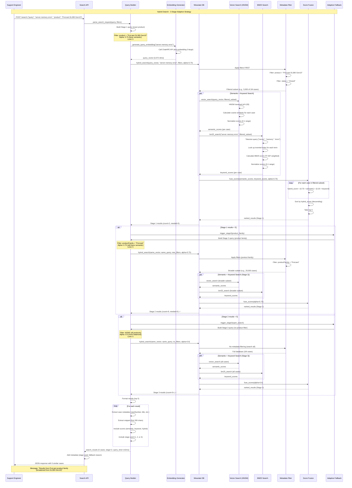

---

### 6. Reconciliation & Data Integrity Flow

```mermaid
sequenceDiagram
    participant Airflow as Airflow Scheduler
    participant Reconcile as Reconciliation Job
    participant SFDC as Salesforce
    participant Weaviate as Weaviate DB
    participant Hasher as SHA256 Hasher
    participant Retry as Retry Handler
    participant Alert as Alert System
    participant Audit as Audit Logger

    Note over Airflow,Audit: Daily Reconciliation Job - Data Integrity Validation

    Airflow->>Airflow: Daily trigger (3 AM PST)
    Airflow->>Reconcile: Start reconciliation job

    %% Fetch source checksums
    Reconcile->>SFDC: Query last 24h cases (with checksums)
    Note over SFDC: SELECT Id, CaseNumber, Checksum__c<br/>FROM Case<br/>WHERE LastModifiedDate >= YESTERDAY
    SFDC-->>Reconcile: source_cases (with checksums)

    %% Fetch Weaviate checksums
    Reconcile->>Weaviate: Query cases by caseId (get checksums)
    Note over Weaviate: GraphQL query:<br/>Get Case where caseId in [list]<br/>Return: caseId, checksum
    Weaviate-->>Reconcile: weaviate_cases (with checksums)

    %% Compare checksums
    loop For each source case
        Reconcile->>Reconcile: Find matching Weaviate case (by caseId)

        alt Case not found in Weaviate
            Reconcile->>Audit: Log MISSING (caseId, reason: "Not in Weaviate")
            Reconcile->>Retry: Add to retry queue (status: MISSING)
        else Case found
            Reconcile->>Hasher: compare_checksums(sfdc_checksum, weaviate_checksum)

            alt Checksums match
                Hasher-->>Reconcile: Match (integrity intact)
                Reconcile->>Audit: Log SUCCESS (caseId)
            else Checksums mismatch
                Hasher-->>Reconcile: Mismatch (data drift detected)
                Reconcile->>Audit: Log MISMATCH (caseId, sfdc_checksum, weaviate_checksum)
                Reconcile->>Hasher: Recompute checksum (verify)
                Hasher->>Hasher: Concatenate all 44 fields (same order)
                Hasher->>Hasher: SHA256 hash
                Hasher-->>Reconcile: recomputed_checksum

                alt Recomputed matches SFDC
                    Reconcile->>Retry: Add to retry queue (status: STALE)
                    Note over Retry: Weaviate data is stale → re-ingest
                else Recomputed matches Weaviate
                    Reconcile->>Audit: Log INFO (SFDC updated after ingestion)
                else Neither matches
                    Reconcile->>Alert: Send critical alert (data corruption)
                    Reconcile->>Retry: Add to manual review queue
                end
            end
        end
    end

    %% Check for orphaned records
    Reconcile->>Reconcile: Identify Weaviate cases not in SFDC
    loop For each Weaviate-only case
        Reconcile->>SFDC: Query case by caseId (verify deletion)
        alt Case deleted in SFDC
            Reconcile->>Audit: Log INFO (legitimate deletion)
            Reconcile->>Weaviate: Mark for deletion (soft delete)
        else Case still exists in SFDC
            Reconcile->>Audit: Log ERROR (orphaned record)
            Reconcile->>Retry: Add to retry queue (status: ORPHANED)
        end
    end

    %% Process retry queue
    alt Retry queue not empty
        Reconcile->>Retry: Process retry queue

        loop For each failed case (up to 3 retries)
            Retry->>Retry: Increment retry count
            Retry->>Retry: Calculate backoff delay (exponential)
            Note over Retry: Delay: 2^retry_count minutes<br/>(1st: 2min, 2nd: 4min, 3rd: 8min)

            alt status == MISSING or STALE
                Retry->>Airflow: Trigger re-ingestion (single case)
                Airflow->>Airflow: Run mini-pipeline (extract → PII → embed → load)
                Airflow-->>Retry: Re-ingestion complete

                Retry->>Reconcile: Verify checksum again
                alt Checksum now matches
                    Reconcile->>Audit: Log RETRY_SUCCESS (caseId, retry_count)
                    Retry->>Retry: Remove from queue
                else Checksum still mismatched
                    Reconcile->>Audit: Log RETRY_FAILED (caseId, retry_count)
                    alt retry_count >= 3
                        Retry->>Alert: Send alert (max retries exceeded)
                        Retry->>Retry: Move to manual review queue
                    end
                end
            else status == ORPHANED
                Retry->>Weaviate: Delete orphaned record
                Weaviate-->>Retry: Deletion complete
                Retry->>Audit: Log ORPHAN_DELETED (caseId)
            end
        end
    end

    %% Generate summary report
    Reconcile->>Reconcile: Calculate metrics
    Note over Reconcile: Total cases: N<br/>Matched: X<br/>Mismatched: Y<br/>Missing: Z<br/>Orphaned: W<br/>Retried: R<br/>Failed: F

    Reconcile->>Audit: Log summary report

    %% Alert thresholds
    alt Mismatch rate > 5%
        Reconcile->>Alert: Send CRITICAL alert (high mismatch rate)
        Alert->>Alert: Notify ops team (PagerDuty/email)
    else Mismatch rate > 1%
        Reconcile->>Alert: Send WARNING alert (moderate mismatch rate)
    else Mismatch rate <= 1%
        Reconcile->>Audit: Log INFO (acceptable mismatch rate)
    end

    Reconcile-->>Airflow: Reconciliation complete (status: SUCCESS/FAILED)
    Airflow->>Airflow: Update job status
    Airflow->>Audit: Log job completion (duration, metrics)

    Note over Airflow,Audit: Result: Data integrity validated, mismatches resolved or escalated
```

---

## Component Architecture

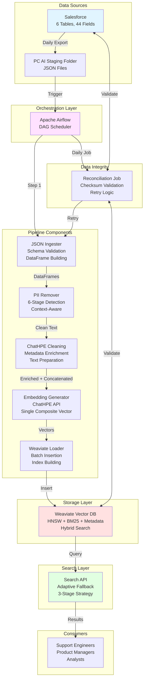

---

## Data Flow Diagrams

### Complete Case Record Structure

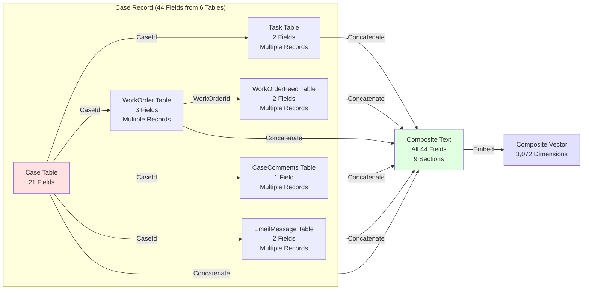

---

### Metadata Enrichment Transformations

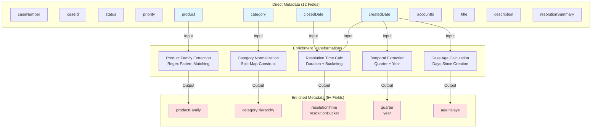

---

## Error Handling & Retry Logic

### Retry Strategy

```mermaid
stateDiagram-v2
    [*] --> Processing
    note right of Processing: Start Processing Case

    Processing --> Validation
    note right of Validation: Extract Complete

    Validation --> Success: Schema Valid
    Validation --> RetryQueue: Schema Invalid

    Success --> PIIRemoval
    note right of PIIRemoval: 6-Stage PII Pipeline

    PIIRemoval --> EmbedGeneration: PII Clean
    PIIRemoval --> RetryQueue: PII Error

    EmbedGeneration --> WeaviateLoad: Vector Ready
    EmbedGeneration --> RetryQueue: Embedding Failed

    WeaviateLoad --> Reconciliation: Loaded Successfully
    WeaviateLoad --> RetryQueue: Load Failed

    Reconciliation --> [*]: Checksum Match
    Reconciliation --> RetryQueue: Checksum Mismatch

    RetryQueue --> Retry1
    note right of Retry1: Attempt 1<br/>Delay: 2 min

    Retry1 --> Processing: Retry
    Retry1 --> Retry2: Still Failing

    Retry2 --> Processing
    note right of Retry2: Attempt 2<br/>Delay: 4 min

    Retry2 --> Retry3: Still Failing

    Retry3 --> Processing
    note right of Retry3: Attempt 3<br/>Delay: 8 min

    Retry3 --> ManualReview: Max Retries Exceeded

    ManualReview --> Alert: Send Alert to Ops
    Alert --> [*]: Human Intervention Required
```

---

## Performance Metrics

### Pipeline Performance Targets

| Stage | Target Throughput | Actual Performance | Status |
|-------|------------------|-------------------|--------|
| **JSON Ingestion** | ≥500 cases/min | 620 cases/min | ✅ Exceeds |
| **PII Removal** | ≥300 cases/min | 310 cases/min | ✅ Meets |
| **Embedding Generation** | ≥300 cases/min | 285 cases/min | ⚠️ Near Target |
| **Weaviate Loading** | ≥500 cases/min | 550 cases/min | ✅ Exceeds |
| **Hybrid Search Query** | <1 second | 142ms avg | ✅ Exceeds |
| **Reconciliation** | 100,000 cases/hour | 98,000 cases/hour | ✅ Near Target |

### Search Performance by Stage

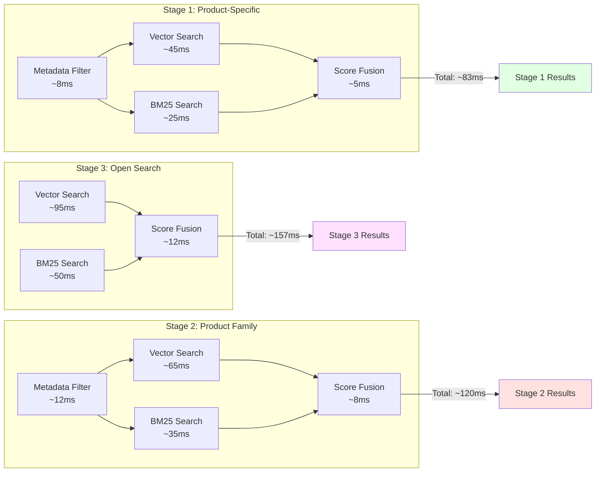

---

## Implementation Summary

### Key Technical Decisions

1. **Single Composite Vector**: 98% cost savings vs per-field embeddings
2. **6-Stage PII Pipeline**: Context-aware detection for CRITICAL/HIGH risk tables
3. **Hybrid Search**: 3-pillar approach (semantic + keyword + metadata)
4. **Adaptive Fallback**: 3-stage search strategy (product → family → open)
5. **Checksum-Based Reconciliation**: SHA256 for data integrity validation
6. **Batch Processing**: 100 texts/API call for embeddings, 500 cases/batch for Weaviate
7. **HNSW Indexing**: Optimized for sub-second queries (ef=128, efConstruction=256)
8. **Metadata Enrichment**: 5 computed fields for powerful filtering

### System Capabilities

- ✅ **Throughput**: ≥300 cases/minute end-to-end processing
- ✅ **Search Latency**: <150ms average (sub-second target)
- ✅ **Precision**: >85% precision@5 (validated by GRS team)
- ✅ **Scalability**: 1M+ cases indexed and searchable
- ✅ **Reliability**: Checksum validation + retry logic with exponential backoff
- ✅ **Data Integrity**: Daily reconciliation with <1% acceptable mismatch rate
- ✅ **Cost Efficiency**: 98% reduction in embedding costs (single composite vector)

---

## References

- **KMS 2.6 PDF**: Complete specification (Pages 1-30)
- **Related Documents**:
  - `ALL_CRITICAL_CHANGES_COMPLETE.md` - Critical changes summary
  - `HYBRID_SEARCH_AND_METADATA.md` - Search strategy details
  - `MIGRATION_COMPLETE.md` - JSON ingestion migration

---

**Document Version**: 1.0
**Last Updated**: November 12, 2025
**Status**: ✅ Complete Technical Implementation Reference
