# KMS 2.5 - Implementation Guide & Code Patterns

## Overview

This document provides practical implementation guidance for developers building the KMS 2.5 Vector Search system. It includes code patterns, configuration examples, and best practices extracted from the technical planning documentation.

---

## Table of Contents

1. [Pipeline Architecture](#pipeline-architecture)
2. [Data Processing Patterns](#data-processing-patterns)
3. [Search Implementation](#search-implementation)
4. [Error Handling & Resilience](#error-handling--resilience)
5. [Testing Strategy](#testing-strategy)
6. [Deployment Configuration](#deployment-configuration)

---

## Pipeline Architecture

### Airflow DAG Structure

```mermaid
flowchart TD
    A[Daily Pipeline DAG<br/>kms_vector_search_daily] --> B[Task 1: Extract from Staging<br/>extract_sfdc_data]

    B --> C[Task 2: Multi-Table Join<br/>join_six_tables]

    C --> D[Task 3: PII Removal<br/>remove_pii_parallel]

    D --> E[Task 4: Text Normalization<br/>normalize_and_build_composite]

    E --> F{Task 5: Embedding Generation}
    F -->|Batch 1-10| G[embedding_batch_1 to 10<br/>Parallel execution]

    G --> H[Task 6: Combine Embeddings<br/>merge_embedding_results]

    H --> I[Task 7: Weaviate Load<br/>load_to_weaviate_batch]

    I --> J[Task 8: Reconciliation<br/>validate_and_reconcile]

    J --> K{Validation Status}
    K -->|Success| L[Task 9: Update Metrics<br/>publish_prometheus_metrics]
    K -->|Failed| M[Task 10: Failed Records<br/>dead_letter_queue]

    L --> N[DAG Complete ✓]
    M --> O[Alert & Manual Review]

    style N fill:#90EE90
    style O fill:#FFB6C1
```



### Airflow DAG Configuration

```python
from airflow import DAG
from airflow.operators.python_operator import PythonOperator
from airflow.providers.apache.spark.operators.spark_submit import SparkSubmitOperator
from datetime import datetime, timedelta

# DAG default arguments
default_args = {
    'owner': 'kms-team',
    'depends_on_past': True,  # Ensure sequential processing
    'start_date': datetime(2025, 1, 1),
    'email': ['kms-alerts@hpe.com'],
    'email_on_failure': True,
    'email_on_retry': False,
    'retries': 3,
    'retry_delay': timedelta(minutes=5),
    'retry_exponential_backoff': True,
    'max_retry_delay': timedelta(minutes=30),
}

# Create DAG
dag = DAG(
    'kms_vector_search_daily',
    default_args=default_args,
    description='Daily vector search pipeline for KMS 2.5',
    schedule_interval='0 2 * * *',  # 2 AM daily
    catchup=False,  # Don't backfill
    max_active_runs=1,  # One run at a time
    tags=['kms', 'vector-search', 'production'],
)

# Task dependencies visualization in code
extract_task >> join_task >> pii_removal_task >> normalize_task
normalize_task >> embedding_tasks  # List of parallel tasks
embedding_tasks >> merge_task >> weaviate_load_task >> reconcile_task
reconcile_task >> [metrics_task, dlq_task]  # Conditional branching
```

---

## Data Processing Patterns

### Multi-Table Join with PySpark

```python
from pyspark.sql import SparkSession
from pyspark.sql.functions import col, concat_ws, coalesce, lit, collect_list, struct
from pyspark.sql.types import StringType, StructType, StructField, ArrayType

def join_six_sfdc_tables(spark, execution_date):
    """
    Join 6 SFDC tables to create unified case records

    Tables:
    - Case (primary, 21 fields)
    - Task (2 fields, filtered by Type)
    - WorkOrder (3 fields)
    - CaseComments (1 field)
    - WorkOrderFeed (2 fields)
    - EmailMessage (2 fields)

    Returns: DataFrame with composite case data
    """

    # Read from staging tables
    df_case = spark.table("udp.case").filter(col("modifieddate") >= execution_date)
    df_task = spark.table("udp.task").filter(
        col("type").isin("Plan of Action", "Trouble Shooting")
    )
    df_workorder = spark.table("udp.workorder")
    df_comment = spark.table("udp.casecomment")
    df_feed = spark.table("udp.workorderfeed")
    df_email = spark.table("udp.emailmessage")

    # Aggregate child tables (one-to-many relationships)
    # TASK: Collect all tasks per case
    df_tasks_agg = df_task.groupBy("whatid").agg(
        collect_list(
            struct(
                col("subject").alias("task_subject"),
                col("description").alias("task_description")
            )
        ).alias("tasks")
    )

    # WORKORDER: Collect all work orders per case
    df_wo_agg = df_workorder.groupBy("caseid").agg(
        collect_list(
            struct(
                col("problem_description__c").alias("wo_problem"),
                col("onsite_action__c").alias("wo_action"),
                col("closing_summary__c").alias("wo_summary")
            )
        ).alias("workorders")
    )

    # CASECOMMENTS: Collect all comments per case
    df_comments_agg = df_comment.groupBy("parentid").agg(
        collect_list(
            struct(
                col("commentbody").alias("comment_body"),
                col("createddate").alias("comment_date")
            )
        ).alias("comments")
    )

    # EMAILS: Collect all emails per case (limit to 3 most recent)
    from pyspark.sql.window import Window
    from pyspark.sql.functions import row_number

    window_spec = Window.partitionBy("parentid").orderBy(col("messagedate").desc())
    df_emails_recent = df_email.withColumn("rn", row_number().over(window_spec)) \
        .filter(col("rn") <= 3) \
        .groupBy("parentid").agg(
            collect_list(
                struct(
                    col("subject").alias("email_subject"),
                    col("textbody").alias("email_body")
                )
            ).alias("emails")
        )

    # LEFT JOIN all tables on Case
    df_unified = df_case \
        .join(df_tasks_agg, df_case.id == df_tasks_agg.whatid, "left") \
        .join(df_wo_agg, df_case.id == df_wo_agg.caseid, "left") \
        .join(df_comments_agg, df_case.id == df_comments_agg.parentid, "left") \
        .join(df_emails_recent, df_case.id == df_emails_recent.parentid, "left") \
        .select(
            df_case["*"],
            coalesce("tasks", lit([])).alias("tasks"),
            coalesce("workorders", lit([])).alias("workorders"),
            coalesce("comments", lit([])).alias("comments"),
            coalesce("emails", lit([])).alias("emails")
        )

    # Add join coverage metrics
    total_cases = df_unified.count()
    with_tasks = df_unified.filter(col("tasks").isNotNull()).count()
    with_workorders = df_unified.filter(col("workorders").isNotNull()).count()
    with_comments = df_unified.filter(col("comments").isNotNull()).count()
    with_emails = df_unified.filter(col("emails").isNotNull()).count()

    logger.info(f"Join coverage stats:")
    logger.info(f"  Total cases: {total_cases}")
    logger.info(f"  With tasks: {with_tasks} ({with_tasks/total_cases*100:.1f}%)")
    logger.info(f"  With work orders: {with_workorders} ({with_workorders/total_cases*100:.1f}%)")
    logger.info(f"  With comments: {with_comments} ({with_comments/total_cases*100:.1f}%)")
    logger.info(f"  With emails: {with_emails} ({with_emails/total_cases*100:.1f}%)")

    # Publish metrics to Prometheus
    multi_table_coverage.labels(table_name='task').set(with_tasks/total_cases)
    multi_table_coverage.labels(table_name='workorder').set(with_workorders/total_cases)
    multi_table_coverage.labels(table_name='comment').set(with_comments/total_cases)
    multi_table_coverage.labels(table_name='email').set(with_emails/total_cases)

    return df_unified
```

---

## Search Implementation

### Weaviate Schema Definition

```python
import weaviate

def create_weaviate_schema(client):
    """
    Create KMS 2.5 vector search schema in Weaviate

    Schema: CaseVectorized
    - 44 text properties from 6 SFDC tables
    - 1 vector property (3,072 dimensions)
    - Metadata properties for filtering
    """

    schema = {
        "classes": [
            {
                "class": "CaseVectorized",
                "description": "HPE support cases with semantic embeddings",
                "vectorizer": "none",  # We provide our own vectors
                "vectorIndexType": "hnsw",
                "vectorIndexConfig": {
                    "ef": 200,  # Higher ef = better recall, slower search
                    "efConstruction": 256,  # Higher = better index quality
                    "maxConnections": 16,  # M parameter
                    "distance": "cosine",  # Cosine similarity
                },
                "properties": [
                    # CASE IDENTIFICATION
                    {
                        "name": "caseNumber",
                        "dataType": ["string"],
                        "description": "Pan HPE case number",
                        "indexInverted": True,  # Enable filtering
                    },
                    {
                        "name": "caseId",
                        "dataType": ["string"],
                        "description": "SFDC case ID",
                        "indexInverted": True,
                    },

                    # ISSUE FIELDS
                    {
                        "name": "subject",
                        "dataType": ["text"],
                        "description": "Case subject/title",
                    },
                    {
                        "name": "description",
                        "dataType": ["text"],
                        "description": "Detailed issue description",
                    },
                    {
                        "name": "issuePlainText",
                        "dataType": ["text"],
                        "description": "Technical issue details",
                    },
                    {
                        "name": "errorCodes",
                        "dataType": ["string"],
                        "description": "Comma-separated error codes",
                        "indexInverted": True,  # Critical for filtering
                    },
                    {
                        "name": "issueType",
                        "dataType": ["string"],
                        "description": "Issue categorization",
                        "indexInverted": True,
                    },

                    # RESOLUTION FIELDS
                    {
                        "name": "resolutionSummary",
                        "dataType": ["text"],
                        "description": "Summary of resolution",
                    },
                    {
                        "name": "resolutionPlainText",
                        "dataType": ["text"],
                        "description": "Detailed resolution steps",
                    },
                    {
                        "name": "resolutionCode",
                        "dataType": ["string"],
                        "description": "Resolution category",
                        "indexInverted": True,
                    },
                    {
                        "name": "rootCause",
                        "dataType": ["string"],
                        "description": "Root cause category",
                        "indexInverted": True,
                    },

                    # PRODUCT METADATA
                    {
                        "name": "productNumber",
                        "dataType": ["string"],
                        "description": "Product SKU",
                        "indexInverted": True,
                    },
                    {
                        "name": "productLine",
                        "dataType": ["string"],
                        "description": "Product line code",
                        "indexInverted": True,
                    },
                    {
                        "name": "productFamily",
                        "dataType": ["string"],
                        "description": "Product family (e.g., ProLiant, Synergy)",
                        "indexInverted": True,
                    },

                    # STATUS & PRIORITY
                    {
                        "name": "status",
                        "dataType": ["string"],
                        "description": "Case status",
                        "indexInverted": True,
                    },
                    {
                        "name": "priority",
                        "dataType": ["string"],
                        "description": "Priority level",
                        "indexInverted": True,
                    },

                    # DATES
                    {
                        "name": "createdDate",
                        "dataType": ["date"],
                        "description": "Case creation timestamp",
                    },
                    {
                        "name": "closedDate",
                        "dataType": ["date"],
                        "description": "Case closure timestamp",
                    },

                    # COMPOSITE TEXT (for display/debugging)
                    {
                        "name": "compositeText",
                        "dataType": ["text"],
                        "description": "Full composite text that was embedded (44 fields)",
                    },

                    # TASKS (JSON array)
                    {
                        "name": "tasks",
                        "dataType": ["text"],
                        "description": "Troubleshooting tasks (JSON)",
                    },

                    # WORK ORDERS (JSON array)
                    {
                        "name": "workOrders",
                        "dataType": ["text"],
                        "description": "Field engineer work orders (JSON)",
                    },

                    # COMMENTS (JSON array)
                    {
                        "name": "comments",
                        "dataType": ["text"],
                        "description": "Engineer comments (JSON)",
                    },

                    # METADATA
                    {
                        "name": "checksum",
                        "dataType": ["string"],
                        "description": "MD5 checksum for idempotency",
                    },
                    {
                        "name": "ingestionTimestamp",
                        "dataType": ["date"],
                        "description": "When record was loaded to Weaviate",
                    },
                ]
            }
        ]
    }

    # Create schema
    client.schema.create(schema)
    logger.info("Weaviate schema created successfully")
```

### Hybrid Search Implementation

```python
import weaviate
from typing import List, Dict, Optional

class HybridSearchEngine:
    """
    Hybrid search combining vector similarity + metadata filters
    """

    def __init__(self, weaviate_url: str, embedding_service):
        self.client = weaviate.Client(weaviate_url)
        self.embedding_service = embedding_service

    def search(
        self,
        query: str,
        filters: Optional[Dict] = None,
        top_k: int = 10,
        similarity_threshold: float = 0.7
    ) -> List[Dict]:
        """
        Execute hybrid search

        Args:
            query: Natural language search query
            filters: Metadata filters (product, priority, dates, etc.)
            top_k: Number of results to return
            similarity_threshold: Minimum cosine similarity (0-1)

        Returns:
            List of matching cases with scores
        """

        # Step 1: Generate query embedding
        query_vector = self.embedding_service.embed(query)

        # Step 2: Build metadata filter
        where_filter = self._build_filter(filters) if filters else None

        # Step 3: Execute hybrid search
        result = (
            self.client.query
            .get("CaseVectorized", [
                "caseNumber", "subject", "description",
                "resolutionSummary", "productFamily",
                "priority", "status", "createdDate"
            ])
            .with_near_vector({
                "vector": query_vector,
                "certainty": similarity_threshold
            })
            .with_where(where_filter) if where_filter else self.client.query.get("CaseVectorized", [...])
            .with_limit(top_k)
            .with_additional(["certainty", "distance", "id"])
            .do()
        )

        # Step 4: Post-process results
        cases = result.get("data", {}).get("Get", {}).get("CaseVectorized", [])

        # Step 5: Enrich with highlights
        enriched_cases = []
        for case in cases:
            case["highlights"] = self._extract_highlights(query, case)
            case["relevanceScore"] = case["_additional"]["certainty"]
            enriched_cases.append(case)

        return enriched_cases

    def _build_filter(self, filters: Dict) -> Dict:
        """Build Weaviate GraphQL filter from user filters"""

        where_filter = {"operator": "And", "operands": []}

        # Product filter
        if filters.get("productNumber"):
            where_filter["operands"].append({
                "path": ["productNumber"],
                "operator": "Equal",
                "valueText": filters["productNumber"]
            })

        # Error codes (multi-select OR)
        if filters.get("errorCodes"):
            error_filters = {
                "operator": "Or",
                "operands": [
                    {"path": ["errorCodes"], "operator": "Like", "valueText": f"*{code}*"}
                    for code in filters["errorCodes"]
                ]
            }
            where_filter["operands"].append(error_filters)

        # Priority (multi-select)
        if filters.get("priority"):
            priority_filters = {
                "operator": "Or",
                "operands": [
                    {"path": ["priority"], "operator": "Equal", "valueText": p}
                    for p in filters["priority"]
                ]
            }
            where_filter["operands"].append(priority_filters)

        # Date range
        if filters.get("dateRange"):
            where_filter["operands"].append({
                "path": ["createdDate"],
                "operator": "GreaterThanEqual",
                "valueDate": filters["dateRange"]["start"]
            })
            where_filter["operands"].append({
                "path": ["createdDate"],
                "operator": "LessThanEqual",
                "valueDate": filters["dateRange"]["end"]
            })

        return where_filter if where_filter["operands"] else None

    def _extract_highlights(self, query: str, case: Dict) -> List[str]:
        """Extract relevant snippets from case text"""
        # Simple keyword matching (can be enhanced with NLP)
        keywords = query.lower().split()
        highlights = []

        for field in ["description", "resolutionSummary"]:
            text = case.get(field, "")
            if text:
                for keyword in keywords:
                    if keyword in text.lower():
                        # Extract snippet around keyword
                        idx = text.lower().index(keyword)
                        start = max(0, idx - 50)
                        end = min(len(text), idx + 100)
                        snippet = text[start:end]
                        highlights.append(f"...{snippet}...")

        return highlights[:3]  # Return top 3 highlights
```

---

## Error Handling & Resilience

### Retry Strategy with Circuit Breaker


### Implementation

```python
from tenacity import retry, stop_after_attempt, wait_exponential, retry_if_exception_type
import requests
from circuitbreaker import circuit
from prometheus_client import Counter, Histogram

# Metrics
api_requests_total = Counter('api_requests_total', 'Total API requests', ['service', 'status'])
api_latency_seconds = Histogram('api_latency_seconds', 'API latency', ['service'])

class EmbeddingService:
    """
    Resilient embedding service with retries and circuit breaker
    """

    def __init__(self, chathpe_url: str, nomic_url: str):
        self.chathpe_url = chathpe_url
        self.nomic_url = nomic_url

    @circuit(failure_threshold=5, recovery_timeout=60, expected_exception=requests.RequestException)
    @retry(
        stop=stop_after_attempt(3),
        wait=wait_exponential(multiplier=1, min=2, max=10),
        retry=retry_if_exception_type(requests.Timeout)
    )
    def embed_with_chathpe(self, text: str) -> List[float]:
        """
        Generate embedding with ChatHPE API
        - Circuit breaker: Opens after 5 failures in 60 seconds
        - Retry: 3 attempts with exponential backoff
        """

        with api_latency_seconds.labels(service='chathpe').time():
            try:
                response = requests.post(
                    f"{self.chathpe_url}/embeddings",
                    json={"input": text, "model": "text-embedding-3-large"},
                    timeout=10
                )
                response.raise_for_status()

                embedding = response.json()["data"][0]["embedding"]
                api_requests_total.labels(service='chathpe', status='success').inc()

                return embedding

            except requests.RequestException as e:
                api_requests_total.labels(service='chathpe', status='error').inc()
                logger.error(f"ChatHPE API error: {e}")
                raise

    def embed_with_nomic_fallback(self, text: str) -> List[float]:
        """
        Fallback to Nomic API (768 dimensions)
        Pad to 3,072 dimensions with zeros
        """

        with api_latency_seconds.labels(service='nomic').time():
            try:
                response = requests.post(
                    f"{self.nomic_url}/embeddings",
                    json={"input": text},
                    timeout=10
                )
                response.raise_for_status()

                embedding_768 = response.json()["embedding"]

                # Pad to 3,072 dimensions
                embedding_3072 = embedding_768 + [0.0] * (3072 - 768)

                api_requests_total.labels(service='nomic', status='success').inc()
                logger.warning(f"Used Nomic fallback for text: {text[:50]}...")

                return embedding_3072

            except requests.RequestException as e:
                api_requests_total.labels(service='nomic', status='error').inc()
                logger.error(f"Nomic API error: {e}")
                raise

    def embed(self, text: str) -> List[float]:
        """
        Smart embedding with automatic fallback
        """
        try:
            return self.embed_with_chathpe(text)
        except Exception as e:
            logger.warning(f"ChatHPE failed, using Nomic fallback: {e}")
            return self.embed_with_nomic_fallback(text)
```

---

## Testing Strategy

### Unit Testing

```python
import pytest
from unittest.mock import Mock, patch
import pandas as pd

class TestPIIRemovalEngine:
    """
    Unit tests for PII removal engine
    """

    @pytest.fixture
    def pii_engine(self):
        return PIIRemovalEngine()

    def test_email_removal(self, pii_engine):
        """Test email address redaction"""
        text = "Contact me at john.doe@hpe.com for details"
        clean = pii_engine.remove_pii(text)

        assert "john.doe@hpe.com" not in clean
        assert "[EMAIL_REDACTED]" in clean

    def test_phone_removal(self, pii_engine):
        """Test phone number redaction"""
        text = "Call customer at +1-555-123-4567"
        clean = pii_engine.remove_pii(text)

        assert "555-123-4567" not in clean
        assert "[PHONE_REDACTED]" in clean

    def test_ip_address_masking(self, pii_engine):
        """Test IP address masking"""
        text = "Server IP: 192.168.1.100"
        clean = pii_engine.remove_pii(text)

        assert "192.168.1.100" not in clean
        assert "[IP_REDACTED]" in clean

    def test_person_name_removal(self, pii_engine):
        """Test NER-based person name removal"""
        text = "Engineer John Smith resolved the issue"
        clean = pii_engine.remove_pii(text)

        assert "John Smith" not in clean
        assert "[PERSON]" in clean or "Engineer" in clean

    def test_preserve_technical_terms(self, pii_engine):
        """Ensure technical terms are NOT removed"""
        text = "ProLiant DL380 Gen10 DIMM error code iLO_400_MemoryErrors"
        clean = pii_engine.remove_pii(text)

        # These should be preserved
        assert "ProLiant DL380" in clean
        assert "DIMM" in clean
        assert "iLO_400_MemoryErrors" in clean
```

### Integration Testing

```python
class TestMultiTableJoin:
    """
    Integration tests for multi-table join logic
    """

    @pytest.fixture
    def spark(self):
        return SparkSession.builder.master("local[2]").getOrCreate()

    def test_join_coverage(self, spark):
        """Test join completeness across 6 tables"""

        # Create test data
        cases = [("case1", "ProLiant issue"), ("case2", "Storage problem")]
        tasks = [("case1", "Troubleshooting")]
        workorders = [("case1", "Onsite repair")]
        comments = [("case1", "Engineer notes"), ("case2", "Resolution")]

        df_case = spark.createDataFrame(cases, ["id", "description"])
        df_task = spark.createDataFrame(tasks, ["whatid", "subject"])
        df_wo = spark.createDataFrame(workorders, ["caseid", "onsite_action"])
        df_comment = spark.createDataFrame(comments, ["parentid", "commentbody"])

        # Execute join
        result = join_six_sfdc_tables(spark, df_case, df_task, df_wo, df_comment, None, None)

        # Assertions
        assert result.count() == 2  # Both cases present

        case1 = result.filter(col("id") == "case1").collect()[0]
        assert len(case1["tasks"]) == 1
        assert len(case1["workorders"]) == 1
        assert len(case1["comments"]) == 1

        case2 = result.filter(col("id") == "case2").collect()[0]
        assert len(case2["tasks"]) == 0  # No tasks
        assert len(case2["comments"]) == 1
```

### End-to-End Testing

```python
class TestSearchQuality:
    """
    E2E tests for search quality validation
    """

    @pytest.fixture
    def search_engine(self):
        return HybridSearchEngine(weaviate_url="http://localhost:8080")

    def test_golden_queries(self, search_engine):
        """
        Test golden query set (50 queries)
        Target: Precision@5 > 85%
        """

        golden_queries = load_golden_query_set()  # From CSV

        precision_scores = []

        for query in golden_queries:
            results = search_engine.search(
                query["query_text"],
                top_k=5
            )

            # Calculate precision@5
            relevant_count = sum(
                1 for r in results
                if r["caseNumber"] in query["expected_relevant_cases"]
            )
            precision = relevant_count / 5
            precision_scores.append(precision)

        avg_precision = sum(precision_scores) / len(precision_scores)

        # Assert target met
        assert avg_precision > 0.85, f"Precision@5: {avg_precision:.2f} < 0.85"
```

---

## Deployment Configuration

### Kubernetes Deployment

```yaml
# weaviate-deployment.yaml
apiVersion: apps/v1
kind: Deployment
metadata:
  name: weaviate
  namespace: kms-vector-search
spec:
  replicas: 3  # High availability
  selector:
    matchLabels:
      app: weaviate
  template:
    metadata:
      labels:
        app: weaviate
    spec:
      containers:
      - name: weaviate
        image: semitechnologies/weaviate:1.22.0
        ports:
        - containerPort: 8080
        env:
        - name: QUERY_DEFAULTS_LIMIT
          value: "25"
        - name: AUTHENTICATION_OIDC_ENABLED
          value: "true"
        - name: AUTHENTICATION_OIDC_ISSUER
          value: "https://keycloak.hpe.com/auth/realms/kms"
        - name: PERSISTENCE_DATA_PATH
          value: "/var/lib/weaviate"
        - name: DEFAULT_VECTORIZER_MODULE
          value: "none"
        - name: ENABLE_MODULES
          value: ""
        resources:
          requests:
            memory: "8Gi"
            cpu: "4"
          limits:
            memory: "16Gi"
            cpu: "8"
        volumeMounts:
        - name: weaviate-data
          mountPath: /var/lib/weaviate
      volumes:
      - name: weaviate-data
        persistentVolumeClaim:
          claimName: weaviate-pvc

---
apiVersion: v1
kind: Service
metadata:
  name: weaviate
  namespace: kms-vector-search
spec:
  selector:
    app: weaviate
  ports:
  - protocol: TCP
    port: 8080
    targetPort: 8080
  type: LoadBalancer
```

### Prometheus Configuration

```yaml
# prometheus-config.yaml
global:
  scrape_interval: 15s
  evaluation_interval: 15s

scrape_configs:
  - job_name: 'kms-pipeline'
    static_configs:
      - targets: ['pyspark-exporter:9090']

  - job_name: 'kms-search-api'
    kubernetes_sd_configs:
      - role: pod
        namespaces:
          names:
            - kms-vector-search
    relabel_configs:
      - source_labels: [__meta_kubernetes_pod_label_app]
        regex: search-api
        action: keep

  - job_name: 'weaviate'
    static_configs:
      - targets: ['weaviate:8080']
    metrics_path: '/metrics'

# Alert rules
rule_files:
  - '/etc/prometheus/alerts/*.yml'
```

### Alert Rules

```yaml
# alerts/kms-alerts.yml
groups:
  - name: kms_critical
    interval: 30s
    rules:
      - alert: PII_Leak_Detected
        expr: pii_validation_failures > 0
        for: 0m
        labels:
          severity: critical
        annotations:
          summary: "CRITICAL: PII leak detected in vector database"
          description: "{{ $value }} PII validation failures detected. Immediate action required."

      - alert: Pipeline_Failure
        expr: rate(pipeline_runs_total{status="failed"}[5m]) > 0.1
        for: 5m
        labels:
          severity: critical
        annotations:
          summary: "Pipeline failure rate > 10%"
          description: "Vector pipeline failing frequently. Check logs."

  - name: kms_high
    interval: 1m
    rules:
      - alert: Low_Search_Quality
        expr: search_precision_at_5 < 0.80
        for: 15m
        labels:
          severity: high
        annotations:
          summary: "Search quality degraded"
          description: "Precision@5 = {{ $value }} < 80%. Review search parameters."

      - alert: High_API_Latency
        expr: histogram_quantile(0.95, search_latency_seconds) > 2.0
        for: 10m
        labels:
          severity: high
        annotations:
          summary: "Search API latency high"
          description: "p95 latency = {{ $value }}s > 2s. Check Weaviate cluster."
```

---

## Best Practices Summary

### Data Pipeline
1. **Idempotency**: Always use checksums to enable safe reprocessing
2. **Batch Processing**: Process in batches of 100-1000 for optimal performance
3. **Parallel Execution**: Use PySpark parallelism for multi-table joins
4. **Monitoring**: Emit metrics at every pipeline stage

### PII Removal
1. **Multi-stage**: Use Regex + NER + Presidio for comprehensive detection
2. **Zero Tolerance**: Fail records with PII rather than risk leakage
3. **Audit Trail**: Log all PII detections with timestamps
4. **Table-specific**: Apply stricter rules to high-risk tables (Email, Comments)

### Search Quality
1. **Golden Query Set**: Maintain 50+ test queries with expected results
2. **Regular Validation**: Run quality metrics daily
3. **A/B Testing**: Test hyperparameter changes before deploying
4. **Human Evaluation**: GRS team validation at key milestones

### Resilience
1. **Circuit Breakers**: Protect against cascading failures
2. **Exponential Backoff**: Retry with increasing delays
3. **Fallback Strategies**: Nomic API for embedding failures
4. **Dead Letter Queues**: Capture failed records for manual review

### Observability
1. **Structured Logging**: JSON format with consistent fields
2. **Distributed Tracing**: Track requests across services
3. **Metrics at Scale**: Use labels judiciously to avoid cardinality explosion
4. **Alert Fatigue**: Set appropriate thresholds to avoid noise

---

**Version**: 1.0
**Last Updated**: November 11, 2025
**Status**: Implementation Reference
