# KMS 2.5 Vector Search - Project Flow & Architecture

## Executive Summary

**Project**: HPE Knowledge Management System (KMS) 2.5 - Semantic Search Implementation
**Objective**: Transform 1M+ historical support cases from Salesforce into a semantic search system using vector embeddings and Weaviate vector database
**Timeline**: 12 weeks
**Budget**: approximately 93,725 USD
**Client**: HPE Global Response Center (GRS)
**Vendor**: Algoleap Technologies

---

## Table of Contents

1. [Overall System Architecture](#overall-system-architecture)
2. [Data Pipeline Flow](#data-pipeline-flow)
3. [Multi-Table Data Integration](#multi-table-data-integration)
4. [Text Embedding Strategy](#text-embedding-strategy)
5. [Hybrid Search Architecture](#hybrid-search-architecture)
6. [PII Removal Pipeline](#pii-removal-pipeline)
7. [Reconciliation & Recovery](#reconciliation--recovery)
8. [Observability Stack](#observability-stack)
9. [Phased Deployment](#phased-deployment)
10. [Technology Stack](#technology-stack)

---

## Overall System Architecture

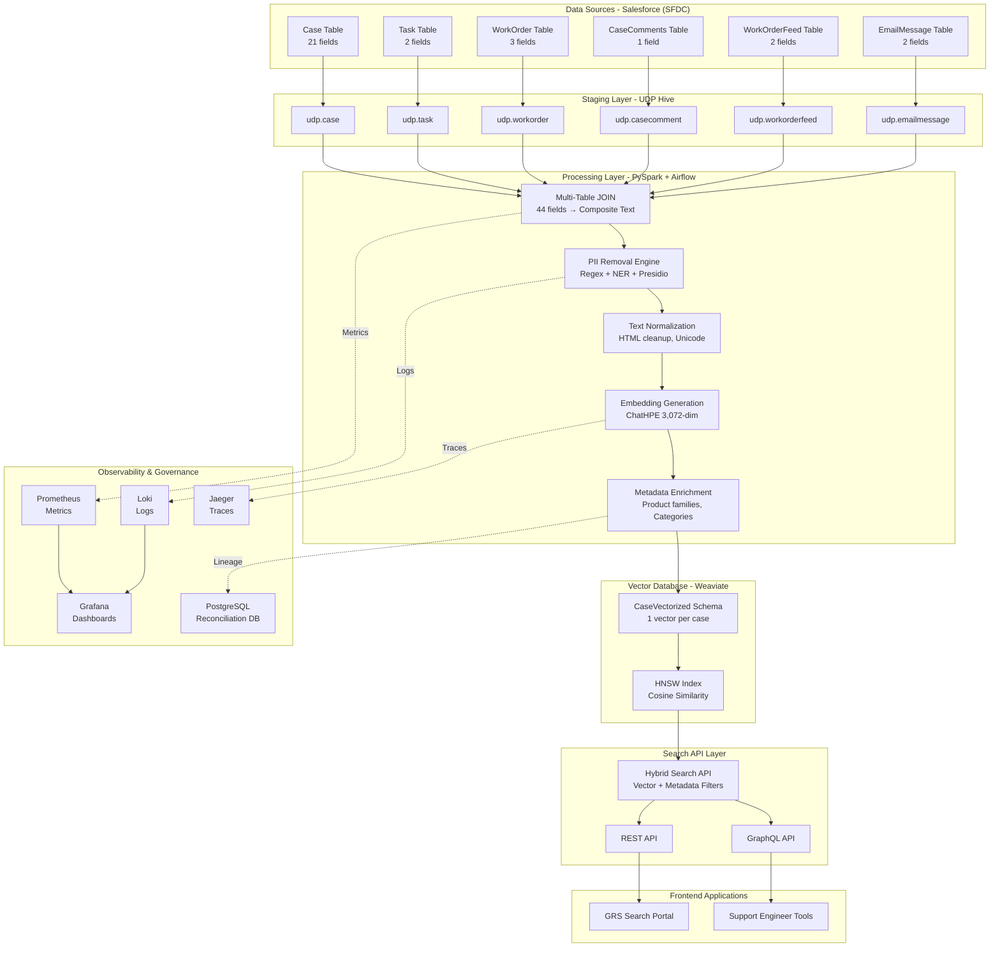
```mermaid
graph TB
    subgraph "Data Sources - Salesforce (SFDC)"
        A1[Case Table<br/>21 fields]
        A2[Task Table<br/>2 fields]
        A3[WorkOrder Table<br/>3 fields]
        A4[CaseComments Table<br/>1 field]
        A5[WorkOrderFeed Table<br/>2 fields]
        A6[EmailMessage Table<br/>2 fields]
    end

    subgraph "Staging Layer - UDP Hive"
        B1[udp.case]
        B2[udp.task]
        B3[udp.workorder]
        B4[udp.casecomment]
        B5[udp.workorderfeed]
        B6[udp.emailmessage]
    end

    subgraph "Processing Layer - PySpark + Airflow"
        C1[Multi-Table JOIN<br/>44 fields → Composite Text]
        C2[PII Removal Engine<br/>Regex + NER + Presidio]
        C3[Text Normalization<br/>HTML cleanup, Unicode]
        C4[Embedding Generation<br/>ChatHPE 3,072-dim]
        C5[Metadata Enrichment<br/>Product families, Categories]
    end

    subgraph "Vector Database - Weaviate"
        D1[CaseVectorized Schema<br/>1 vector per case]
        D2[HNSW Index<br/>Cosine Similarity]
    end

    subgraph "Search API Layer"
        E1[Hybrid Search API<br/>Vector + Metadata Filters]
        E2[REST API]
        E3[GraphQL API]
    end

    subgraph "Frontend Applications"
        F1[GRS Search Portal]
        F2[Support Engineer Tools]
    end

    subgraph "Observability & Governance"
        G1[Prometheus<br/>Metrics]
        G2[Loki<br/>Logs]
        G3[Grafana<br/>Dashboards]
        G4[Jaeger<br/>Traces]
        G5[PostgreSQL<br/>Reconciliation DB]
    end

    A1 --> B1
    A2 --> B2
    A3 --> B3
    A4 --> B4
    A5 --> B5
    A6 --> B6

    B1 --> C1
    B2 --> C1
    B3 --> C1
    B4 --> C1
    B5 --> C1
    B6 --> C1

    C1 --> C2
    C2 --> C3
    C3 --> C4
    C4 --> C5
    C5 --> D1
    D1 --> D2

    D2 --> E1
    E1 --> E2
    E1 --> E3
    E2 --> F1
    E3 --> F2

    C1 -.->|Metrics| G1
    C2 -.->|Logs| G2
    C4 -.->|Traces| G4
    C5 -.->|Lineage| G5

    G1 --> G3
    G2 --> G3
```

---

## Data Pipeline Flow

```mermaid
flowchart LR
    subgraph "Stage 1: Data Ingestion"
        A[SFDC CDC Events] --> B[Kafka Topics]
        B --> C[Hive Staging Tables<br/>6 tables]
    end

    subgraph "Stage 2: Multi-Table Join"
        C --> D[PySpark Job]
        D --> E{Join Strategy}
        E -->|LEFT JOIN| F[Case + Task]
        E -->|LEFT JOIN| G[Case + WorkOrder]
        E -->|LEFT JOIN| H[Case + Comments]
        E -->|LEFT JOIN| I[Case + Emails]
        F --> J[Unified Case Record<br/>44 fields]
        G --> J
        H --> J
        I --> J
    end

    subgraph "Stage 3: PII Removal"
        J --> K[Regex Patterns<br/>Email, Phone, IP]
        K --> L[spaCy NER<br/>Person, Org Names]
        L --> M[Presidio<br/>Advanced PII]
        M --> N[Clean Text<br/>ZERO PII]
    end

    subgraph "Stage 4: Text Processing"
        N --> O[HTML Tag Removal]
        O --> P[Unicode Normalization]
        P --> Q[Composite Text Builder<br/>Structured Sections]
    end

    subgraph "Stage 5: Embedding"
        Q --> R{ChatHPE API}
        R -->|Success| S[3,072-dim Vector]
        R -->|Failure| T[Nomic Fallback<br/>768-dim]
        S --> U[Embedding Ready]
        T --> U
    end

    subgraph "Stage 6: Vector DB Load"
        U --> V[Weaviate Batch API]
        V --> W[HNSW Index Update]
        W --> X[Vector Search Ready]
    end

    subgraph "Stage 7: Reconciliation"
        X --> Y[PostgreSQL Lineage]
        Y --> Z{Validation}
        Z -->|Success| AA[Mark Complete]
        Z -->|Failed| AB[Retry Queue]
        AB --> D
    end
```

---

## Multi-Table Data Integration

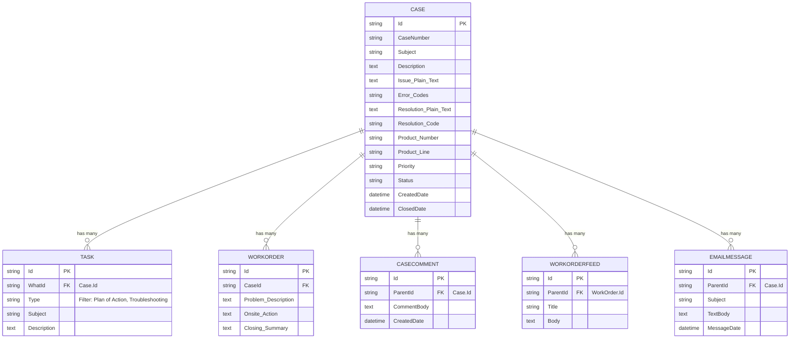
```mermaid
erDiagram
    CASE ||--o{ TASK : "has many"
    CASE ||--o{ WORKORDER : "has many"
    CASE ||--o{ CASECOMMENT : "has many"
    CASE ||--o{ WORKORDERFEED : "has many"
    CASE ||--o{ EMAILMESSAGE : "has many"

    CASE {
        string Id PK
        string CaseNumber
        string Subject
        text Description
        text Issue_Plain_Text
        string Error_Codes
        text Resolution_Plain_Text
        string Resolution_Code
        string Product_Number
        string Product_Line
        string Priority
        string Status
        datetime CreatedDate
        datetime ClosedDate
    }

    TASK {
        string Id PK
        string WhatId FK "Case.Id"
        string Type "Filter: Plan of Action, Troubleshooting"
        string Subject
        text Description
    }

    WORKORDER {
        string Id PK
        string CaseId FK
        text Problem_Description
        text Onsite_Action
        text Closing_Summary
    }

    CASECOMMENT {
        string Id PK
        string ParentId FK "Case.Id"
        text CommentBody
        datetime CreatedDate
    }

    WORKORDERFEED {
        string Id PK
        string ParentId FK "WorkOrder.Id"
        string Title
        text Body
    }

    EMAILMESSAGE {
        string Id PK
        string ParentId FK "Case.Id"
        string Subject
        text TextBody
        datetime MessageDate
    }
```

### Composite Text Construction

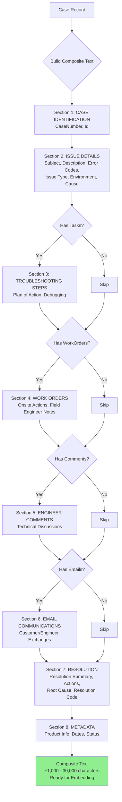
```mermaid
flowchart TD
    A[Case Record] --> B{Build Composite Text}

    B --> C[Section 1: CASE IDENTIFICATION<br/>CaseNumber, Id]
    C --> D[Section 2: ISSUE DETAILS<br/>Subject, Description, Error Codes,<br/>Issue Type, Environment, Cause]

    D --> E{Has Tasks?}
    E -->|Yes| F[Section 3: TROUBLESHOOTING STEPS<br/>Plan of Action, Debugging]
    E -->|No| G[Skip]

    F --> H{Has WorkOrders?}
    G --> H

    H -->|Yes| I[Section 4: WORK ORDERS<br/>Onsite Actions, Field Engineer Notes]
    H -->|No| J[Skip]

    I --> K{Has Comments?}
    J --> K

    K -->|Yes| L[Section 5: ENGINEER COMMENTS<br/>Technical Discussions]
    K -->|No| M[Skip]

    L --> N{Has Emails?}
    M --> N

    N -->|Yes| O[Section 6: EMAIL COMMUNICATIONS<br/>Customer/Engineer Exchanges]
    N -->|No| P[Skip]

    O --> Q[Section 7: RESOLUTION<br/>Resolution Summary, Actions,<br/>Root Cause, Resolution Code]
    P --> Q

    Q --> R[Section 8: METADATA<br/>Product Info, Dates, Status]

    R --> S[Composite Text<br/>~1,000 - 30,000 characters<br/>Ready for Embedding]

    style S fill:#90EE90
```

---

## Text Embedding Strategy

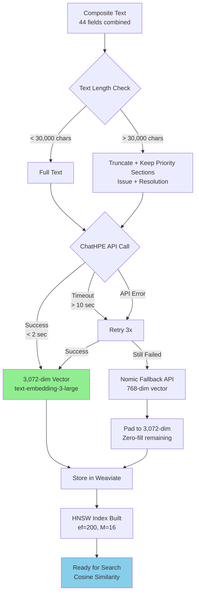
```mermaid
flowchart TB
    A[Composite Text<br/>44 fields combined] --> B{Text Length Check}

    B -->|< 30,000 chars| C[Full Text]
    B -->|> 30,000 chars| D[Truncate + Keep Priority Sections<br/>Issue + Resolution]

    C --> E{ChatHPE API Call}
    D --> E

    E -->|Success<br/>< 2 sec| F[3,072-dim Vector<br/>text-embedding-3-large]
    E -->|Timeout<br/>> 10 sec| G[Retry 3x]
    E -->|API Error| G

    G -->|Still Failed| H[Nomic Fallback API<br/>768-dim vector]
    G -->|Success| F

    H --> I[Pad to 3,072-dim<br/>Zero-fill remaining]

    F --> J[Store in Weaviate]
    I --> J

    J --> K[HNSW Index Built<br/>ef=200, M=16]

    K --> L[Ready for Search<br/>Cosine Similarity]

    style F fill:#90EE90
    style L fill:#87CEEB
```

### Why Single Vector Strategy?

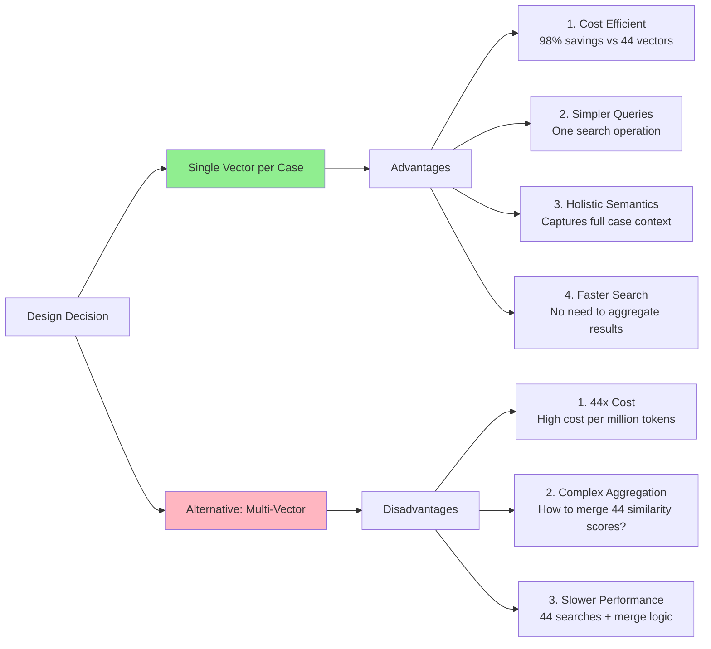
```mermaid
graph LR
    A[Design Decision] --> B[Single Vector per Case]
    A --> C[Alternative: Multi-Vector]

    B --> D[Advantages]
    D --> E[1. Cost Efficient<br/>98% savings vs 44 vectors]
    D --> F[2. Simpler Queries<br/>One search operation]
    D --> G[3. Holistic Semantics<br/>Captures full case context]
    D --> H[4. Faster Search<br/>No need to aggregate results]

    C --> I[Disadvantages]
    I --> J[1. 44x Cost<br/>High cost per million tokens]
    I --> K[2. Complex Aggregation<br/>How to merge 44 similarity scores?]
    I --> L[3. Slower Performance<br/>44 searches + merge logic]

    style B fill:#90EE90
    style C fill:#FFB6C1
```

---

## Hybrid Search Architecture

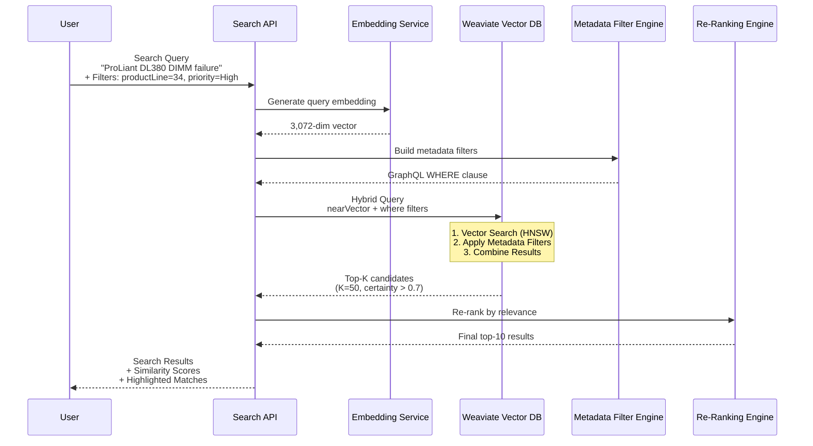
```mermaid
sequenceDiagram
    participant User
    participant API as Search API
    participant Embed as Embedding Service
    participant Weaviate as Weaviate Vector DB
    participant Filter as Metadata Filter Engine
    participant Rank as Re-Ranking Engine

    User->>API: Search Query<br/>"ProLiant DL380 DIMM failure"<br/>+ Filters: productLine=34, priority=High

    API->>Embed: Generate query embedding
    Embed-->>API: 3,072-dim vector

    API->>Filter: Build metadata filters
    Filter-->>API: GraphQL WHERE clause

    API->>Weaviate: Hybrid Query<br/>nearVector + where filters

    Note over Weaviate: 1. Vector Search (HNSW)<br/>2. Apply Metadata Filters<br/>3. Combine Results

    Weaviate-->>API: Top-K candidates<br/>(K=50, certainty > 0.7)

    API->>Rank: Re-rank by relevance
    Rank-->>API: Final top-10 results

    API-->>User: Search Results<br/>+ Similarity Scores<br/>+ Highlighted Matches
```

### Search Strategies by Use Case

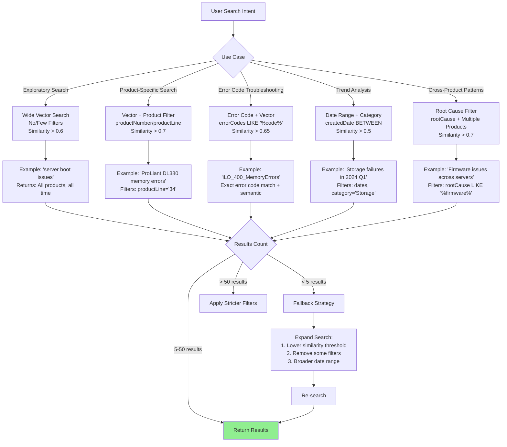
```mermaid
flowchart TD
    A[User Search Intent] --> B{Use Case}

    B -->|Exploratory Search| C[Wide Vector Search<br/>No/Few Filters<br/>Similarity > 0.6]
    C --> C1[Example: 'server boot issues'<br/>Returns: All products, all time]

    B -->|Product-Specific Search| D[Vector + Product Filter<br/>productNumber/productLine<br/>Similarity > 0.7]
    D --> D1[Example: 'ProLiant DL380 memory errors'<br/>Filters: productLine='34']

    B -->|Error Code Troubleshooting| E[Error Code + Vector<br/>errorCodes LIKE '%code%'<br/>Similarity > 0.65]
    E --> E1[Example: 'iLO_400_MemoryErrors'<br/>Exact error code match + semantic]

    B -->|Trend Analysis| F[Date Range + Category<br/>createdDate BETWEEN<br/>Similarity > 0.5]
    F --> F1[Example: 'Storage failures in 2024 Q1'<br/>Filters: dates, category='Storage']

    B -->|Cross-Product Patterns| G[Root Cause Filter<br/>rootCause + Multiple Products<br/>Similarity > 0.7]
    G --> G1[Example: 'Firmware issues across servers'<br/>Filters: rootCause LIKE '%firmware%']

    C1 --> H{Results Count}
    D1 --> H
    E1 --> H
    F1 --> H
    G1 --> H

    H -->|< 5 results| I[Fallback Strategy]
    H -->|5-50 results| J[Return Results]
    H -->|> 50 results| K[Apply Stricter Filters]

    I --> L[Expand Search:<br/>1. Lower similarity threshold<br/>2. Remove some filters<br/>3. Broader date range]

    L --> M[Re-search]
    M --> J

    style J fill:#90EE90
```

---

## PII Removal Pipeline

```mermaid
flowchart TB
    A[Raw Text from 6 Tables] --> B{Table Risk Assessment}

    B -->|CRITICAL: EmailMessage| C1[Email Signature Removal<br/>Contact Info Redaction]
    B -->|HIGH: CaseComments, WorkOrder| C2[Name Detection<br/>Location Redaction]
    B -->|MEDIUM: Case, Task| C3[IP Address Masking<br/>Selective PII]
    B -->|LOW: WorkOrderFeed| C4[Light PII Scan]

    C1 --> D[Stage 1: Regex Patterns]
    C2 --> D
    C3 --> D
    C4 --> D

    D --> E{Pattern Matching}
    E -->|Email| F1["user at example.com → EMAIL_REDACTED"]
    E -->|Phone| F2["+1-555-1234 → PHONE_REDACTED"]
    E -->|IP Address| F3["192.168.1.1 → IP_REDACTED"]
    E -->|SSN| F4["123-45-6789 → SSN_REDACTED"]

    F1 --> G[Stage 2: Named Entity Recognition]
    F2 --> G
    F3 --> G
    F4 --> G

    G --> H{spaCy NER Model}
    H -->|PERSON| I1[John Smith → [PERSON]]
    H -->|ORG| I2[Company ABC → [ORG]]
    H -->|GPE| I3[123 Main St, Austin → [LOCATION]]

    I1 --> J[Stage 3: Microsoft Presidio]
    I2 --> J
    I3 --> J

    J --> K{Advanced PII Detection}
    K -->|Credit Card| L1[4111-1111-1111-1111 → [CARD_REDACTED]]
    K -->|Employee ID| L2[HPE12345 → [EMP_ID_REDACTED]]
    K -->|Custom Patterns| L3[Customer-specific PII]

    L1 --> M[Stage 4: Validation & Audit]
    L2 --> M
    L3 --> M

    M --> N{PII Leak Check}
    N -->|Zero PII Detected| O[✓ Clean Text<br/>Ready for Embedding]
    N -->|PII Still Found| P[❌ Reject Record<br/>Log for Manual Review]

    P --> Q[Failed PII Queue]
    Q --> R[Manual Redaction]
    R --> D

    O --> S[Audit Log Entry<br/>Timestamp, PII Types, Counts]

    style O fill:#90EE90
    style P fill:#FFB6C1
```

### PII Detection Metrics

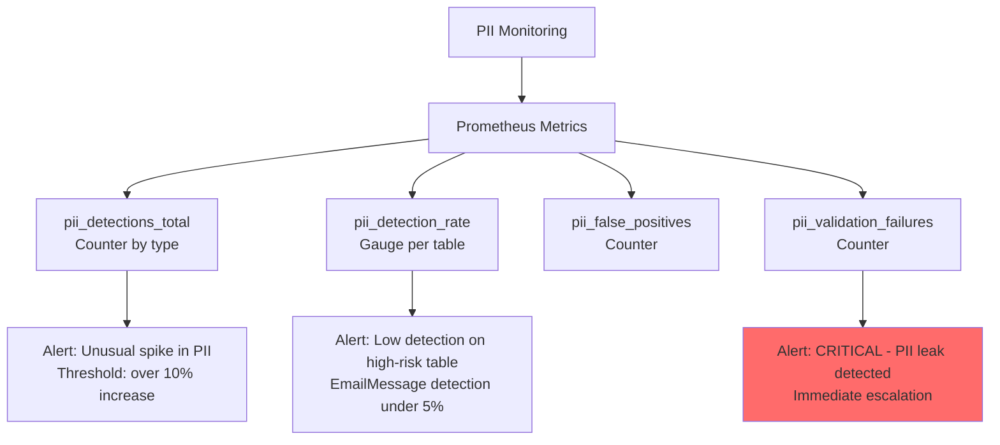
```mermaid
graph TB
    A[PII Monitoring] --> B[Prometheus Metrics]

    B --> C[pii_detections_total<br/>Counter by type]
    B --> D[pii_detection_rate<br/>Gauge per table]
    B --> E[pii_false_positives<br/>Counter]
    B --> F[pii_validation_failures<br/>Counter]

    C --> G["Alert: Unusual spike in PII<br/>Threshold: over 10% increase"]
    D --> H["Alert: Low detection on high-risk table<br/>EmailMessage detection under 5%"]
    F --> I["Alert: CRITICAL - PII leak detected<br/>Immediate escalation"]

    style I fill:#FF6B6B
```

---

## Reconciliation & Recovery

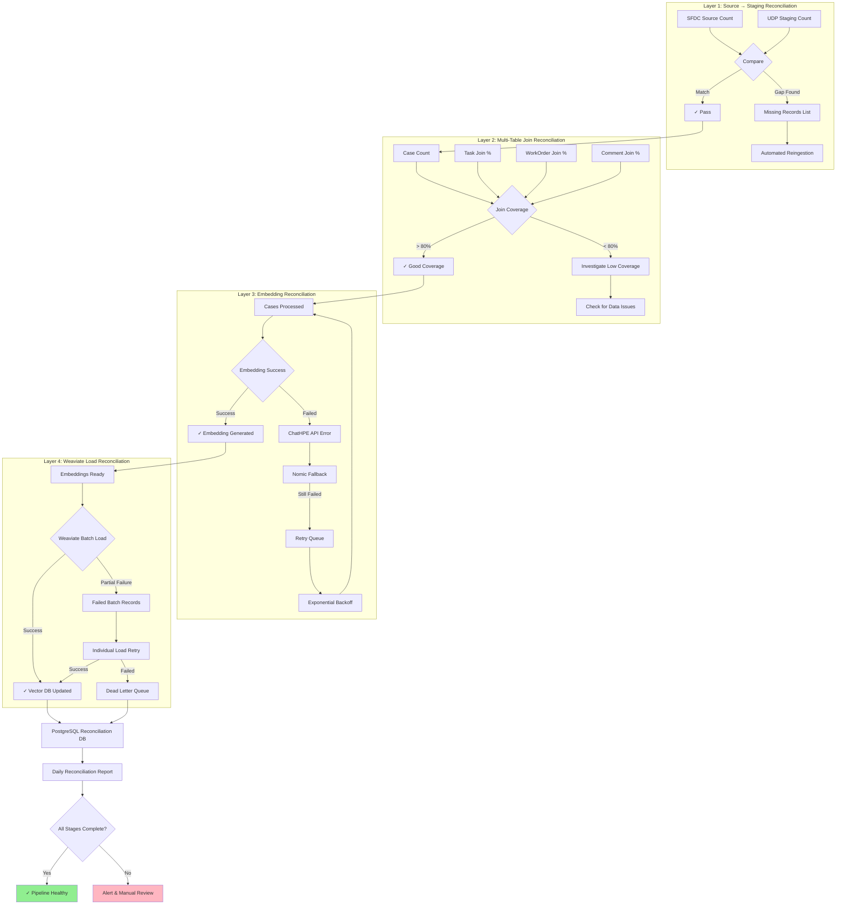
```mermaid
flowchart TB
    subgraph "Layer 1: Source → Staging Reconciliation"
        A1[SFDC Source Count] --> B1{Compare}
        A2[UDP Staging Count] --> B1
        B1 -->|Match| C1[✓ Pass]
        B1 -->|Gap Found| D1[Missing Records List]
        D1 --> E1[Automated Reingestion]
    end

    subgraph "Layer 2: Multi-Table Join Reconciliation"
        A3[Case Count] --> B2{Join Coverage}
        A4[Task Join %] --> B2
        A5[WorkOrder Join %] --> B2
        A6[Comment Join %] --> B2
        B2 -->|> 80%| C2[✓ Good Coverage]
        B2 -->|< 80%| D2[Investigate Low Coverage]
        D2 --> E2[Check for Data Issues]
    end

    subgraph "Layer 3: Embedding Reconciliation"
        A7[Cases Processed] --> B3{Embedding Success}
        B3 -->|Success| C3[✓ Embedding Generated]
        B3 -->|Failed| D3[ChatHPE API Error]
        D3 --> E3[Nomic Fallback]
        E3 -->|Still Failed| F3[Retry Queue]
        F3 --> G3[Exponential Backoff]
        G3 --> A7
    end

    subgraph "Layer 4: Weaviate Load Reconciliation"
        A8[Embeddings Ready] --> B4{Weaviate Batch Load}
        B4 -->|Success| C4[✓ Vector DB Updated]
        B4 -->|Partial Failure| D4[Failed Batch Records]
        D4 --> E4[Individual Load Retry]
        E4 -->|Success| C4
        E4 -->|Failed| F4[Dead Letter Queue]
    end

    C1 --> A3
    C2 --> A7
    C3 --> A8
    C4 --> H[PostgreSQL Reconciliation DB]
    F4 --> H

    H --> I[Daily Reconciliation Report]
    I --> J{All Stages Complete?}
    J -->|Yes| K[✓ Pipeline Healthy]
    J -->|No| L[Alert & Manual Review]

    style K fill:#90EE90
    style L fill:#FFB6C1
```

### Idempotency Design

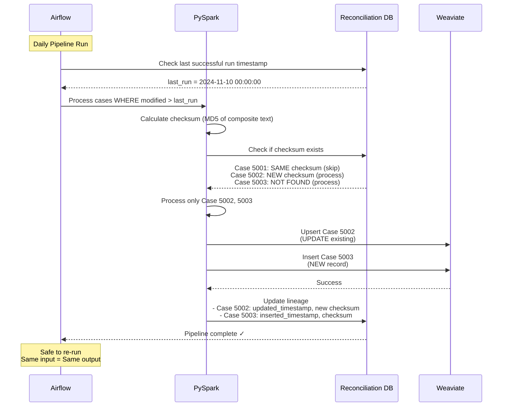
```mermaid
sequenceDiagram
    participant Airflow
    participant PySpark
    participant ReconDB as Reconciliation DB
    participant Weaviate

    Note over Airflow: Daily Pipeline Run

    Airflow->>ReconDB: Check last successful run timestamp
    ReconDB-->>Airflow: last_run = 2024-11-10 00:00:00

    Airflow->>PySpark: Process cases WHERE modified > last_run
    PySpark->>PySpark: Calculate checksum (MD5 of composite text)

    PySpark->>ReconDB: Check if checksum exists
    ReconDB-->>PySpark: Case 5001: SAME checksum (skip)<br/>Case 5002: NEW checksum (process)<br/>Case 5003: NOT FOUND (process)

    PySpark->>PySpark: Process only Case 5002, 5003

    PySpark->>Weaviate: Upsert Case 5002<br/>(UPDATE existing)
    PySpark->>Weaviate: Insert Case 5003<br/>(NEW record)

    Weaviate-->>PySpark: Success

    PySpark->>ReconDB: Update lineage<br/>- Case 5002: updated_timestamp, new checksum<br/>- Case 5003: inserted_timestamp, checksum

    ReconDB-->>Airflow: Pipeline complete ✓

    Note over Airflow: Safe to re-run<br/>Same input = Same output
```

---

## Observability Stack

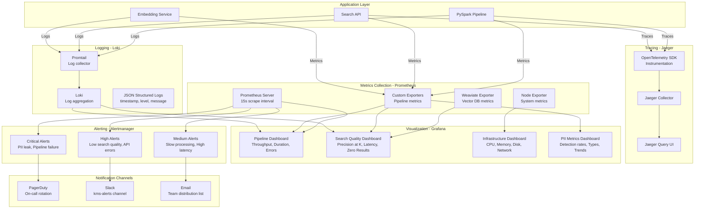
```mermaid
graph TB
    subgraph "Application Layer"
        A1[PySpark Pipeline]
        A2[Search API]
        A3[Embedding Service]
    end

    subgraph "Metrics Collection - Prometheus"
        B1[Prometheus Server<br/>15s scrape interval]
        B2[Node Exporter<br/>System metrics]
        B3[Weaviate Exporter<br/>Vector DB metrics]
        B4[Custom Exporters<br/>Pipeline metrics]
    end

    subgraph "Logging - Loki"
        C1[Promtail<br/>Log collector]
        C2[Loki<br/>Log aggregation]
        C3[JSON Structured Logs<br/>timestamp, level, message]
    end

    subgraph "Tracing - Jaeger"
        D1[OpenTelemetry SDK<br/>Instrumentation]
        D2[Jaeger Collector]
        D3[Jaeger Query UI]
    end

    subgraph "Visualization - Grafana"
        E1[Pipeline Dashboard<br/>Throughput, Duration, Errors]
        E2[Search Quality Dashboard<br/>Precision at K, Latency, Zero Results]
        E3[Infrastructure Dashboard<br/>CPU, Memory, Disk, Network]
        E4[PII Metrics Dashboard<br/>Detection rates, Types, Trends]
    end

    subgraph "Alerting - Alertmanager"
        F1[Critical Alerts<br/>PII leak, Pipeline failure]
        F2[High Alerts<br/>Low search quality, API errors]
        F3[Medium Alerts<br/>Slow processing, High latency]
    end

    subgraph "Notification Channels"
        G1[PagerDuty<br/>On-call rotation]
        G2[Slack<br/>kms-alerts channel]
        G3[Email<br/>Team distribution list]
    end

    A1 -->|Metrics| B4
    A2 -->|Metrics| B4
    A3 -->|Metrics| B4

    A1 -->|Logs| C1
    A2 -->|Logs| C1
    A3 -->|Logs| C1

    A1 -->|Traces| D1
    A2 -->|Traces| D1

    B1 --> E1
    B2 --> E3
    B3 --> E2
    B4 --> E1
    B4 --> E2
    B4 --> E4

    C2 --> E1
    C2 --> E2

    D2 --> D3

    B1 --> F1
    B1 --> F2
    B1 --> F3

    F1 --> G1
    F2 --> G2
    F3 --> G3

    C1 --> C2
    D1 --> D2
```

### Key Metrics Tracked

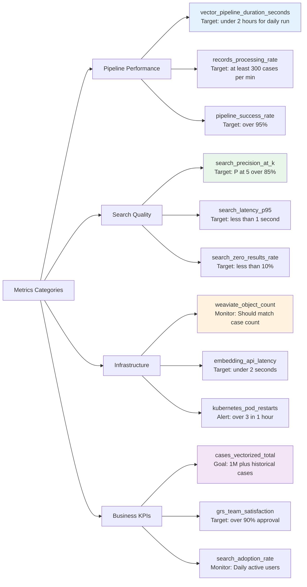
```mermaid
graph LR
    A[Metrics Categories] --> B[Pipeline Performance]
    A --> C[Search Quality]
    A --> D[Infrastructure]
    A --> E[Business KPIs]

    B --> B1["vector_pipeline_duration_seconds<br/>Target: under 2 hours for daily run"]
    B --> B2["records_processing_rate<br/>Target: at least 300 cases per min"]
    B --> B3["pipeline_success_rate<br/>Target: over 95%"]

    C --> C1["search_precision_at_k<br/>Target: P at 5 over 85%"]
    C --> C2["search_latency_p95<br/>Target: less than 1 second"]
    C --> C3["search_zero_results_rate<br/>Target: less than 10%"]

    D --> D1[weaviate_object_count<br/>Monitor: Should match case count]
    D --> D2["embedding_api_latency<br/>Target: under 2 seconds"]
    D --> D3["kubernetes_pod_restarts<br/>Alert: over 3 in 1 hour"]

    E --> E1["cases_vectorized_total<br/>Goal: 1M plus historical cases"]
    E --> E2["grs_team_satisfaction<br/>Target: over 90% approval"]
    E --> E3[search_adoption_rate<br/>Monitor: Daily active users]

    style B1 fill:#E3F2FD
    style C1 fill:#E8F5E9
    style D1 fill:#FFF3E0
    style E1 fill:#F3E5F5
```

---

## Phased Deployment

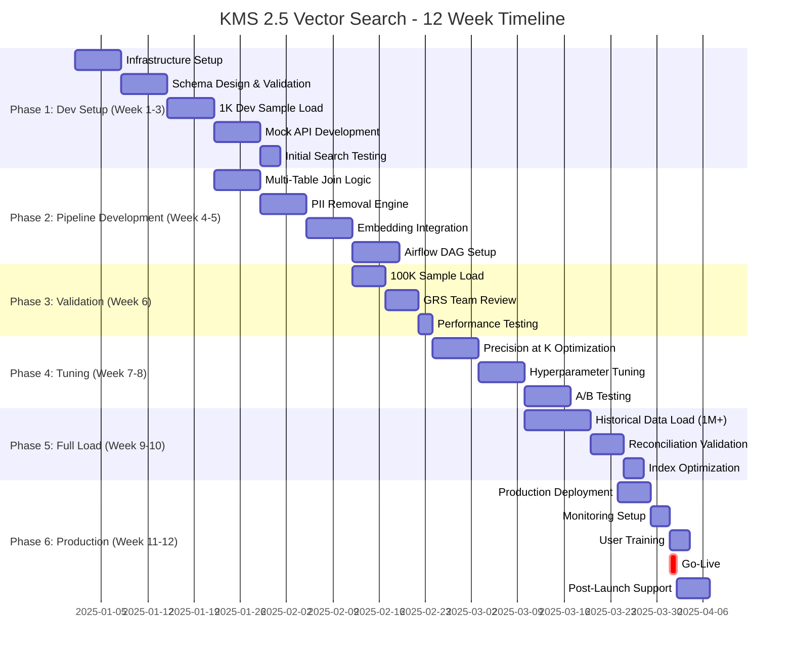
```mermaid
gantt
    title KMS 2.5 Vector Search - 12 Week Timeline
    dateFormat YYYY-MM-DD

    section Phase 1: Dev Setup (Week 1-3)
    Infrastructure Setup           :2025-01-01, 7d
    Schema Design & Validation     :7d
    1K Dev Sample Load            :2025-01-15, 7d
    Mock API Development          :7d
    Initial Search Testing        :3d

    section Phase 2: Pipeline Development (Week 4-5)
    Multi-Table Join Logic        :2025-01-22, 7d
    PII Removal Engine            :7d
    Embedding Integration         :7d
    Airflow DAG Setup            :7d

    section Phase 3: Validation (Week 6)
    100K Sample Load             :2025-02-12, 5d
    GRS Team Review              :2025-02-17, 5d
    Performance Testing          :2d

    section Phase 4: Tuning (Week 7-8)
    Precision at K Optimization     :2025-02-24, 7d
    Hyperparameter Tuning        :7d
    A/B Testing                  :7d

    section Phase 5: Full Load (Week 9-10)
    Historical Data Load (1M+)   :2025-03-10, 10d
    Reconciliation Validation    :5d
    Index Optimization           :3d

    section Phase 6: Production (Week 11-12)
    Production Deployment        :2025-03-24, 5d
    Monitoring Setup             :3d
    User Training                :3d
    Go-Live                      :crit, 2025-04-01, 1d
    Post-Launch Support          :2025-04-02, 5d
```

### Phased Data Loading

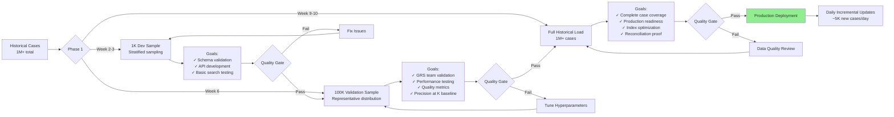
```mermaid
flowchart LR
    A[Historical Cases<br/>1M+ total] --> B{Phase 1}

    B -->|Week 2-3| C[1K Dev Sample<br/>Stratified sampling]
    C --> C1[Goals:<br/>✓ Schema validation<br/>✓ API development<br/>✓ Basic search testing]

    B -->|Week 6| D[100K Validation Sample<br/>Representative distribution]
    D --> D1[Goals:<br/>✓ GRS team validation<br/>✓ Performance testing<br/>✓ Quality metrics<br/>✓ Precision at K baseline]

    B -->|Week 9-10| E[Full Historical Load<br/>1M+ cases]
    E --> E1[Goals:<br/>✓ Complete case coverage<br/>✓ Production readiness<br/>✓ Index optimization<br/>✓ Reconciliation proof]

    C1 --> F{Quality Gate}
    D1 --> G{Quality Gate}
    E1 --> H{Quality Gate}

    F -->|Pass| D
    F -->|Fail| I1[Fix Issues]
    I1 --> C

    G -->|Pass| E
    G -->|Fail| I2[Tune Hyperparameters]
    I2 --> D

    H -->|Pass| J[Production Deployment]
    H -->|Fail| I3[Data Quality Review]
    I3 --> E

    J --> K[Daily Incremental Updates<br/>~5K new cases/day]

    style J fill:#90EE90
```

---

## Technology Stack

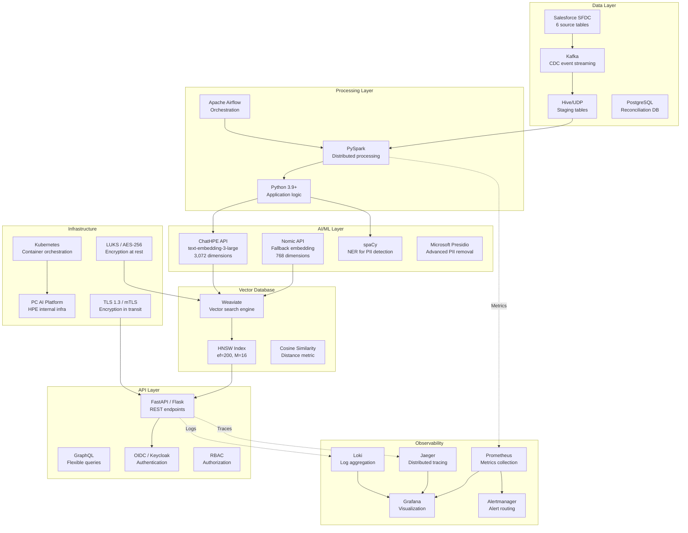
```mermaid
graph TB
    subgraph "Data Layer"
        A1[Salesforce SFDC<br/>6 source tables]
        A2[Kafka<br/>CDC event streaming]
        A3[Hive/UDP<br/>Staging tables]
        A4[PostgreSQL<br/>Reconciliation DB]
    end

    subgraph "Processing Layer"
        B1[Apache Airflow<br/>Orchestration]
        B2[PySpark<br/>Distributed processing]
        B3[Python 3.9+<br/>Application logic]
    end

    subgraph "AI/ML Layer"
        C1[ChatHPE API<br/>text-embedding-3-large<br/>3,072 dimensions]
        C2[Nomic API<br/>Fallback embedding<br/>768 dimensions]
        C3[spaCy<br/>NER for PII detection]
        C4[Microsoft Presidio<br/>Advanced PII removal]
    end

    subgraph "Vector Database"
        D1[Weaviate<br/>Vector search engine]
        D2[HNSW Index<br/>ef=200, M=16]
        D3[Cosine Similarity<br/>Distance metric]
    end

    subgraph "API Layer"
        E1[FastAPI / Flask<br/>REST endpoints]
        E2[GraphQL<br/>Flexible queries]
        E3[OIDC / Keycloak<br/>Authentication]
        E4[RBAC<br/>Authorization]
    end

    subgraph "Observability"
        F1[Prometheus<br/>Metrics collection]
        F2[Loki<br/>Log aggregation]
        F3[Grafana<br/>Visualization]
        F4[Jaeger<br/>Distributed tracing]
        F5[Alertmanager<br/>Alert routing]
    end

    subgraph "Infrastructure"
        G1[Kubernetes<br/>Container orchestration]
        G2[PC AI Platform<br/>HPE internal infra]
        G3[TLS 1.3 / mTLS<br/>Encryption in transit]
        G4[LUKS / AES-256<br/>Encryption at rest]
    end

    A1 --> A2
    A2 --> A3
    A3 --> B2
    B1 --> B2
    B2 --> B3
    B3 --> C1
    B3 --> C3
    C1 --> D1
    C2 --> D1
    D1 --> D2
    D2 --> E1
    E1 --> E3

    B2 -.->|Metrics| F1
    E1 -.->|Logs| F2
    E1 -.->|Traces| F4
    F1 --> F3
    F2 --> F3
    F4 --> F3
    F1 --> F5

    G1 --> G2
    G3 --> E1
    G4 --> D1
```

### Technology Rationale

| Technology | Purpose | Why Chosen |
|------------|---------|------------|
| **Weaviate** | Vector database | HNSW index for fast approximate nearest neighbor search, built-in GraphQL API, horizontal scaling |
| **ChatHPE** | Embedding generation | 3,072-dim embeddings for high-quality semantic search, HPE internal API |
| **PySpark** | Distributed processing | Handle 1M+ cases efficiently, parallel processing, integration with Hive |
| **Airflow** | Orchestration | DAG-based workflow, retry logic, monitoring, idempotent task design |
| **Prometheus/Grafana** | Observability | Industry standard, rich ecosystem, Kubernetes native |
| **PostgreSQL** | Reconciliation DB | ACID compliance, strong consistency for data lineage tracking |
| **spaCy + Presidio** | PII removal | State-of-the-art NER, comprehensive PII patterns, HPE compliance |
| **Kubernetes** | Infrastructure | Auto-scaling, self-healing, service discovery, HPE PC AI platform |

---

## Search Query Flow (End-to-End)

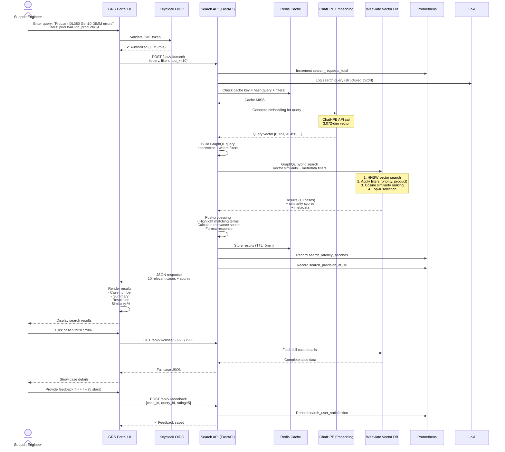
```mermaid
sequenceDiagram
    actor Engineer as Support Engineer
    participant Portal as GRS Portal UI
    participant Auth as Keycloak OIDC
    participant API as Search API (FastAPI)
    participant Cache as Redis Cache
    participant Embed as ChatHPE Embedding
    participant Weaviate as Weaviate Vector DB
    participant Metrics as Prometheus
    participant Logs as Loki

    Engineer->>Portal: Enter query: "ProLiant DL380 Gen10 DIMM errors"<br/>Filters: priority=High, product=34

    Portal->>Auth: Validate JWT token
    Auth-->>Portal: ✓ Authorized (GRS role)

    Portal->>API: POST /api/v1/search<br/>{query, filters, top_k=10}

    API->>Metrics: Increment search_requests_total
    API->>Logs: Log search query (structured JSON)

    API->>Cache: Check cache key = hash(query + filters)
    Cache-->>API: Cache MISS

    API->>Embed: Generate embedding for query
    Note over Embed: ChatHPE API call<br/>3,072-dim vector
    Embed-->>API: Query vector [0.123, -0.456, ...]

    API->>API: Build GraphQL query<br/>nearVector + where filters

    API->>Weaviate: GraphQL hybrid search<br/>Vector similarity + metadata filters

    Note over Weaviate: 1. HNSW vector search<br/>2. Apply filters (priority, product)<br/>3. Cosine similarity ranking<br/>4. Top-K selection

    Weaviate-->>API: Results (10 cases)<br/>+ similarity scores<br/>+ metadata

    API->>API: Post-processing<br/>- Highlight matching terms<br/>- Calculate relevance scores<br/>- Format response

    API->>Cache: Store results (TTL=5min)
    API->>Metrics: Record search_latency_seconds
    API->>Metrics: Record search_precision_at_10

    API-->>Portal: JSON response<br/>10 relevant cases + scores

    Portal->>Portal: Render results<br/>- Case number<br/>- Summary<br/>- Resolution<br/>- Similarity %

    Portal-->>Engineer: Display search results

    Engineer->>Portal: Click case 5392877906
    Portal->>API: GET /api/v1/cases/5392877906
    API->>Weaviate: Fetch full case details
    Weaviate-->>API: Complete case data
    API-->>Portal: Full case JSON
    Portal-->>Engineer: Show case details

    Engineer->>Portal: Provide feedback ⭐⭐⭐⭐⭐ (5 stars)
    Portal->>API: POST /api/v1/feedback<br/>{case_id, query_id, rating=5}
    API->>Metrics: Record search_user_satisfaction
    API-->>Portal: ✓ Feedback saved
```

---

## Performance Optimization Strategies

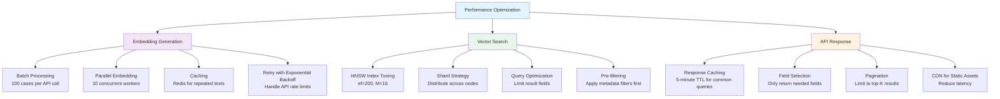
```mermaid
graph TB
    A[Performance Optimization] --> B[Embedding Generation]
    A --> C[Vector Search]
    A --> D[API Response]

    B --> B1[Batch Processing<br/>100 cases per API call]
    B --> B2[Parallel Embedding<br/>10 concurrent workers]
    B --> B3[Caching<br/>Redis for repeated texts]
    B --> B4[Retry with Exponential Backoff<br/>Handle API rate limits]

    C --> C1[HNSW Index Tuning<br/>ef=200, M=16]
    C --> C2[Shard Strategy<br/>Distribute across nodes]
    C --> C3[Query Optimization<br/>Limit result fields]
    C --> C4[Pre-filtering<br/>Apply metadata filters first]

    D --> D1[Response Caching<br/>5-minute TTL for common queries]
    D --> D2[Field Selection<br/>Only return needed fields]
    D --> D3[Pagination<br/>Limit to top-K results]
    D --> D4[CDN for Static Assets<br/>Reduce latency]

    style A fill:#E1F5FE
    style B fill:#F3E5F5
    style C fill:#E8F5E9
    style D fill:#FFF3E0
```

---

## Quality Verification Process

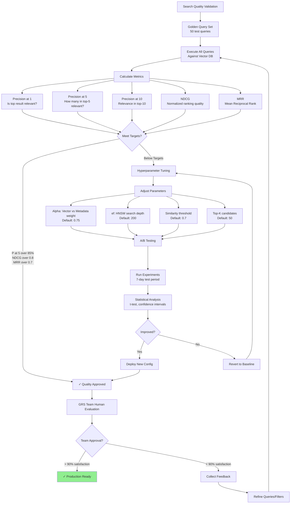
```mermaid
flowchart TB
    A[Search Quality Validation] --> B[Golden Query Set<br/>50 test queries]

    B --> C[Execute All Queries<br/>Against Vector DB]

    C --> D[Calculate Metrics]

    D --> E1["Precision at 1<br/>Is top result relevant?"]
    D --> E2["Precision at 5<br/>How many in top-5 relevant?"]
    D --> E3["Precision at 10<br/>Relevance in top-10"]
    D --> E4[NDCG<br/>Normalized ranking quality]
    D --> E5[MRR<br/>Mean Reciprocal Rank]

    E1 --> F{Meet Targets?}
    E2 --> F
    E3 --> F
    E4 --> F
    E5 --> F

    F -->|"P at 5 over 85%<br/>NDCG over 0.8<br/>MRR over 0.7"| G[✓ Quality Approved]
    F -->|Below Targets| H[Hyperparameter Tuning]

    H --> I[Adjust Parameters]
    I --> I1[Alpha: Vector vs Metadata weight<br/>Default: 0.75]
    I --> I2[ef: HNSW search depth<br/>Default: 200]
    I --> I3[Similarity threshold<br/>Default: 0.7]
    I --> I4[Top-K candidates<br/>Default: 50]

    I1 --> J[A/B Testing]
    I2 --> J
    I3 --> J
    I4 --> J

    J --> K[Run Experiments<br/>7-day test period]
    K --> L[Statistical Analysis<br/>t-test, confidence intervals]
    L --> M{Improved?}

    M -->|Yes| N[Deploy New Config]
    M -->|No| O[Revert to Baseline]

    N --> G
    O --> H

    G --> P[GRS Team Human Evaluation]
    P --> Q{Team Approval?}
    Q -->|> 90% satisfaction| R[✓ Production Ready]
    Q -->|< 90% satisfaction| S[Collect Feedback]
    S --> T[Refine Queries/Filters]
    T --> C

    style R fill:#90EE90
```

---

## Compliance & Security

```mermaid
graph TB
    A[Security & Compliance] --> B[Data Governance]
    A --> C[Access Control]
    A --> D[Encryption]
    A --> E[Audit & Compliance]

    B --> B1[PII Removal<br/>ZERO PII in vector DB]
    B --> B2[Data Classification<br/>Confidential, Internal Use]
    B --> B3[Retention Policy<br/>7 years for case data]
    B --> B4[Right to Deletion<br/>GDPR compliance]

    C --> C1[OIDC Authentication<br/>Keycloak integration]
    C --> C2[RBAC<br/>Role: GRS_Engineer, GRS_Admin]
    C --> C3[API Key Management<br/>Rotate every 90 days]
    C --> C4[IP Whitelisting<br/>HPE internal network only]

    D --> D1[TLS 1.3<br/>API traffic encryption]
    D --> D2[mTLS<br/>Service-to-service auth]
    D --> D3[AES-256<br/>Data at rest in Weaviate]
    D --> D4[LUKS<br/>Disk-level encryption]

    E --> E1[Audit Logs<br/>All API calls logged]
    E --> E2[PII Removal Audit<br/>Track all redactions]
    E --> E3[GDPR Compliance<br/>Data processing agreement]
    E --> E4[CCPA Compliance<br/>California privacy rights]

    style B1 fill:#FFCDD2
    style C1 fill:#C5E1A5
    style D1 fill:#B3E5FC
    style E3 fill:#FFF9C4
```

---

## Disaster Recovery & Business Continuity

```mermaid
flowchart TB
    A[Disaster Scenarios] --> B{Scenario Type}

    B -->|ChatHPE API Outage| C1[Fallback Strategy]
    C1 --> C2[Switch to Nomic API<br/>768-dim embeddings]
    C2 --> C3[Continue pipeline<br/>Pad vectors to 3,072-dim]

    B -->|Weaviate Cluster Failure| D1[Recovery Plan]
    D1 --> D2[Daily snapshots to S3<br/>Full backup every 24h]
    D2 --> D3[Restore from backup<br/>RTO: 4 hours<br/>RPO: 24 hours]
    D3 --> D4[Incremental replay<br/>Use reconciliation DB]

    B -->|Data Corruption| E1[Detection]
    E1 --> E2[Checksum validation<br/>Daily reconciliation job]
    E2 --> E3{Corruption Found?}
    E3 -->|Yes| E4[Identify corrupt records]
    E4 --> E5[Reprocess from staging<br/>Idempotent pipeline]

    B -->|Network Partition| F1[High Availability]
    F1 --> F2[Multi-zone Kubernetes<br/>3 availability zones]
    F2 --> F3[Weaviate replication<br/>Factor: 3]
    F3 --> F4[Load balancer failover<br/>Automatic]

    C3 --> G[Monitor & Alert]
    D4 --> G
    E5 --> G
    F4 --> G

    G --> H[Incident Response]
    H --> I[PagerDuty escalation<br/>On-call engineer]
    I --> J[Runbook execution<br/>Step-by-step recovery]
    J --> K[Post-mortem<br/>Document lessons learned]

    style G fill:#FFE082
    style K fill:#CE93D8
```

---

## Cost Analysis

```mermaid
graph LR
    A[Total Project Cost<br/>approximately 93,725 USD] --> B[Development]
    A --> C[Infrastructure]
    A --> D[AI/ML APIs]

    B --> B1[Engineering<br/>60,000 USD<br/>3 engineers × 12 weeks]
    B --> B2[Project Management<br/>10,000 USD]
    B --> B3[QA/Testing<br/>8,000 USD]

    C --> C1[Kubernetes Cluster<br/>5,000 USD<br/>PC AI platform]
    C --> C2[Weaviate Hosting<br/>3,000 USD<br/>3 nodes]
    C --> C3[PostgreSQL DB<br/>500 USD]

    D --> D1[ChatHPE Embedding API<br/>5,000 USD<br/>1M cases × 0.005 per case]
    D --> D2[Nomic Fallback<br/>500 USD<br/>approximately 10% fallback rate]
    D --> D3[OpenAI if needed<br/>1,725 USD<br/>Contingency]

    style A fill:#E1BEE7
```

### Cost Breakdown: Single Vector vs Multi-Vector

```mermaid
graph TB
    A[Embedding Cost Comparison] --> B[Single Vector Strategy<br/>CHOSEN]
    A --> C[Multi-Vector Strategy<br/>REJECTED]

    B --> B1[1M cases × 1 vector<br/>= 1M embeddings]
    B1 --> B2[Average tokens: 2,000<br/>Total: 2B tokens]
    B2 --> B3[ChatHPE cost: 0.0025 per 1K tokens<br/>Total: 5,000 USD]

    C --> C1[1M cases × 44 fields<br/>= 44M embeddings]
    C1 --> C2[Average tokens: 100 per field<br/>Total: 4.4B tokens]
    C2 --> C3[ChatHPE cost: 0.0025 per 1K tokens<br/>Total: 11,000 USD]

    B3 --> D[Savings: 6,000 USD - 53% cost reduction]
    C3 --> D

    style B fill:#90EE90
    style C fill:#FFB6C1
    style D fill:#FFD700
```

---

## Future Enhancements (Post-Launch)

```mermaid
mindmap
  root((KMS 2.5<br/>Future Roadmap))
    Advanced Search
      Semantic Clustering
        Group similar cases
        Trend detection
      Multi-lingual Support
        Spanish, French, Chinese
        Cross-language search
      Context-aware Search
        User role-based results
        Product expertise level
    Analytics
      Case Pattern Mining
        Identify recurring issues
        Proactive alerts
      Resolution Time Prediction
        ML model for ETA
        Resource allocation
      Product Quality Insights
        Defect trending
        Warranty analysis
    Integrations
      ServiceNow Integration
        Bi-directional sync
        Ticket enrichment
      Slack Bot
        Search via chat
        Alert notifications
      Mobile App
        iOS/Android clients
        Voice search
    Automation
      Auto-suggested Resolutions
        GPT-4 powered
        Contextual recommendations
      Case Auto-routing
        ML-based assignment
        Skills matching
      Knowledge Base Auto-update
        Extract from resolved cases
        Content generation
```

---

## Summary: Key Architectural Decisions

| Decision | Choice | Rationale |
|----------|--------|-----------|
| **Vector Strategy** | Single vector per case (44 fields concatenated) | 98% cost savings, simpler queries, holistic semantics |
| **Embedding Model** | ChatHPE text-embedding-3-large (3,072-dim) | High-quality embeddings, HPE internal API |
| **Vector Database** | Weaviate with HNSW index | Fast ANN search, GraphQL API, horizontal scaling |
| **Search Strategy** | Hybrid (vector + metadata filters) | Precision through structured filters, recall through semantic search |
| **PII Handling** | Multi-stage removal (Regex + NER + Presidio) | Zero PII tolerance, compliance with GDPR/CCPA |
| **Orchestration** | Apache Airflow with idempotent DAGs | Retry logic, monitoring, safe reprocessing |
| **Reconciliation** | PostgreSQL with checksums | Data integrity, auditability, gap detection |
| **Deployment** | Phased (1K → 100K → 1M+) | Risk mitigation, early validation, iterative improvement |
| **Observability** | Prometheus + Loki + Grafana + Jaeger | Complete visibility, proactive alerting, debugging |

---

## Document Version

- **Version**: 1.0
- **Last Updated**: November 11, 2025
- **Author**: Generated for HPE KMS 2.5 Project
- **Status**: Technical Planning Documentation

---

For implementation details, refer to the individual reference documents in `/reference_docs/`.
