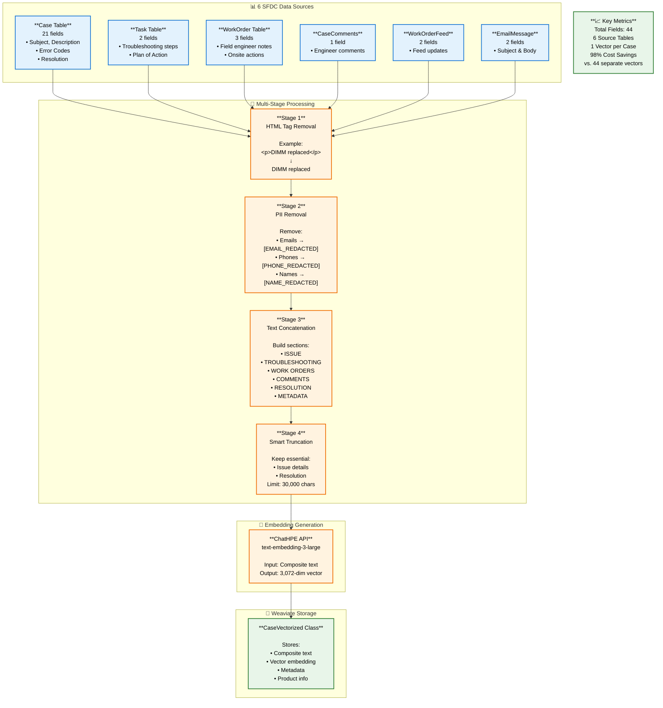

# Text Field Embedding Strategy - Summary

## Overview
This document provides a simplified summary of how we handle 44 text fields from 6 SFDC tables to create semantic embeddings for support case search.

---

## Visual Flow Diagram



---

## Step-by-Step Process Summary

### Step 1: Collect Data from 6 SFDC Tables

We gather information from multiple Salesforce tables to get the complete story of each support case:

**Table 1: Case (21 fields)**
- **Issue information**: Subject, Description, Error Codes, Environment Details
  - Example Subject: "Server boot failure - DIMM errors"
  - Example Error Code: "218004" or "iLO_400_MemoryErrors"
- **Resolution information**: Resolution Summary, Root Cause, Resolution Code
  - Example: "Engineer visited site and replaced DIMM"

**Table 2: Task (2 fields)**
- Troubleshooting steps taken by engineers
- Example: "Informed customer we will check with extended diagnostics team"

**Table 3: WorkOrder (3 fields)**
- Field engineer actions performed onsite
- Example: "Check case log, contact customer, collect log, disk replacement"

**Table 4: CaseComments (1 field)**
- Engineer comments and updates
- Example: "The quote NQ09405645 is now Orderable and ready to work"

**Table 5: WorkOrderFeed (2 fields)**
- Feed updates and notes
- Example: "Partner Notes20251009, CE: Zaid..."

**Table 6: EmailMessage (2 fields)**
- Email communications between customer and support
- Example Subject: "RE: HPE Support Case 5392877906"

---

### Step 2: Remove HTML Tags

Many resolution fields contain HTML formatting that needs to be cleaned.

**Before**:
```
<p>DIMM replaced successfully</p><br/><strong>System rebooted</strong>
```

**After**:
```
DIMM replaced successfully. System rebooted
```

---

### Step 3: Remove Personal Information (PII)

Protect customer privacy by removing sensitive information across all 6 tables:

**What Gets Removed**:
- **Email addresses**: john.doe@company.com → [EMAIL_REDACTED]
- **Phone numbers**: +1-555-123-4567 → [PHONE_REDACTED]
- **IP addresses**: 192.168.1.100 → [IP_REDACTED]
- **Person names**: John Smith → [NAME_REDACTED]
- **Physical addresses**: 123 Main Street → [ADDRESS_REDACTED]
- **Serial numbers**: SN: XYZ12345678 → [SERIAL_REDACTED]

**Example**:
```
Before: "Contact john.doe@company.com at +1-555-123-4567 for site at 123 Main St"
After: "Contact [EMAIL_REDACTED] at [PHONE_REDACTED] for site at [ADDRESS_REDACTED]"
```

---

### Step 4: Build Composite Text with Structured Sections

Combine all 44 fields from 6 tables into one organized text document:

**Structure**:
```
CASE NUMBER: 5392877906
CASE ID: 500XXXXX

=== ISSUE ===
SUBJECT: Server boot failure - DIMM errors
DESCRIPTION: ProLiant DL380 showing POST error 1796
CAUSE: DIMM failure detected in Processor 2 Slot 12
ERROR CODES: 218004, iLO_400_MemoryErrors
ENVIRONMENT: Model: DL360 Gen9, OS: Windows Server 2019
ISSUE TYPE: Product Non-functional

=== TROUBLESHOOTING STEPS ===
TASK 1 - Plan of Action:
Informed customer we will check with extended diagnostics team
Ran memory diagnostics to identify faulty module

=== WORK ORDERS ===
WORK ORDER 1:
Problem: Fault - Faulty RAM in Processor 2 Slot 12
Onsite Action: Check case log, contact customer, collect log
Closing Summary: disk replacement completed, system operational

=== ENGINEER COMMENTS ===
Comment 1: Memory diagnostics confirmed DIMM failure
Comment 2: Replacement part shipped, tracking number provided

=== EMAIL COMMUNICATIONS ===
Email 1 Subject: RE: HPE Support Case 5392877906
Email Body: Dear Customer, Thank you for choosing HPE...

=== RESOLUTION ===
RESOLUTION SUMMARY: DIMM replaced, system tested and operational
RESOLUTION: Engineer visited site and replaced faulty DIMM in Slot 12
RESOLUTION CODE: Onsite Repair
ROOT CAUSE: Hardware failure - Memory module defect
CLOSE COMMENTS: Case resolved, customer satisfied

=== METADATA ===
PRODUCT NUMBER: 867055-B21
PRODUCT LINE: ProLiant DL380 Gen9
ISSUE TYPE: Product Non-functional
```

**Why This Approach?**
- Complete context in one document
- Maintains natural issue → troubleshooting → resolution flow
- All related information stays together
- Better semantic understanding for AI

---

### Step 5: Smart Truncation (if needed)

If the combined text exceeds 30,000 characters (about 8,192 tokens), we intelligently trim it:

**What We Keep** (Essential):
- ISSUE section
- RESOLUTION section
- METADATA section

**What We May Trim** (if space is tight):
- Middle troubleshooting steps
- Some comments
- Older emails

**Example**:
```
CASE NUMBER: 5392877906

=== ISSUE ===
[Full issue details preserved]

=== TROUBLESHOOTING STEPS ===
TASK 1: First diagnostic step...
TASK 2: Second diagnostic step...

[... TROUBLESHOOTING STEPS AND COMMENTS TRUNCATED ...]

=== RESOLUTION ===
[Full resolution preserved]

=== METADATA ===
[Full metadata preserved]
```

---

### Step 6: Generate Embedding Vector

Send the composite text to ChatHPE API to create a mathematical representation:

**Input**: Complete composite text (up to 30,000 characters)

**Process**: ChatHPE text-embedding-3-large model converts text into numbers

**Output**: Vector of 3,072 numbers representing the semantic meaning

**Example Concept**:
```
Text: "Server boot failure due to DIMM error, replaced memory module"
↓
Vector: [0.023, -0.145, 0.892, ..., 0.334] (3,072 numbers)
```

Similar cases will have vectors that are mathematically close to each other.

---

### Step 7: Store in Weaviate Vector Database

Save both the text and vector in Weaviate for fast semantic search:

**What Gets Stored**:
- **Identifiers**: Case Number (5392877906), Case ID
- **Original text fields**: Subject, Description, Resolution (for display)
- **Composite text**: The full concatenated text we created
- **Vector**: The 3,072-dimensional embedding
- **Metadata**: Product info, dates, priority, status

**Search Benefits**:
When a user searches "memory failure DL380", the system:
1. Converts their query to a vector
2. Finds cases with similar vectors (semantic match)
3. Returns relevant cases even if exact words don't match
   - "DIMM error" matches "memory module failure"
   - "Boot issue" matches "POST failure"

---

## Why This Strategy Works

### Single Vector Approach Benefits

**1. Complete Context**
- All 44 fields from 6 tables in one embedding
- System understands full case narrative
- Better semantic matching

**2. Cost Efficient**
- 1 vector per case instead of 44 vectors
- 98% cost savings on embedding generation
- Lower storage costs

**3. Simpler Queries**
- One vector search instead of joining multiple tables
- Faster response times
- Easier to maintain

**4. Handles Missing Data**
- Works even if some tables are empty
- No null value issues
- Graceful degradation

---

## Key Metrics

| Metric | Value |
|--------|-------|
| Source Tables | 6 (Case, Task, WorkOrder, CaseComments, WorkOrderFeed, EmailMessage) |
| Total Fields | 44 |
| Vectors per Case | 1 (composite) |
| Vector Dimensions | 3,072 |
| Token Limit | 8,192 tokens (~30,000 characters) |
| Embedding Model | ChatHPE text-embedding-3-large |
| Cost Savings | 98% vs. separate field embeddings |

---

## Real-World Example

**Original Data Across 6 Tables**:
- Case Subject: "ProLiant DL380 Gen9 - Server not booting"
- Case Description: "Customer reports POST error 1796, memory failure indicated"
- Case Error Codes: "218004, iLO_400_MemoryErrors"
- Task Description: "Ran memory diagnostics, identified slot 12 failure"
- WorkOrder Problem: "Fault - Faulty RAM in Processor 2 Slot 12"
- WorkOrder Action: "Replaced DIMM module, tested system"
- CaseComment: "Replacement part shipped overnight"
- Email Body: "Dear customer, engineer will visit tomorrow..."
- Case Resolution: "Faulty DIMM replaced, system operational"

**After Processing** → Single composite text with all information organized

**After Embedding** → Vector [0.023, -0.145, ..., 0.334] representing complete case semantics

**Search Result**: When someone searches "memory error DL380", this case appears as a top match even though they didn't use the exact words "DIMM failure POST 1796"

---

## Conclusion

This multi-table concatenation strategy creates a comprehensive semantic representation of support cases by:
1. Gathering all relevant text from 6 SFDC tables (44 fields)
2. Cleaning and protecting customer privacy
3. Organizing into structured sections
4. Creating a single powerful embedding vector
5. Enabling accurate semantic search

The result is a cost-effective, accurate, and maintainable solution for finding similar support cases.
