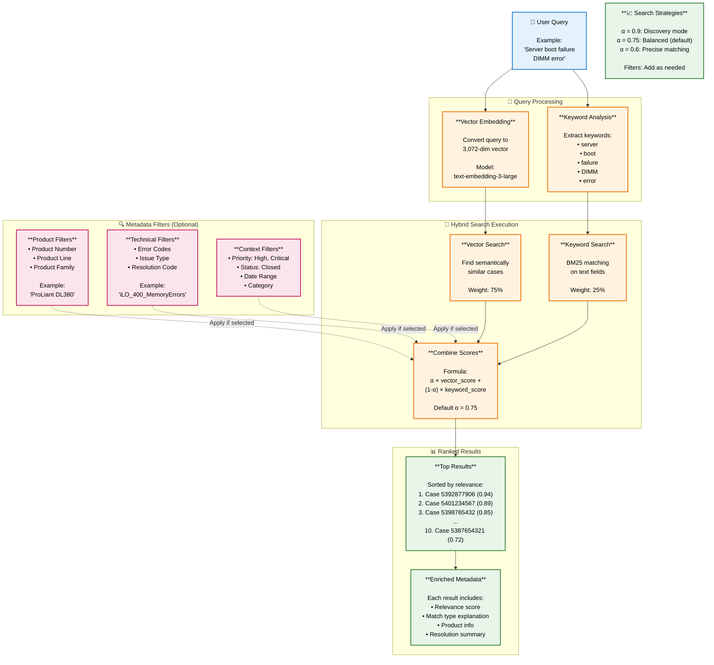

# Hybrid Search Strategy - Summary

## Overview
This document explains how we combine semantic vector search with structured metadata filters to provide precise, contextually relevant support case results.

---

## Visual Flow Diagram



---

## What is Hybrid Search?

Hybrid search combines two powerful search methods:

1. **Semantic Search (Vector-based)**: Understands meaning and context
   - "Memory failure" matches "DIMM error" even though words differ
   - "Boot problem" matches "POST failure"

2. **Keyword Search (BM25)**: Finds exact term matches
   - Exact error codes: "218004", "iLO_400_MemoryErrors"
   - Product numbers: "867055-B21"
   - Specific technical terms

3. **Metadata Filters**: Narrows results by structured data
   - Product: ProLiant DL380
   - Priority: High, Critical
   - Date: Last 6 months
   - Status: Closed (resolved cases)

---

## Step-by-Step Process

### Step 1: User Submits Query

**Example**: "Server not booting, showing memory errors on ProLiant DL380"

The query contains:
- **Natural language description**: "Server not booting"
- **Technical terms**: "memory errors"
- **Product context**: "ProLiant DL380"

---

### Step 2: Query Processing (Dual Path)

#### Path A: Vector Embedding
The query is converted to a 3,072-dimensional vector using the same model that embedded the cases.

**Example**:
```
Query: "Server not booting, showing memory errors"
↓
Vector: [0.145, -0.023, 0.892, ..., 0.334] (3,072 numbers)
```

#### Path B: Keyword Extraction
Keywords are identified for exact matching:
- server
- booting
- memory
- errors
- ProLiant
- DL380

---

### Step 3: Apply Metadata Filters (Optional)

Users can narrow results by selecting filters:

**Product Filters**:
- Product Number: "867055-B21"
- Product Line: "34" (ProLiant)
- Product Family: "ProLiant"

**Technical Filters**:
- Error Codes: "iLO_400_MemoryErrors", "POST_1796"
- Issue Type: "Product Non-functional"
- Resolution Code: "Onsite Repair"
- Root Cause: "Hardware failure"

**Context Filters**:
- Priority: High, Critical
- Status: Closed (only resolved cases)
- Date Range: Last 6 months
- Category: Hardware > Server > Memory

**Example Filter Selection**:
```
Product Family: "ProLiant"
Priority: High, Critical
Status: Closed
Date Range: 2024-06-01 to 2024-12-31
```

---

### Step 4: Execute Hybrid Search

The system performs two searches simultaneously:

#### Search A: Vector Similarity (75% weight)
Finds cases with similar semantic meaning:
```
Case 5392877906: 0.94 similarity
  "ProLiant DL380 Gen9 boot failure - DIMM errors"

Case 5401234567: 0.89 similarity
  "Server POST error 1796 - Memory module fault"

Case 5398765432: 0.85 similarity
  "DL360 Gen10 - RAM failure preventing boot"
```

#### Search B: Keyword Matching (25% weight)
Finds cases with exact keyword matches:
```
Case 5392877906: Matches "boot", "memory", "error", "ProLiant"
Case 5387654321: Matches "DL380", "memory", "error"
Case 5405678901: Matches "server", "boot", "ProLiant"
```

---

### Step 5: Combine Scores

Scores from both searches are combined using a weighted formula:

**Formula**: `Final Score = (α × Vector Score) + ((1-α) × Keyword Score)`

**Default α = 0.75** (75% semantic, 25% keyword)

**Example Calculation**:
```
Case 5392877906:
  Vector Score: 0.94
  Keyword Score: 0.88
  Final Score: (0.75 × 0.94) + (0.25 × 0.88) = 0.705 + 0.220 = 0.925

Case 5401234567:
  Vector Score: 0.89
  Keyword Score: 0.76
  Final Score: (0.75 × 0.89) + (0.25 × 0.76) = 0.668 + 0.190 = 0.858
```

---

### Step 6: Apply Metadata Filters

Only cases matching ALL selected filters are included:

**Before Filters**: 150 matching cases
**After Filters**:
- Product Family = "ProLiant": 87 cases
- Priority = High or Critical: 43 cases
- Status = Closed: 38 cases
- Date Range (last 6 months): 25 cases

**Final**: 25 cases pass all filters

---

### Step 7: Rank and Return Results

Cases are sorted by final score and returned with enriched information:

```
Result 1: Case 5392877906 (Score: 0.925)
  Title: "ProLiant DL380 Gen9 - Server boot failure DIMM errors"
  Match Type: "Exact semantic match"
  Product: ProLiant DL380 Gen9
  Priority: High
  Status: Closed
  Resolution: "Faulty DIMM replaced in Slot 12, system operational"
  Created: 2024-08-15
  Closed: 2024-08-16

Result 2: Case 5401234567 (Score: 0.858)
  Title: "POST error 1796 - Memory module failure"
  Match Type: "Strong semantic similarity"
  Product: ProLiant DL360 Gen10
  Priority: Critical
  Status: Closed
  Resolution: "Memory diagnostics identified bad module, replaced"
  Created: 2024-09-22
  Closed: 2024-09-23

Result 3: Case 5398765432 (Score: 0.801)
  Title: "DL380 Gen10 - Boot failure RAM issue"
  Match Type: "Strong semantic similarity"
  Product: ProLiant DL380 Gen10
  Priority: High
  Status: Closed
  Resolution: "Reseated memory modules, ran diagnostics, issue resolved"
  Created: 2024-11-02
  Closed: 2024-11-03
```

---

## Four Search Strategies

### Strategy 1: Broad Discovery Search

**When to use**: Exploring issues without specific product knowledge

**Configuration**:
- **α = 0.9** (90% semantic, 10% keyword)
- **Filters**: None
- **Results**: 20-50 cases

**Example**:
```
Query: "network timeout issues"
Filters: None
Result: Cases from all products with network connectivity problems
```

**Best for**:
- New engineers learning about issues
- Cross-product pattern discovery
- Exploring unfamiliar problems

---

### Strategy 2: Product-Specific Troubleshooting

**When to use**: Working on a specific product issue

**Configuration**:
- **α = 0.75** (75% semantic, 25% keyword) - Balanced
- **Filters**: Product Family + Status = Closed
- **Results**: 10-15 cases

**Example**:
```
Query: "firmware update fails with checksum error"
Filters:
  - Product Family: "ProLiant"
  - Status: "Closed"
  - Priority: High, Critical
Result: Resolved ProLiant firmware cases with similar errors
```

**Best for**:
- Active troubleshooting
- Finding proven solutions
- Product-specific issues

---

### Strategy 3: Recent Trends Analysis

**When to use**: Identifying recurring issues in recent timeframe

**Configuration**:
- **α = 0.6** (60% semantic, 40% keyword) - More precise
- **Filters**: Date Range + Category
- **Results**: 30-50 cases

**Example**:
```
Query: "disk failure predictions"
Filters:
  - Date Range: Last 3 months (2024-09-01 to 2024-12-01)
  - Category: "Storage"
Result: Recent storage-related cases for trend analysis
```

**Best for**:
- Quality analysis
- Identifying emerging issues
- Seasonal pattern detection

---

### Strategy 4: Cross-Product Pattern Detection

**When to use**: Finding similar issues across different products

**Configuration**:
- **α = 0.85** (85% semantic, 15% keyword) - High semantic
- **Filters**: Category + Status only (no product filter)
- **Results**: 20-30 cases

**Example**:
```
Query: "iLO firmware update failure"
Filters:
  - Status: "Closed"
  - Category: "Firmware"
Result: iLO firmware issues across all ProLiant generations
```

**Best for**:
- Root cause analysis
- Firmware/software bugs affecting multiple products
- Engineering team insights

---

## Understanding the Alpha (α) Parameter

The alpha parameter controls the balance between semantic and keyword search:

| α Value | Semantic % | Keyword % | Best Use Case | Example |
|---------|-----------|-----------|---------------|---------|
| **0.9** | 90% | 10% | Broad exploration | "What issues affect servers?" |
| **0.8** | 80% | 20% | Conceptual search | "Memory performance problems" |
| **0.75** | 75% | 25% | **Default balanced** | "DIMM failure boot error" |
| **0.6** | 60% | 40% | Precise matching | "Error code 218004" |
| **0.5** | 50% | 50% | Equal weight | Technical documentation search |

**Rule of Thumb**:
- **Higher α (0.8-0.9)**: Use when query is conceptual or exploratory
- **Medium α (0.7-0.8)**: Use for typical troubleshooting (default)
- **Lower α (0.5-0.6)**: Use when exact terms/codes are critical

---

## Available Metadata Filters

### Product Filters
| Filter | Example Values | Use Case |
|--------|---------------|----------|
| Product Number | "867055-B21", "BB958A" | Exact product SKU |
| Product Line | "34", "3S", "TI" | Product line code |
| Product Series | "1008995294" | Series identifier |
| Product Family | "ProLiant", "Synergy", "Aruba" | Product category |

### Technical Filters
| Filter | Example Values | Use Case |
|--------|---------------|----------|
| Error Codes | "218004", "iLO_400_MemoryErrors", "FTO-4D" | Specific error matching |
| Issue Type | "Product Non-functional", "Help me/How to" | Issue categorization |
| Resolution Code | "Onsite Repair", "Part Shipped", "Electronic Case AutoClose" | Resolution method |
| Root Cause | "Hardware failure", "Software bug", "Configuration error" | Root cause analysis |

### Context Filters
| Filter | Example Values | Use Case |
|--------|---------------|----------|
| Priority | "Low", "Medium", "High", "Critical" | Severity matching |
| Status | "Open", "In Progress", "Closed", "Escalated" | Case state |
| Category | "Hardware > Server > Memory" | Issue category |
| Date Range | "2024-01-01 to 2024-12-31" | Time-based filtering |
| Case Number | "5392877906" | Exact case lookup |

---

## Multi-Stage Adaptive Search

For best results, the system can use a "fallback" approach:

### Stage 1: Strict Search (High Precision)
```
Query: "DL380 boot failure"
Filters:
  - Product: "ProLiant DL380 Gen9" (exact match)
  - Priority: High, Critical
Alpha: 0.8
Limit: 5

Result: 5 cases found with score > 0.85
✓ Success → Return results
```

### Stage 2: Relaxed Product Filter (Medium Precision)
```
If Stage 1 finds < 5 results OR top score < 0.85:

Query: "DL380 boot failure"
Filters:
  - Product Family: "ProLiant" (broader match)
  - Priority: High, Critical
Alpha: 0.8
Limit: 10

Result: 10 cases found with score > 0.75
✓ Success → Return results
```

### Stage 3: Open Search (High Recall)
```
If Stage 2 finds < 5 results OR top score < 0.75:

Query: "DL380 boot failure"
Filters: None
Alpha: 0.6 (more keyword weight for precision)
Limit: 20

Result: 20 cases found
✓ Always returns results
```

This ensures users always get relevant results, even for rare issues.

---

## Real-World Search Examples

### Example 1: Specific Error Code Search

**User Query**: "Error code 218004 on ProLiant server"

**System Processing**:
- Detects error code "218004" → Use lower alpha for precision
- Detects "ProLiant" → Apply product filter
- Configuration: α = 0.65, Product Family = "ProLiant"

**Results**:
```
1. Case 5392877906 (0.92) - "DL380 Gen9 error 218004 DIMM failure"
2. Case 5387654321 (0.88) - "DL360 Gen10 POST error 218004"
3. Case 5401237890 (0.84) - "ProLiant error 218004 memory issue"
```

**Why it works**: Keyword search heavily weights exact error code match, semantic search finds contextually similar memory issues.

---

### Example 2: Conceptual Search

**User Query**: "Server randomly rebooting without error messages"

**System Processing**:
- Conceptual query → Use higher alpha for semantic understanding
- No specific product → No product filter
- Configuration: α = 0.85, No filters

**Results**:
```
1. Case 5405678901 (0.87) - "Unexpected server restart - power supply issue"
2. Case 5398123456 (0.83) - "Intermittent reboot - thermal shutdown"
3. Case 5393456789 (0.81) - "System crash without logs - memory fault"
```

**Why it works**: Semantic search understands "randomly rebooting" relates to "unexpected restart", "intermittent reboot", "system crash" even though exact words differ.

---

### Example 3: Product-Specific with Date Range

**User Query**: "iLO connection issues"

**Filters Applied**:
- Product Family: "ProLiant"
- Date Range: Last 3 months
- Status: Closed
- Priority: High, Critical

**Configuration**: α = 0.75 (balanced)

**Results**:
```
1. Case 5407890123 (0.91) - "iLO web interface timeout - firmware updated"
   Date: 2024-10-15, Resolution: "Updated iLO firmware to 2.78"

2. Case 5404567890 (0.86) - "Cannot access iLO remotely - network config"
   Date: 2024-09-28, Resolution: "Corrected network settings"

3. Case 5401234098 (0.82) - "iLO not responding - power reset resolved"
   Date: 2024-11-03, Resolution: "Reset iLO to factory defaults"
```

**Why it works**: Filters ensure only recent, resolved, high-priority ProLiant cases appear. Hybrid search finds both exact "iLO" matches and conceptually similar connectivity issues.

---

## Key Benefits of Hybrid Search

### 1. Better Relevance
- **Semantic component** understands meaning and context
- **Keyword component** ensures exact term matches aren't missed
- **Combined**: Best of both worlds

### 2. Flexibility
- Adjust α to control semantic vs. keyword balance
- Add filters as needed for precision
- No filters needed for discovery

### 3. Handles Varied Queries
- **Technical**: "Error code iLO_400_MemoryErrors" → Keyword-heavy
- **Conceptual**: "Server performance degraded" → Semantic-heavy
- **Mixed**: "DL380 boot failure DIMM" → Balanced

### 4. Context-Aware
- Filter by product for relevant results
- Filter by date for recent solutions
- Filter by status for proven resolutions

### 5. Explainable Results
- Each result shows relevance score
- Match type explains why it matched
- Users can adjust filters and α to tune results

---

## Search Performance Metrics

| Metric | Target | Description |
|--------|--------|-------------|
| **Response Time** | < 500ms | Time to return results |
| **Recall@10** | > 85% | % of relevant cases in top 10 |
| **Precision@10** | > 75% | % of top 10 that are relevant |
| **Mean Reciprocal Rank** | > 0.8 | Position of first relevant result |
| **User Click-Through** | > 60% | % of searches resulting in case view |

---

## Conclusion

Hybrid search combines:
1. **Vector similarity** (semantic understanding) - 75% weight
2. **Keyword matching** (exact terms) - 25% weight
3. **Metadata filters** (structured filtering) - Applied on top

This three-part approach ensures:
- **Semantic matches**: "DIMM error" finds "memory failure"
- **Exact matches**: "218004" finds error code exactly
- **Contextual filtering**: Only ProLiant cases from last quarter

The result is accurate, flexible, and fast support case search that helps engineers find solutions quickly.

---

## Quick Reference Guide

### Choosing the Right Strategy

| Your Situation | Recommended α | Filters to Apply | Result Count |
|----------------|---------------|------------------|--------------|
| Don't know much about the issue | 0.85-0.9 | None | 20-30 |
| Working on specific product | 0.75 | Product + Status | 10-15 |
| Have exact error code | 0.6-0.65 | Error Code + Product | 5-10 |
| Looking for recent trends | 0.6-0.7 | Date Range + Category | 30-50 |
| Cross-product analysis | 0.85 | Status + Category only | 20-30 |

### Filter Selection Tips

1. **Always filter by Status = "Closed"** when looking for solutions
2. **Use Product Family** instead of exact product for broader results
3. **Add Date Range** for current/relevant issues
4. **Include Priority** to match severity level
5. **Use Error Codes** when available for precision
