# Quality Verification in Early Phases - Summary

## Overview
This document outlines the systematic quality verification process across three development phases (Weeks 2-8) to ensure search accuracy meets the >85% precision@5 target before production deployment.

---

## Visual Flow Diagram

```mermaid
graph TB
    %% Define Styles
    classDef phase1Style fill:#E3F2FD,stroke:#1976D2,stroke-width:3px,color:#000
    classDef phase2Style fill:#FFF3E0,stroke:#EF6C00,stroke-width:3px,color:#000
    classDef phase3Style fill:#E8F5E9,stroke:#2E7D32,stroke-width:3px,color:#000
    classDef testStyle fill:#FCE4EC,stroke:#C2185B,stroke-width:2px,color:#000
    classDef metricStyle fill:#F3E5F5,stroke:#7B1FA2,stroke-width:2px,color:#000

    %% Timeline
    Start["🚀 Development Start"]:::phase1Style

    %% Phase 1: Week 2-3
    subgraph Phase1["📋 Phase 1: Schema & API Validation (Week 2-3)"]
        P1_Sample["**Step 1: Sample Selection**<br/><br/>Select 1,000 cases<br/>Stratified by:<br/>• Product families<br/>• Priority levels<br/>• Complexity<br/>• Last 6 months"]:::phase1Style

        P1_Golden["**Step 2: Golden Queries**<br/><br/>Create 50 test queries<br/>Cover all 6 tables:<br/>• Case, Task, WorkOrder<br/>• Comments, Feed, Email<br/>Define expected results"]:::phase1Style

        P1_Tests["**Step 3: Automated Tests**<br/><br/>7 quality checks:<br/>✓ Embedding generation<br/>✓ PII removal<br/>✓ Multi-table joins<br/>✓ Field validation<br/>✓ Error codes<br/>✓ Weaviate load<br/>✓ Search API"]:::testStyle

        P1_Results["**Step 4: Baseline Results**<br/><br/>Target: P@5 > 75%<br/>Latency: < 1s<br/>PII leaks: 0<br/>Success rate: > 99%"]:::metricStyle
    end

    %% Phase 2: Week 6
    subgraph Phase2["👥 Phase 2: GRS Team Validation (Week 6)"]
        P2_Load["**Step 1: 100K Load**<br/><br/>Load 100,000 cases<br/>Last 3 months<br/>All product families<br/>Closed/resolved only"]:::phase2Style

        P2_Interface["**Step 2: Validation UI**<br/><br/>Create evaluation tool<br/>50 realistic queries<br/>5-star rating system<br/>GRS team testing"]:::phase2Style

        P2_Eval["**Step 3: Human Evaluation**<br/><br/>5 GRS engineers<br/>Rate top 5 results<br/>Mark helpful cases<br/>Provide feedback"]:::testStyle

        P2_Metrics["**Step 4: Calculate Metrics**<br/><br/>Precision@1, @3, @5, @10<br/>NDCG@5<br/>MRR<br/>By product family"]:::metricStyle

        P2_Report["**Step 5: Validation Report**<br/><br/>Target: P@5 > 85%<br/>NDCG@5 > 0.85<br/>MRR > 0.80<br/>Identify gaps"]:::metricStyle
    end

    %% Phase 3: Week 7-8
    subgraph Phase3["🎯 Phase 3: Accuracy Tuning & Regression (Week 7-8)"]
        P3_Tune["**Step 1: Hyperparameter Tuning**<br/><br/>Test combinations:<br/>• Alpha: 0.6 to 0.9<br/>• HNSW ef: 100-400<br/>• Threshold: 0.65-0.80<br/>Find optimal config"]:::phase3Style

        P3_Regression["**Step 2: Regression Suite**<br/><br/>5 automated tests:<br/>• Golden query precision<br/>• Product-specific accuracy<br/>• Query latency<br/>• No degradation<br/>• PII leakage"]:::testStyle

        P3_AB["**Step 3: A/B Testing**<br/><br/>Compare configs:<br/>Variant A vs B<br/>50/50 traffic split<br/>Statistical analysis"]:::phase3Style

        P3_Dashboard["**Step 4: Quality Dashboard**<br/><br/>Real-time monitoring:<br/>• Precision trends<br/>• Latency p95<br/>• Success rate<br/>• Zero results rate"]:::metricStyle

        P3_Production["**Step 5: Production Ready**<br/><br/>✓ All metrics met<br/>✓ Regression tests pass<br/>✓ Dashboard live<br/>✓ Documentation complete"]:::metricStyle
    end

    %% Decision Points
    Decision1{"P@5 > 75%?"}:::testStyle
    Decision2{"P@5 > 85%?"}:::testStyle
    Decision3{"All tests pass?"}:::testStyle

    %% Production
    Production["🎉 Production Deployment"]:::phase3Style

    %% Flow
    Start --> P1_Sample
    P1_Sample --> P1_Golden
    P1_Golden --> P1_Tests
    P1_Tests --> P1_Results
    P1_Results --> Decision1

    Decision1 -->|Yes| P2_Load
    Decision1 -->|No| P1_Tests

    P2_Load --> P2_Interface
    P2_Interface --> P2_Eval
    P2_Eval --> P2_Metrics
    P2_Metrics --> P2_Report
    P2_Report --> Decision2

    Decision2 -->|Yes| P3_Tune
    Decision2 -->|No| P1_Tests

    P3_Tune --> P3_Regression
    P3_Regression --> P3_AB
    P3_AB --> P3_Dashboard
    P3_Dashboard --> P3_Production
    P3_Production --> Decision3

    Decision3 -->|Yes| Production
    Decision3 -->|No| P3_Tune

    %% Stats Box
    Stats["**📊 Success Criteria**<br/><br/>Week 2-3: P@5 > 75%<br/>Week 6: P@5 > 85%<br/>Week 7-8: Production ready<br/>Latency: < 1s<br/>PII leaks: 0"]:::metricStyle
```



---

## Three-Phase Quality Verification Process

### Timeline Overview

| Phase | Timeline | Data Size | Focus | Key Metric | Status Gate |
|-------|----------|-----------|-------|------------|-------------|
| **Phase 1** | Week 2-3 | 1,000 cases | Schema & API validation | P@5 > 75% | Technical validation |
| **Phase 2** | Week 6 | 100,000 cases | Human evaluation | P@5 > 85% | User acceptance |
| **Phase 3** | Week 7-8 | Full dataset | Tuning & monitoring | Production ready | Launch readiness |

---

## Phase 1: Schema & API Validation (Week 2-3)

### Goal
Verify that the basic infrastructure works correctly with a small representative sample before scaling up.

---

### Step 1: Select Representative Sample (1,000 Cases)

**Purpose**: Get a diverse, manageable dataset for initial testing

**Selection Criteria**:

**By Product Family** (ensure all products represented):
- ProLiant servers: 400 cases (40%)
- Synergy: 200 cases (20%)
- Aruba networking: 200 cases (20%)
- Storage (3PAR, Nimble): 150 cases (15%)
- Other products: 50 cases (5%)

**By Priority** (match real-world distribution):
- Critical: 200 cases (20%)
- High: 300 cases (30%)
- Medium: 400 cases (40%)
- Low: 100 cases (10%)

**By Complexity** (based on description length):
- Simple (<200 chars): 300 cases - Quick fixes
- Moderate (200-800 chars): 500 cases - Standard troubleshooting
- Complex (>800 chars): 200 cases - Multi-step resolutions

**Additional Filters**:
- Status: Only "Closed" or "Resolved" cases
- Must have resolution text
- Created in last 6 months (recent, relevant cases)
- Description length > 50 characters

**Example Sample**:
```
Case 5392877906 - ProLiant DL380, High priority, Moderate complexity
Case 5401234567 - Synergy 480, Critical priority, Complex
Case 5398765432 - Aruba Switch, Medium priority, Simple
... (997 more cases)
```

---

### Step 2: Create Golden Query Set (50 Queries)

**Purpose**: Establish ground truth test queries with known expected results

**Query Types** (covering all 6 tables and 44 fields):

**1. Standard Product Issues** (20 queries):
```
Query: "server fails to boot after firmware update"
Expected cases: Case 5392877906, Case 5401234567
Expected products: ProLiant
Expected categories: Hardware, Firmware
Min precision@5: 80%
```

**2. Error Code Searches** (10 queries):
```
Query: "iLO_400_MemoryErrors"
Filters: errorCodes = ["iLO_400_MemoryErrors"]
Expected products: ProLiant
Expected resolution: Onsite Repair, Part Shipped
Min precision@5: 95% (exact match should be very accurate)
```

**3. Multi-Table Searches** (10 queries):
```
Query: "replaced DIMM memory module onsite"
Expected tables: Case + Task + WorkOrder (tests full data integration)
Expected products: ProLiant, Synergy
Expected resolution: Onsite Repair
Min precision@5: 85%
```

**4. Comments/Email Searches** (5 queries):
```
Query: "customer confirmed resolution successful"
Expected tables: CaseComments + EmailMessage
Expected status: Closed
Min precision@5: 80%
```

**5. Issue Type Filters** (5 queries):
```
Query: "product not working as expected"
Filters: issueType = "Product Non-functional/Not working as Expected"
Expected status: Closed
Min precision@5: 80%
```

**How Queries Are Created**:
1. Take 50 diverse resolved cases
2. Extract key phrases from titles/descriptions
3. Manually identify 2-5 similar cases for each
4. Define expected products, categories, error codes
5. Set minimum precision thresholds

---

### Step 3: Run 7 Automated Quality Checks

**Test 1: Embedding Generation Success**
- Generate embeddings for all 1,000 composite texts
- **Target**: >99% success rate
- **Example Result**: 997/1000 successful = 99.7% ✓

**Test 2: PII Removal Verification (All 6 Tables)**
- Scan processed text for emails, phone numbers, IPs, names
- Check Case, Task, WorkOrder, Comments, Feed, Email tables
- **Target**: 0 PII leaks
- **Example Result**: 0 PII patterns detected ✓

**Test 3: Multi-Table Join Completeness**
- Verify data from all 6 tables is joined correctly
- **Expected Coverage**:
  - Case table: 100% (primary)
  - Task table: 30-50% (not all cases have tasks)
  - WorkOrder table: 25-40% (only onsite repair cases)
  - CaseComments: 60-80% (most cases have comments)
  - WorkOrderFeed: 20-30% (field engineer updates)
  - EmailMessage: 40-60% (email correspondence)
- **Example Result**: Case=100%, Task=35%, WorkOrder=28%, Comments=72% ✓

**Test 4: Field-Level Validation (44 Fields)**
- Check that critical fields are populated
- **Critical Fields**:
  - subject: >95% populated
  - description: >95% populated
  - casenumber: 100% populated
  - product_number: >90% populated
- **Example Result**: All critical fields >95% ✓

**Test 5: Error Code Field Validation**
- Verify error code fields are extracted correctly
- **Metrics**:
  - % of cases with error codes: 35-45%
  - Unique error codes found: 200-300
- **Example Result**: 38% have error codes, 247 unique codes ✓

**Test 6: Weaviate Load Success**
- Load all 1,000 cases to Weaviate
- **Target**: >99% success rate
- **Example Result**: 1,000/1,000 loaded = 100% ✓

**Test 7: Search API Functionality**
- Execute 10 test searches
- Measure response time
- **Target**: <1 second average
- **Example Result**: Average 0.485s ✓

---

### Step 4: Baseline Precision Check

**Test Golden Queries** (subset of 10 queries):

```
Query 1: "server boot failure" → P@5 = 0.80 (4/5 relevant)
Query 2: "network timeout" → P@5 = 0.60 (3/5 relevant)
Query 3: "disk SMART error" → P@5 = 1.00 (5/5 relevant)
Query 4: "iLO_400_MemoryErrors" → P@5 = 1.00 (5/5 relevant)
Query 5: "firmware update failed" → P@5 = 0.80 (4/5 relevant)
Query 6: "replaced memory onsite" → P@5 = 0.60 (3/5 relevant)
Query 7: "customer confirmed fix" → P@5 = 0.80 (4/5 relevant)
Query 8: "product not working" → P@5 = 0.80 (4/5 relevant)
Query 9: "system crash reboot" → P@5 = 0.60 (3/5 relevant)
Query 10: "power supply failure" → P@5 = 1.00 (5/5 relevant)

Average Precision@5 = 0.80 (80%)
```

**Phase 1 Decision**:
- ✓ **PASS** if P@5 > 75% → Proceed to Phase 2
- ✗ **FAIL** if P@5 < 75% → Fix issues, retest

---

## Phase 2: GRS Team Validation (Week 6)

### Goal
Validate search quality at scale with real users (GRS engineers) on a larger dataset.

---

### Step 1: Load 100,000 Test Cases

**Purpose**: Test system with realistic production volume

**Selection Criteria**:
- **Date Range**: Last 3 months (June 1 - September 1, 2024)
- **Status**: Only Closed or Resolved cases
- **Must have**: Resolution text populated
- **Balanced**: All product families proportionally represented

**Distribution Example**:
```
ProLiant: 40,000 cases (40%)
Synergy: 15,000 cases (15%)
Aruba: 20,000 cases (20%)
Storage: 15,000 cases (15%)
Other: 10,000 cases (10%)
Total: 100,000 cases
```

---

### Step 2: Create Validation Interface for GRS Team

**Purpose**: Enable human evaluators to rate search quality

**Interface Components**:

**Search Box**:
- Text input for query
- Optional filters (product, priority, date range)
- Search button

**Results Display**:
- Top 10 results shown
- Each result shows: Case number, title, description snippet, product, resolution summary

**Rating System** (for each result):
- 5 stars: Exact match, would definitely use
- 4 stars: Highly relevant, very helpful
- 3 stars: Somewhat relevant, might be useful
- 2 stars: Marginally relevant, limited usefulness
- 1 star: Not relevant, would not use

**Feedback Box**:
- Comments on result quality
- Suggestions for improvement

---

### Step 3: GRS Team Evaluates 50 Queries

**Evaluation Process**:

**Team**: 5 GRS engineers (each evaluates 10 queries)

**Instructions**:
1. Read the query
2. Execute the search
3. Review top 5 results
4. Rate each result (1-5 stars)
5. Mark if the result would help resolve the issue
6. Provide comments

**Example Evaluation**:

**Query**: "ProLiant server not booting after firmware update"

**Results & Ratings**:
```
Result 1: Case 5392877906 - "DL380 Gen9 POST failure after iLO update"
Rating: 5 stars ⭐⭐⭐⭐⭐
Comment: "Exact match, same issue, clear resolution steps"

Result 2: Case 5401234567 - "DL360 Gen10 boot error firmware rollback"
Rating: 4 stars ⭐⭐⭐⭐
Comment: "Very similar, different model but same fix approach"

Result 3: Case 5398765432 - "ProLiant firmware update best practices"
Rating: 3 stars ⭐⭐⭐
Comment: "Preventive guidance, somewhat useful"

Result 4: Case 5405678901 - "DL380 Gen10 BIOS update procedure"
Rating: 4 stars ⭐⭐⭐⭐
Comment: "Related firmware process, helpful context"

Result 5: Case 5387654321 - "Server boot troubleshooting checklist"
Rating: 3 stars ⭐⭐⭐
Comment: "General guidance, less specific"

Precision@5 = 4/5 = 0.80 (considering 4+ stars as relevant)
```

---

### Step 4: Calculate Comprehensive Metrics

**Precision@K** (what % of top K results are relevant):

```
Precision@1: 82% (first result is relevant 82% of the time)
Precision@3: 85% (average 2.55 out of 3 are relevant)
Precision@5: 87% (average 4.35 out of 5 are relevant) ✓
Precision@10: 79% (average 7.9 out of 10 are relevant)
```

**NDCG@5** (Normalized Discounted Cumulative Gain):
- Measures ranking quality using graded relevance (1-5 stars)
- Higher scores at top positions count more
- **Target**: >0.85
- **Result**: 0.88 ✓

**MRR** (Mean Reciprocal Rank):
- Position of first relevant result
- If first result is relevant: MRR = 1.0
- If second result is first relevant: MRR = 0.5
- If third result is first relevant: MRR = 0.33
- **Target**: >0.80
- **Result**: 0.84 ✓

**By Product Family**:
```
ProLiant: P@5 = 89% ✓
Synergy: P@5 = 86% ✓
Aruba: P@5 = 84% (slightly below, needs attention)
Storage: P@5 = 88% ✓
Other: P@5 = 82% (below target)
```

---

### Step 5: Generate Validation Report

**Report Includes**:

**Overall Metrics Table**:
| Metric | Score | Target | Status |
|--------|-------|--------|--------|
| Precision@1 | 82% | >70% | ✓ PASS |
| Precision@3 | 85% | >80% | ✓ PASS |
| **Precision@5** | **87%** | **>85%** | **✓ PASS** |
| Precision@10 | 79% | >75% | ✓ PASS |
| NDCG@5 | 0.88 | >0.85 | ✓ PASS |
| MRR | 0.84 | >0.80 | ✓ PASS |

**Key Findings**:
- Overall performance exceeds target
- Aruba and "Other" products slightly below target
- Error code searches perform excellently (95% precision)
- Multi-table searches work well (85% precision)

**Recommendations**:
- Add more Aruba training data
- Review "Other" product category (too broad?)
- Maintain current configuration for ProLiant/Synergy

**Phase 2 Decision**:
- ✓ **PASS** if P@5 > 85% → Proceed to Phase 3
- ✗ **FAIL** if P@5 < 85% → Improve and retest

---

## Phase 3: Accuracy Tuning & Regression Testing (Week 7-8)

### Goal
Fine-tune parameters, establish continuous quality monitoring, and prepare for production.

---

### Step 1: Hyperparameter Tuning

**Purpose**: Find optimal configuration for best accuracy

**Parameters to Test**:

**Alpha** (balance between semantic and keyword search):
- Test values: 0.6, 0.7, 0.75, 0.8, 0.85, 0.9
- Lower = more keyword matching
- Higher = more semantic matching

**HNSW ef** (search quality vs speed):
- Test values: 100, 200, 300, 400
- Higher = better quality, slower
- Lower = faster, slightly less accurate

**Certainty Threshold** (minimum relevance score):
- Test values: 0.65, 0.70, 0.75, 0.80
- Higher = fewer but more confident results
- Lower = more results, some marginal

**Testing Process**:

Run all combinations (6 × 4 × 4 = 96 tests) on the 50 golden queries:

```
Test 1: alpha=0.6, ef=100, threshold=0.65 → P@5=0.82
Test 2: alpha=0.6, ef=100, threshold=0.70 → P@5=0.81
Test 3: alpha=0.6, ef=100, threshold=0.75 → P@5=0.79
...
Test 45: alpha=0.75, ef=300, threshold=0.70 → P@5=0.89 ✓ (best)
...
Test 96: alpha=0.9, ef=400, threshold=0.80 → P@5=0.86
```

**Best Configuration Found**:
- Alpha: 0.75 (75% semantic, 25% keyword)
- HNSW ef: 300
- Certainty threshold: 0.70
- Precision@5: 89%

---

### Step 2: Implement Regression Test Suite

**Purpose**: Automatically detect quality degradation

**5 Automated Tests** (run daily/weekly):

**RT001: Golden Query Precision**
- Run all 50 golden queries
- Target: P@5 ≥ 85%
- Frequency: Daily
- **Example**: Today's P@5 = 87% ✓

**RT002: Product-Specific Accuracy**
- Test each product family separately
- Target: P@5 ≥ 80% for each
- Frequency: Weekly
- **Example**: ProLiant=89%, Synergy=86%, Aruba=84%, Storage=88% ✓

**RT003: Query Latency**
- Measure p95 response time
- Target: <1 second
- Frequency: Daily
- **Example**: p95 = 0.623s ✓

**RT004: No Degradation**
- Compare with previous week's baseline
- Target: No >5% drop in precision
- Frequency: Weekly
- **Example**: Last week=87%, This week=87% (0% change) ✓

**RT005: PII Leakage**
- Scan all results for PII patterns
- Target: 0 detections
- Frequency: Daily
- **Example**: 0 PII patterns found ✓

**Alert System**:
- If any test fails → Email alert to team
- If critical test fails → Slack notification
- Weekly summary report

---

### Step 3: A/B Testing Framework

**Purpose**: Compare two configurations scientifically

**Example A/B Test**:

**Variant A (Baseline)**:
- Alpha: 0.75
- HNSW ef: 200
- Current configuration

**Variant B (Experimental)**:
- Alpha: 0.85
- HNSW ef: 300
- Potentially better semantic matching

**Test Setup**:
- Duration: 7 days
- Traffic split: 50% A, 50% B
- Random assignment per query
- Track metrics for both

**Results After 7 Days**:
```
Variant A:
  Queries: 5,247
  Avg latency: 0.512s
  Avg precision@5: 0.87

Variant B:
  Queries: 5,198
  Avg latency: 0.634s
  Avg precision@5: 0.89

Statistical Analysis:
  Precision improvement: +2.3% (p-value: 0.023) ✓ Significant
  Latency increase: +23.8% (p-value: 0.001) ✓ Significant

Recommendation: Keep Variant A (baseline)
Reason: 2.3% precision gain doesn't justify 23.8% latency increase
```

---

### Step 4: Quality Metrics Dashboard

**Purpose**: Real-time monitoring of search quality

**Dashboard Panels**:

**Panel 1: Precision@5 Trend**
- Line graph showing daily precision
- Green zone: >85%
- Yellow zone: 80-85%
- Red zone: <80%
- **Current**: 87% (green) ✓

**Panel 2: Query Latency (p95)**
- Line graph showing 95th percentile latency
- Green zone: <1s
- Yellow zone: 1-2s
- Red zone: >2s
- **Current**: 0.623s (green) ✓

**Panel 3: Search Success Rate**
- Single number: % of searches that don't error
- Target: >99%
- **Current**: 99.7% ✓

**Panel 4: Zero Results Rate**
- % of queries returning 0 results
- Target: <10%
- Alert if >10%
- **Current**: 4.2% ✓

**Panel 5: Precision by Product**
- Heatmap showing precision for each product family
- Helps identify which products need attention
- **Current**: All products 84-89% ✓

---

### Step 5: Production Readiness Checklist

**All Must Pass**:

✓ Precision@5 > 85% (Current: 87%)
✓ NDCG@5 > 0.85 (Current: 0.88)
✓ MRR > 0.80 (Current: 0.84)
✓ Latency p95 < 1s (Current: 0.623s)
✓ PII leaks = 0 (Current: 0)
✓ Success rate > 99% (Current: 99.7%)
✓ Regression tests passing (5/5 passing)
✓ Dashboard deployed and monitored
✓ A/B testing framework operational
✓ Documentation complete

**Phase 3 Decision**:
- ✓ **PASS** → Production deployment approved
- ✗ **FAIL** → Address gaps, retest

---

## Quality Metrics Explained

### Precision@K

**What it means**: Of the top K results, what percentage are relevant?

**Example**:
```
Query: "memory error boot failure"
Top 5 results:
1. Case A - Memory module replacement ✓ (relevant)
2. Case B - DIMM error troubleshooting ✓ (relevant)
3. Case C - Network card failure ✗ (not relevant)
4. Case D - Memory diagnostic procedure ✓ (relevant)
5. Case E - Boot sequence issues ✓ (relevant)

Precision@5 = 4 relevant / 5 total = 0.80 (80%)
```

**Why it matters**: Users typically look at top 5-10 results. High precision means less time wasted on irrelevant results.

---

### NDCG (Normalized Discounted Cumulative Gain)

**What it means**: Ranking quality considering both relevance and position.

**Key principle**: Highly relevant results should appear at top positions.

**Example**:
```
Query: "disk failure"

Actual ranking (from search):
Position 1: 5 stars (perfect match)
Position 2: 4 stars (very relevant)
Position 3: 2 stars (marginally relevant)
Position 4: 5 stars (perfect match)
Position 5: 3 stars (somewhat relevant)

Ideal ranking (sorted by relevance):
Position 1: 5 stars
Position 2: 5 stars
Position 3: 4 stars
Position 4: 3 stars
Position 5: 2 stars

NDCG = Actual DCG / Ideal DCG = 0.92

Interpretation: 92% as good as perfect ranking
```

**Why it matters**: Not just about having relevant results, but having them in the right order.

---

### MRR (Mean Reciprocal Rank)

**What it means**: Average position of the first relevant result.

**Formula**: MRR = 1 / position of first relevant result

**Example**:
```
Query 1: First relevant result at position 1 → RR = 1/1 = 1.00
Query 2: First relevant result at position 2 → RR = 1/2 = 0.50
Query 3: First relevant result at position 1 → RR = 1/1 = 1.00
Query 4: First relevant result at position 3 → RR = 1/3 = 0.33
Query 5: First relevant result at position 1 → RR = 1/1 = 1.00

MRR = (1.00 + 0.50 + 1.00 + 0.33 + 1.00) / 5 = 0.77
```

**Why it matters**: Users often click only the first relevant result. High MRR means relevant results appear early.

---

## Summary: Three-Phase Progression

| Aspect | Phase 1 (Week 2-3) | Phase 2 (Week 6) | Phase 3 (Week 7-8) |
|--------|-------------------|------------------|-------------------|
| **Data Size** | 1,000 cases | 100,000 cases | Full dataset |
| **Validation** | Automated tests | Human evaluation | Tuning & monitoring |
| **Target** | P@5 > 75% | P@5 > 85% | Production ready |
| **Focus** | Does it work? | Is it accurate enough? | Is it optimal? |
| **Outcome** | Technical validation | User acceptance | Launch readiness |

---

## Key Takeaways

1. **Incremental Validation**: Start small (1K), scale to medium (100K), then full production

2. **Multiple Validation Methods**:
   - Automated tests for technical checks
   - Golden queries for consistency
   - Human evaluation for real-world accuracy
   - Continuous monitoring for ongoing quality

3. **Clear Success Criteria**: Precision@5 > 85% is the main gate, plus supporting metrics

4. **Iterative Improvement**: Each phase builds on previous, with decision gates

5. **Human-in-the-Loop**: GRS team validation ensures real-world relevance

6. **Continuous Testing**: Regression suite catches quality degradation early

7. **Data-Driven Tuning**: Systematic hyperparameter optimization

8. **Production Safety**: A/B testing and dashboards ensure stable rollout

---

## Conclusion

This three-phase quality verification ensures that semantic search meets production standards before launch. By combining automated testing, human evaluation, and continuous monitoring, we can confidently deploy a system that delivers >85% precision@5 to help engineers find relevant support cases quickly.
