# How Metadata Filters Are Created

## Overview
This document explains where metadata filters come from and how they're created from the original SFDC data during the data pipeline process.

---

## Metadata Filter Flow Diagram

```mermaid
graph TB
    %% Define Styles
    classDef sourceStyle fill:#E3F2FD,stroke:#1976D2,stroke-width:2px,color:#000
    classDef processStyle fill:#FFF3E0,stroke:#EF6C00,stroke-width:2px,color:#000
    classDef enrichStyle fill:#F3E5F5,stroke:#7B1FA2,stroke-width:2px,color:#000
    classDef storageStyle fill:#E8F5E9,stroke:#2E7D32,stroke-width:2px,color:#000

    %% Raw Data Sources
    subgraph RawData["📊 Raw SFDC Data"]
        CaseData["**Case Table Fields**<br/><br/>Direct from SFDC:<br/>• Product__c<br/>• Status<br/>• Priority<br/>• Category__c<br/>• Error_Codes__c<br/>• Issue_Type__c<br/>• Resolution_Code__c<br/>• Root_Cause__c<br/>• CreatedDate<br/>• ClosedDate<br/>• CaseNumber"]:::sourceStyle
    end

    %% Processing Steps
    subgraph Processing["🔄 Metadata Processing Pipeline"]
        Extract["**Step 1: Extract**<br/><br/>Pull raw fields from SFDC:<br/>Product__c = 'ProLiant DL380 Gen10'<br/>Status = 'Closed'<br/>Priority = 'High'<br/>Error_Codes__c = '218004'"]:::processStyle

        Clean["**Step 2: Clean**<br/><br/>Standardize values:<br/>• Trim whitespace<br/>• Fix casing<br/>• Remove nulls<br/>• Validate data types"]:::processStyle

        Enrich["**Step 3: Enrich**<br/><br/>Create derived fields:<br/>• productFamily<br/>• categoryHierarchy<br/>• resolutionTimeBucket<br/>• quarter/year"]:::processStyle
    end

    %% Enrichment Details
    subgraph Enrichment["✨ Metadata Enrichment"]
        ProdFamily["**Product Family Extraction**<br/><br/>Input: 'ProLiant DL380 Gen10'<br/>Process: Pattern matching<br/>Output: 'ProLiant'<br/><br/>Rules:<br/>ProLiant.* → 'ProLiant'<br/>Synergy.* → 'Synergy'<br/>Aruba.*Switch.* → 'Aruba Switches'"]:::enrichStyle

        CatNorm["**Category Normalization**<br/><br/>Input: 'HW - Server - Boot'<br/>Process: Split and map<br/>Output:<br/>  level1: 'Hardware'<br/>  level2: 'Server'<br/>  level3: 'Boot'<br/>  fullPath: 'Hardware > Server > Boot'"]:::enrichStyle

        TimeCalc["**Time-Based Metadata**<br/><br/>Calculations:<br/>• resolutionTimeHours<br/>• resolutionTimeBucket<br/>  0-4h, 4-24h, 1-7d, >7d<br/>• ageInDays<br/>• quarter: 'Q4 2024'<br/>• year: 2024"]:::enrichStyle
    end

    %% Storage
    subgraph Storage["💾 Weaviate Storage with Indexed Filters"]
        Schema["**CaseVectorized Schema**<br/><br/>Indexed Properties:<br/>✓ caseNumber<br/>✓ product<br/>✓ productFamily (derived)<br/>✓ category<br/>✓ status<br/>✓ priority<br/>✓ errorCodes<br/>✓ issueType<br/>✓ resolutionCode<br/>✓ rootCause<br/>✓ createdDate<br/>✓ closedDate<br/><br/>indexInverted: True<br/>= Enables fast filtering"]:::storageStyle
    end

    %% Flow
    CaseData --> Extract
    Extract --> Clean
    Clean --> Enrich

    Enrich --> ProdFamily
    Enrich --> CatNorm
    Enrich --> TimeCalc

    ProdFamily --> Schema
    CatNorm --> Schema
    TimeCalc --> Schema

    %% Example Box
    Example["**📝 Complete Example**<br/><br/>Raw SFDC:<br/>Product__c: 'HPE ProLiant DL380 Gen10'<br/>Category__c: 'HW - Server - Memory'<br/>CreatedDate: '2024-10-15'<br/>ClosedDate: '2024-10-16'<br/><br/>↓ After Processing ↓<br/><br/>Weaviate Properties:<br/>product: 'HPE ProLiant DL380 Gen10'<br/>productFamily: 'ProLiant' (derived)<br/>category: 'Hardware > Server > Memory'<br/>resolutionTimeHours: 24<br/>resolutionTimeBucket: '4-24 hours'<br/>quarter: 'Q4 2024'"]:::storageStyle
```



---

## Step-by-Step: Where Metadata Comes From

### Step 1: Direct Fields from SFDC Case Table

These metadata fields come **directly** from the SFDC Case table with minimal or no transformation:

| Metadata Filter | SFDC Source Field | Example Value | Processing |
|----------------|-------------------|---------------|------------|
| **caseNumber** | CaseNumber | "5392877906" | Direct copy |
| **caseId** | Id | SFDC GUID | Direct copy |
| **product** | Product__c | "ProLiant DL380 Gen10" | Direct copy |
| **status** | Status | "Closed", "Open", "In Progress" | Direct copy |
| **priority** | Priority | "High", "Critical", "Medium", "Low" | Direct copy |
| **createdDate** | CreatedDate | "2024-10-15T10:30:00Z" | Direct copy |
| **closedDate** | ClosedDate | "2024-10-16T14:45:00Z" | Direct copy |
| **errorCodes** | Error_Codes__c | "218004, iLO_400_MemoryErrors" | Direct copy |
| **issueType** | Issue_Type__c | "Product Non-functional" | Direct copy |
| **resolutionCode** | Resolution_Code__c | "Onsite Repair" | Direct copy |
| **rootCause** | Root_Cause__c | "Hardware failure - Memory" | Direct copy |

**Example Raw SFDC Record**:
```
CaseNumber: 5392877906
Product__c: "HPE ProLiant DL380 Gen10"
Status: "Closed"
Priority: "High"
Error_Codes__c: "218004, iLO_400_MemoryErrors, POST_1796"
Issue_Type__c: "Product Non-functional"
Resolution_Code__c: "Onsite Repair"
Root_Cause__c: "Hardware failure - Memory module defect"
CreatedDate: "2024-08-15T09:00:00Z"
ClosedDate: "2024-08-16T11:30:00Z"
Category__c: "HW - Server - Boot Issues"
```

---

### Step 2: Derived/Enriched Metadata Fields

These metadata fields are **calculated or extracted** during the data pipeline:

#### 2.1 Product Family Extraction

**Purpose**: Create broader product categories for filtering

**Source**: Product__c field from SFDC

**Process**: Pattern matching using regex

**Implementation**:
```
Input: "HPE ProLiant DL380 Gen10"

Pattern Matching Rules:
- If matches "ProLiant.*" → Output: "ProLiant"
- If matches "Synergy.*" → Output: "Synergy"
- If matches "Apollo.*" → Output: "Apollo"
- If matches "Aruba.*Switch.*" → Output: "Aruba Switches"
- If matches "Aruba.*AP.*" → Output: "Aruba Access Points"
- If matches "3PAR.*" → Output: "3PAR Storage"
- If matches "Nimble.*" → Output: "Nimble Storage"
- If matches "SimpliVity.*" → Output: "SimpliVity"
- Otherwise → Output: "Other"

Result: "ProLiant"
```

**Examples**:

| Input (Product__c) | Output (productFamily) |
|-------------------|----------------------|
| "HPE ProLiant DL380 Gen10" | "ProLiant" |
| "ProLiant DL360 Gen9" | "ProLiant" |
| "HPE Synergy 480 Gen10 Compute Module" | "Synergy" |
| "Aruba 2930F 48G Switch" | "Aruba Switches" |
| "Aruba AP-505 Access Point" | "Aruba Access Points" |
| "HPE 3PAR StoreServ 8200" | "3PAR Storage" |
| "Nimble Storage AF20" | "Nimble Storage" |

---

#### 2.2 Category Hierarchy Normalization

**Purpose**: Standardize category abbreviations and create hierarchical structure

**Source**: Category__c field from SFDC

**Process**: Split by delimiter, map abbreviations, construct hierarchy

**Implementation**:
```
Input: "HW - Server - Boot Issues"

Step 1: Split by "-" delimiter
Parts: ["HW", "Server", "Boot Issues"]

Step 2: Map level 1 abbreviation
Mapping Rules:
- "HW" → "Hardware"
- "SW" → "Software"
- "NW" → "Networking"
- "FW" → "Firmware"

Step 3: Construct hierarchy
Output:
  level1: "Hardware"
  level2: "Server"
  level3: "Boot Issues"
  fullPath: "Hardware > Server > Boot Issues"
```

**Examples**:

| Input (Category__c) | Output (category - fullPath) |
|---------------------|----------------------------|
| "HW - Server - Boot Issues" | "Hardware > Server > Boot Issues" |
| "HW - Server - Memory" | "Hardware > Server > Memory" |
| "SW - OS - Configuration" | "Software > OS > Configuration" |
| "NW - Switch - Connectivity" | "Networking > Switch > Connectivity" |
| "FW - iLO - Update Failed" | "Firmware > iLO > Update Failed" |

---

#### 2.3 Time-Based Metadata Calculation

**Purpose**: Create time-based filters for temporal analysis and resolution time filtering

**Source**: CreatedDate and ClosedDate fields from SFDC

**Process**: Calculate durations and categorize into buckets

**Implementation**:

##### A. Resolution Time Calculation
```
Input:
  CreatedDate: "2024-08-15T09:00:00Z"
  ClosedDate: "2024-08-16T11:30:00Z"

Step 1: Calculate duration
Duration = ClosedDate - CreatedDate
Duration = 26.5 hours

Step 2: Categorize into bucket
Rules:
- < 4 hours → "0-4 hours"
- 4-24 hours → "4-24 hours"
- 24-168 hours (1-7 days) → "1-7 days"
- > 168 hours → ">7 days"

Output:
  resolutionTimeHours: 26.5
  resolutionTimeBucket: "1-7 days"
```

##### B. Case Age Calculation
```
Input:
  CreatedDate: "2024-08-15T09:00:00Z"
  Current Date: "2024-11-04T12:00:00Z"

Calculation:
  ageInDays = Current Date - CreatedDate
  ageInDays = 81 days

Output:
  ageInDays: 81
```

##### C. Quarter and Year Extraction
```
Input:
  CreatedDate: "2024-08-15T09:00:00Z"

Calculation:
  Month = 8 (August)
  Quarter = ((8 - 1) / 3) + 1 = 3 (Q3)
  Year = 2024

Output:
  quarter: "Q3 2024"
  year: 2024
```

**Examples**:

| CreatedDate | ClosedDate | resolutionTimeHours | resolutionTimeBucket | quarter | year |
|-------------|-----------|-------------------|-------------------|---------|------|
| 2024-08-15 09:00 | 2024-08-15 12:00 | 3 | "0-4 hours" | "Q3 2024" | 2024 |
| 2024-08-15 09:00 | 2024-08-15 18:00 | 9 | "4-24 hours" | "Q3 2024" | 2024 |
| 2024-08-15 09:00 | 2024-08-16 11:30 | 26.5 | "1-7 days" | "Q3 2024" | 2024 |
| 2024-08-15 09:00 | 2024-08-30 15:00 | 366 | ">7 days" | "Q3 2024" | 2024 |

---

### Step 3: Storing Metadata in Weaviate

All metadata fields (both direct and derived) are stored as **indexed properties** in Weaviate.

**Weaviate Schema Configuration**:
```
CaseVectorized Class Properties:

Indexed Properties (Fast Filtering):
✓ caseNumber         - indexInverted: True
✓ product            - indexInverted: True
✓ productFamily      - indexInverted: True (derived)
✓ category           - indexInverted: True
✓ status             - indexInverted: True
✓ priority           - indexInverted: True
✓ errorCodes         - indexInverted: True
✓ issueType          - indexInverted: True
✓ resolutionCode     - indexInverted: True
✓ rootCause          - indexInverted: True
✓ createdDate        - Date type (range queries)
✓ closedDate         - Date type (range queries)

Non-Indexed Properties (Display Only):
✗ title              - indexInverted: False
✗ description        - indexInverted: False
✗ resolutionSummary  - indexInverted: False
✗ compositeText      - indexInverted: False (only vector search)
```

**Why indexInverted: True?**
- Enables fast metadata filtering
- Creates inverted index for quick lookups
- Allows equality and range queries
- Required for hybrid search filters

---

## Complete Pipeline Example

Let's trace one complete case through the entire metadata creation pipeline:

### Input: Raw SFDC Case Data
```
Case Record from SFDC Case Table:
{
  "CaseNumber": "5392877906",
  "Id": "500XXXXXXXXXXXXXXXXX",
  "Subject": "ProLiant DL380 Gen9 - Server boot failure",
  "Description": "Customer reports POST error 1796, memory failure indicated",
  "Product__c": "HPE ProLiant DL380 Gen9",
  "Status": "Closed",
  "Priority": "High",
  "Category__c": "HW - Server - Boot Issues",
  "Error_Codes__c": "218004, iLO_400_MemoryErrors, POST_1796",
  "Issue_Type__c": "Product Non-functional",
  "Resolution_Code__c": "Onsite Repair",
  "Root_Cause__c": "Hardware failure - Memory module defect",
  "CreatedDate": "2024-08-15T09:00:00Z",
  "ClosedDate": "2024-08-16T11:30:00Z"
}
```

### Processing: Metadata Enrichment

**Step 1: Extract Direct Fields**
```
caseNumber: "5392877906"
product: "HPE ProLiant DL380 Gen9"
status: "Closed"
priority: "High"
errorCodes: "218004, iLO_400_MemoryErrors, POST_1796"
issueType: "Product Non-functional"
resolutionCode: "Onsite Repair"
rootCause: "Hardware failure - Memory module defect"
createdDate: "2024-08-15T09:00:00Z"
closedDate: "2024-08-16T11:30:00Z"
```

**Step 2: Derive Product Family**
```
Input: product = "HPE ProLiant DL380 Gen9"
Pattern Match: "ProLiant.*" → matched
Output: productFamily = "ProLiant"
```

**Step 3: Normalize Category**
```
Input: Category__c = "HW - Server - Boot Issues"
Split: ["HW", "Server", "Boot Issues"]
Map: "HW" → "Hardware"
Output: category = "Hardware > Server > Boot Issues"
```

**Step 4: Calculate Time Metadata**
```
Resolution Time:
  Duration = 2024-08-16 11:30 - 2024-08-15 09:00
  Duration = 26.5 hours
  Bucket = "1-7 days"
  Output: resolutionTimeHours = 26.5
          resolutionTimeBucket = "1-7 days"

Temporal:
  Month = 8 (August)
  Quarter = Q3
  Year = 2024
  Output: quarter = "Q3 2024"
          year = 2024

Age:
  Current = 2024-11-04
  Age = 81 days
  Output: ageInDays = 81
```

### Output: Weaviate Properties Object

```json
{
  "caseNumber": "5392877906",
  "caseId": "500XXXXXXXXXXXXXXXXX",
  "title": "ProLiant DL380 Gen9 - Server boot failure",
  "description": "Customer reports POST error 1796, memory failure indicated",
  "compositeText": "[Full concatenated text with all 44 fields]",

  "product": "HPE ProLiant DL380 Gen9",
  "productFamily": "ProLiant",
  "category": "Hardware > Server > Boot Issues",
  "status": "Closed",
  "priority": "High",
  "errorCodes": "218004, iLO_400_MemoryErrors, POST_1796",
  "issueType": "Product Non-functional",
  "resolutionCode": "Onsite Repair",
  "rootCause": "Hardware failure - Memory module defect",

  "createdDate": "2024-08-15T09:00:00Z",
  "closedDate": "2024-08-16T11:30:00Z",
  "resolutionTimeHours": 26.5,
  "resolutionTimeBucket": "1-7 days",
  "quarter": "Q3 2024",
  "year": 2024,
  "ageInDays": 81,

  "embeddingModel": "text-embedding-3-large",
  "embeddingVersion": "v1.0",
  "processedTimestamp": "2024-11-04T12:00:00Z"
}
```

This object is stored in Weaviate along with the 3,072-dimensional embedding vector.

---

## How Filters Are Used at Search Time

When a user performs a search, they can filter using any of the indexed metadata properties:

### Example Search Request
```json
{
  "query": "server boot failure memory error",
  "filters": {
    "productFamily": "ProLiant",
    "priority": ["High", "Critical"],
    "status": "Closed",
    "dateRange": {
      "start": "2024-06-01",
      "end": "2024-12-31"
    }
  },
  "limit": 10,
  "alpha": 0.75
}
```

### What Happens
1. **Query embedding**: "server boot failure memory error" → vector
2. **Vector search**: Find semantically similar cases
3. **Apply filters**: Only keep cases where:
   - productFamily = "ProLiant" ✓
   - priority IN ["High", "Critical"] ✓
   - status = "Closed" ✓
   - createdDate >= "2024-06-01" AND <= "2024-12-31" ✓
4. **Return results**: Top 10 filtered cases ranked by relevance

---

## Summary: Metadata Sources

| Metadata Type | Source | Examples | Processing |
|--------------|--------|----------|------------|
| **Direct SFDC Fields** | Case table columns | caseNumber, product, status, priority, errorCodes | Copy as-is |
| **Derived Product** | Product__c field | productFamily | Pattern matching extraction |
| **Derived Category** | Category__c field | category hierarchy | Split and map abbreviations |
| **Derived Time** | CreatedDate, ClosedDate | resolutionTimeBucket, quarter, year | Date calculations |
| **System Metadata** | Pipeline process | embeddingModel, processedTimestamp | Generated during load |

---

## Key Takeaways

1. **Most metadata comes directly from SFDC** - No complex processing needed for fields like status, priority, error codes

2. **Some metadata is enriched during pipeline** - Product family, category hierarchy, and time buckets are calculated

3. **All metadata is indexed in Weaviate** - indexInverted: True enables fast filtering

4. **Metadata enables precise filtering** - Combine semantic search with structured filters for best results

5. **Metadata creation happens during data load** - One-time processing when loading cases into Weaviate

---

## Where This Happens in the Pipeline

**Reference**: See `01_Text_Field_Embedding_Strategy.md` Section 1.1.5

The metadata enrichment happens in the **data load process**:

```
Step 1: Extract from UDP Hive Tables (SFDC data)
Step 2: PII Removal
Step 3: Text Cleaning
Step 4: Metadata Enrichment ← THIS IS WHERE IT HAPPENS
  - Extract product family
  - Normalize categories
  - Calculate time metadata
Step 5: Generate Embeddings
Step 6: Load to Weaviate with all metadata
```

All metadata (direct + derived) is created once during the initial load and incremental updates. At search time, filters are simply applied to the pre-existing indexed metadata properties.
