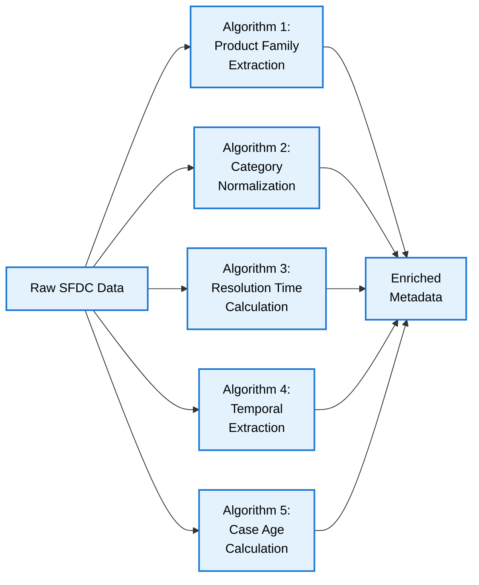

# Metadata Creation Algorithms

## Overview
This document details the specific algorithms needed to create the metadata filters from raw SFDC data. Each algorithm is presented with pseudocode and implementation notes.

---

## Algorithm Summary



---

## Algorithm 1: Product Family Extraction

### Purpose
Extract standardized product family from free-text product field using pattern matching.

### Input
- **Field**: `Product__c` (string)
- **Example**: "HPE ProLiant DL380 Gen10"

### Output
- **Field**: `productFamily` (string)
- **Example**: "ProLiant"

### Algorithm: Pattern-Based Classification

```
FUNCTION extract_product_family(product_string):
    // Define product family patterns (regex)
    patterns = [
        ("ProLiant.*", "ProLiant"),
        ("Synergy.*", "Synergy"),
        ("Apollo.*", "Apollo"),
        ("Aruba.*Switch.*", "Aruba Switches"),
        ("Aruba.*AP.*", "Aruba Access Points"),
        ("Aruba.*Access.*Point.*", "Aruba Access Points"),
        ("3PAR.*", "3PAR Storage"),
        ("Nimble.*", "Nimble Storage"),
        ("SimpliVity.*", "SimpliVity"),
        ("Primera.*", "Primera Storage"),
        ("Alletra.*", "Alletra Storage"),
        ("MSA.*", "MSA Storage"),
        ("StoreOnce.*", "StoreOnce"),
        ("Edgeline.*", "Edgeline"),
        ("Cloudline.*", "Cloudline")
    ]

    // Normalize input
    IF product_string IS NULL OR EMPTY:
        RETURN "Unknown"

    product_clean = TRIM(product_string)
    product_upper = TO_UPPERCASE(product_clean)

    // Try to match each pattern
    FOR EACH (pattern, family) IN patterns:
        IF REGEX_MATCH(product_upper, pattern, CASE_INSENSITIVE):
            RETURN family

    // No match found
    RETURN "Other"
END FUNCTION
```

### Implementation Notes

**Time Complexity**: O(n) where n = number of patterns (linear search)

**Space Complexity**: O(1) (fixed pattern list)

**Edge Cases**:
- NULL or empty product field → "Unknown"
- Multiple pattern matches → Return first match (pattern order matters)
- Mixed case input → Convert to uppercase for matching
- Special characters → Handled by regex wildcard

**Example Execution**:
```
Input: "HPE ProLiant DL380 Gen10"
Step 1: Clean and uppercase → "HPE PROLIANT DL380 GEN10"
Step 2: Match pattern "ProLiant.*" → TRUE
Step 3: Return "ProLiant"
```

**Test Cases**:
```
extract_product_family("HPE ProLiant DL380 Gen10") → "ProLiant"
extract_product_family("ProLiant DL360 Gen9") → "ProLiant"
extract_product_family("HPE Synergy 480 Gen10") → "Synergy"
extract_product_family("Aruba 2930F Switch") → "Aruba Switches"
extract_product_family("Aruba AP-505") → "Aruba Access Points"
extract_product_family("") → "Unknown"
extract_product_family(NULL) → "Unknown"
extract_product_family("Unknown Product XYZ") → "Other"
```

---

## Algorithm 2: Category Hierarchy Normalization

### Purpose
Convert abbreviated category strings into normalized hierarchical structure.

### Input
- **Field**: `Category__c` (string)
- **Example**: "HW - Server - Boot Issues"

### Output
- **Fields**:
  - `category` (string): "Hardware > Server > Boot Issues"
  - `categoryLevel1` (string): "Hardware"
  - `categoryLevel2` (string): "Server"
  - `categoryLevel3` (string): "Boot Issues"

### Algorithm: Split-Map-Construct

```
FUNCTION normalize_category(category_string):
    // Define abbreviation mappings
    level1_mapping = {
        "HW": "Hardware",
        "SW": "Software",
        "NW": "Networking",
        "FW": "Firmware",
        "OS": "Operating System",
        "APP": "Application",
        "SEC": "Security"
    }

    // Handle NULL or empty
    IF category_string IS NULL OR EMPTY:
        RETURN {
            "level1": "Uncategorized",
            "level2": NULL,
            "level3": NULL,
            "fullPath": "Uncategorized"
        }

    // Step 1: Split by delimiter
    parts = SPLIT(category_string, "-")

    // Step 2: Trim whitespace from each part
    FOR i = 0 TO LENGTH(parts) - 1:
        parts[i] = TRIM(parts[i])

    // Step 3: Map level 1 abbreviation
    level1_abbrev = TO_UPPERCASE(parts[0])
    IF level1_abbrev IN level1_mapping:
        level1 = level1_mapping[level1_abbrev]
    ELSE:
        level1 = parts[0]  // Use as-is if not in mapping

    // Step 4: Extract remaining levels
    level2 = parts[1] IF LENGTH(parts) > 1 ELSE NULL
    level3 = parts[2] IF LENGTH(parts) > 2 ELSE NULL

    // Step 5: Construct full path
    path_components = [level1]
    IF level2 IS NOT NULL:
        APPEND level2 TO path_components
    IF level3 IS NOT NULL:
        APPEND level3 TO path_components

    fullPath = JOIN(path_components, " > ")

    // Return structured object
    RETURN {
        "level1": level1,
        "level2": level2,
        "level3": level3,
        "fullPath": fullPath
    }
END FUNCTION
```

### Implementation Notes

**Time Complexity**: O(1) - fixed number of operations (max 3 levels)

**Space Complexity**: O(1) - fixed output structure

**Edge Cases**:
- NULL or empty category → Return "Uncategorized"
- Single level (no delimiter) → Only level1, others NULL
- Two levels → level1 and level2, level3 = NULL
- Unmapped abbreviation → Use original value
- Extra delimiters → Ignore levels beyond 3

**Example Execution**:
```
Input: "HW - Server - Boot Issues"
Step 1: Split by "-" → ["HW", " Server", " Boot Issues"]
Step 2: Trim whitespace → ["HW", "Server", "Boot Issues"]
Step 3: Map "HW" → "Hardware"
Step 4: Extract levels → level1="Hardware", level2="Server", level3="Boot Issues"
Step 5: Construct path → "Hardware > Server > Boot Issues"
Output: {
    level1: "Hardware",
    level2: "Server",
    level3: "Boot Issues",
    fullPath: "Hardware > Server > Boot Issues"
}
```

**Test Cases**:
```
normalize_category("HW - Server - Boot Issues") →
    {level1: "Hardware", level2: "Server", level3: "Boot Issues",
     fullPath: "Hardware > Server > Boot Issues"}

normalize_category("SW - OS - Configuration") →
    {level1: "Software", level2: "OS", level3: "Configuration",
     fullPath: "Software > OS > Configuration"}

normalize_category("NW - Switch") →
    {level1: "Networking", level2: "Switch", level3: NULL,
     fullPath: "Networking > Switch"}

normalize_category("FW") →
    {level1: "Firmware", level2: NULL, level3: NULL,
     fullPath: "Firmware"}

normalize_category("") →
    {level1: "Uncategorized", level2: NULL, level3: NULL,
     fullPath: "Uncategorized"}

normalize_category("XYZ - Unknown - Test") →
    {level1: "XYZ", level2: "Unknown", level3: "Test",
     fullPath: "XYZ > Unknown > Test"}
```

---

## Algorithm 3: Resolution Time Calculation and Bucketing

### Purpose
Calculate case resolution time in hours and categorize into buckets.

### Input
- **Field**: `CreatedDate` (datetime)
- **Field**: `ClosedDate` (datetime)
- **Example**: CreatedDate="2024-08-15T09:00:00Z", ClosedDate="2024-08-16T11:30:00Z"

### Output
- **Field**: `resolutionTimeHours` (float)
- **Field**: `resolutionTimeBucket` (string)
- **Example**: resolutionTimeHours=26.5, resolutionTimeBucket="1-7 days"

### Algorithm: Duration Calculation with Bucketing

```
FUNCTION calculate_resolution_time(created_date, closed_date):
    // Handle NULL or open cases
    IF created_date IS NULL:
        RETURN {
            "resolutionTimeHours": NULL,
            "resolutionTimeBucket": "Unknown"
        }

    IF closed_date IS NULL:
        RETURN {
            "resolutionTimeHours": NULL,
            "resolutionTimeBucket": "Open"
        }

    // Step 1: Calculate duration in seconds
    duration_seconds = closed_date - created_date  // Unix timestamp difference

    // Handle negative duration (data quality issue)
    IF duration_seconds < 0:
        RETURN {
            "resolutionTimeHours": NULL,
            "resolutionTimeBucket": "Invalid"
        }

    // Step 2: Convert to hours
    resolutionTimeHours = duration_seconds / 3600.0

    // Step 3: Determine bucket
    IF resolutionTimeHours < 4:
        bucket = "0-4 hours"
    ELSE IF resolutionTimeHours < 24:
        bucket = "4-24 hours"
    ELSE IF resolutionTimeHours < 168:  // 7 days = 168 hours
        bucket = "1-7 days"
    ELSE:
        bucket = ">7 days"

    // Return result
    RETURN {
        "resolutionTimeHours": ROUND(resolutionTimeHours, 2),
        "resolutionTimeBucket": bucket
    }
END FUNCTION
```

### Implementation Notes

**Time Complexity**: O(1) - constant time operations

**Space Complexity**: O(1) - fixed output

**Edge Cases**:
- NULL CreatedDate → Return NULL hours, "Unknown" bucket
- NULL ClosedDate (open case) → Return NULL hours, "Open" bucket
- ClosedDate < CreatedDate → Return NULL hours, "Invalid" bucket
- Zero duration → "0-4 hours" bucket
- Exactly 4 hours → "4-24 hours" bucket (boundary)
- Exactly 24 hours → "1-7 days" bucket (boundary)

**Bucket Boundaries**:
```
[0, 4)        → "0-4 hours"
[4, 24)       → "4-24 hours"
[24, 168)     → "1-7 days"
[168, ∞)      → ">7 days"
```

**Example Execution**:
```
Input:
  CreatedDate = "2024-08-15T09:00:00Z"  (Unix: 1723712400)
  ClosedDate = "2024-08-16T11:30:00Z"   (Unix: 1723807800)

Step 1: Calculate duration
  duration_seconds = 1723807800 - 1723712400 = 95400 seconds

Step 2: Convert to hours
  resolutionTimeHours = 95400 / 3600 = 26.5 hours

Step 3: Determine bucket
  26.5 >= 24 AND < 168 → bucket = "1-7 days"

Output: {
  resolutionTimeHours: 26.5,
  resolutionTimeBucket: "1-7 days"
}
```

**Test Cases**:
```
calculate_resolution_time("2024-08-15 09:00", "2024-08-15 12:00") →
    {hours: 3.0, bucket: "0-4 hours"}

calculate_resolution_time("2024-08-15 09:00", "2024-08-15 18:00") →
    {hours: 9.0, bucket: "4-24 hours"}

calculate_resolution_time("2024-08-15 09:00", "2024-08-16 11:30") →
    {hours: 26.5, bucket: "1-7 days"}

calculate_resolution_time("2024-08-15 09:00", "2024-08-30 15:00") →
    {hours: 366.0, bucket: ">7 days"}

calculate_resolution_time("2024-08-15 09:00", NULL) →
    {hours: NULL, bucket: "Open"}

calculate_resolution_time(NULL, "2024-08-16 11:30") →
    {hours: NULL, bucket: "Unknown"}

calculate_resolution_time("2024-08-16 09:00", "2024-08-15 09:00") →
    {hours: NULL, bucket: "Invalid"}
```

---

## Algorithm 4: Temporal Metadata Extraction (Quarter & Year)

### Purpose
Extract quarter and year from case creation date for temporal filtering.

### Input
- **Field**: `CreatedDate` (datetime)
- **Example**: "2024-08-15T09:00:00Z"

### Output
- **Field**: `quarter` (string)
- **Field**: `year` (integer)
- **Example**: quarter="Q3 2024", year=2024

### Algorithm: Date Component Extraction

```
FUNCTION extract_temporal_metadata(created_date):
    // Handle NULL
    IF created_date IS NULL:
        RETURN {
            "quarter": "Unknown",
            "year": NULL
        }

    // Step 1: Extract year
    year = EXTRACT_YEAR(created_date)

    // Step 2: Extract month (1-12)
    month = EXTRACT_MONTH(created_date)

    // Step 3: Calculate quarter
    // Quarter formula: Q = floor((month - 1) / 3) + 1
    quarter_number = FLOOR((month - 1) / 3) + 1

    // Step 4: Format quarter string
    quarter_string = "Q" + STRING(quarter_number) + " " + STRING(year)

    // Return result
    RETURN {
        "quarter": quarter_string,
        "year": year,
        "quarterNumber": quarter_number,
        "month": month
    }
END FUNCTION
```

### Implementation Notes

**Time Complexity**: O(1) - constant time operations

**Space Complexity**: O(1) - fixed output

**Quarter Mapping**:
```
Month 1, 2, 3    (Jan, Feb, Mar) → Q1
Month 4, 5, 6    (Apr, May, Jun) → Q2
Month 7, 8, 9    (Jul, Aug, Sep) → Q3
Month 10, 11, 12 (Oct, Nov, Dec) → Q4
```

**Formula Verification**:
```
Month = 1:  Quarter = floor((1-1)/3) + 1 = floor(0) + 1 = 1 (Q1) ✓
Month = 3:  Quarter = floor((3-1)/3) + 1 = floor(0.67) + 1 = 1 (Q1) ✓
Month = 4:  Quarter = floor((4-1)/3) + 1 = floor(1) + 1 = 2 (Q2) ✓
Month = 6:  Quarter = floor((6-1)/3) + 1 = floor(1.67) + 1 = 2 (Q2) ✓
Month = 7:  Quarter = floor((7-1)/3) + 1 = floor(2) + 1 = 3 (Q3) ✓
Month = 9:  Quarter = floor((9-1)/3) + 1 = floor(2.67) + 1 = 3 (Q3) ✓
Month = 10: Quarter = floor((10-1)/3) + 1 = floor(3) + 1 = 4 (Q4) ✓
Month = 12: Quarter = floor((12-1)/3) + 1 = floor(3.67) + 1 = 4 (Q4) ✓
```

**Example Execution**:
```
Input: CreatedDate = "2024-08-15T09:00:00Z"

Step 1: Extract year → 2024
Step 2: Extract month → 8 (August)
Step 3: Calculate quarter → floor((8-1)/3) + 1 = floor(2.33) + 1 = 3
Step 4: Format string → "Q3 2024"

Output: {
  quarter: "Q3 2024",
  year: 2024,
  quarterNumber: 3,
  month: 8
}
```

**Test Cases**:
```
extract_temporal_metadata("2024-01-15 09:00") → {quarter: "Q1 2024", year: 2024}
extract_temporal_metadata("2024-02-28 09:00") → {quarter: "Q1 2024", year: 2024}
extract_temporal_metadata("2024-03-31 09:00") → {quarter: "Q1 2024", year: 2024}
extract_temporal_metadata("2024-04-01 09:00") → {quarter: "Q2 2024", year: 2024}
extract_temporal_metadata("2024-06-30 09:00") → {quarter: "Q2 2024", year: 2024}
extract_temporal_metadata("2024-07-01 09:00") → {quarter: "Q3 2024", year: 2024}
extract_temporal_metadata("2024-08-15 09:00") → {quarter: "Q3 2024", year: 2024}
extract_temporal_metadata("2024-09-30 09:00") → {quarter: "Q3 2024", year: 2024}
extract_temporal_metadata("2024-10-01 09:00") → {quarter: "Q4 2024", year: 2024}
extract_temporal_metadata("2024-12-31 23:59") → {quarter: "Q4 2024", year: 2024}
extract_temporal_metadata(NULL) → {quarter: "Unknown", year: NULL}
```

---

## Algorithm 5: Case Age Calculation

### Purpose
Calculate the age of a case in days from creation date to current date.

### Input
- **Field**: `CreatedDate` (datetime)
- **Current Date**: `NOW()` (datetime)
- **Example**: CreatedDate="2024-08-15T09:00:00Z", Current="2024-11-04T12:00:00Z"

### Output
- **Field**: `ageInDays` (integer)
- **Example**: 81

### Algorithm: Date Difference

```
FUNCTION calculate_case_age(created_date, current_date):
    // Handle NULL
    IF created_date IS NULL:
        RETURN NULL

    IF current_date IS NULL:
        current_date = NOW()  // Use current system time

    // Step 1: Calculate difference in seconds
    difference_seconds = current_date - created_date

    // Handle invalid (future) creation date
    IF difference_seconds < 0:
        RETURN NULL  // Invalid: case created in the future

    // Step 2: Convert to days
    ageInDays = FLOOR(difference_seconds / 86400)  // 86400 seconds per day

    // Return result
    RETURN ageInDays
END FUNCTION
```

### Implementation Notes

**Time Complexity**: O(1) - constant time operations

**Space Complexity**: O(1) - single integer output

**Edge Cases**:
- NULL CreatedDate → Return NULL
- CreatedDate in the future → Return NULL (invalid)
- Same day creation → Return 0
- Partial days → Floor to integer days

**Example Execution**:
```
Input:
  CreatedDate = "2024-08-15T09:00:00Z"  (Unix: 1723712400)
  Current = "2024-11-04T12:00:00Z"      (Unix: 1730721600)

Step 1: Calculate difference
  difference_seconds = 1730721600 - 1723712400 = 7009200 seconds

Step 2: Convert to days
  ageInDays = floor(7009200 / 86400) = floor(81.13) = 81

Output: 81
```

**Test Cases**:
```
calculate_case_age("2024-08-15 09:00", "2024-11-04 12:00") → 81
calculate_case_age("2024-11-04 09:00", "2024-11-04 12:00") → 0
calculate_case_age("2024-11-03 09:00", "2024-11-04 12:00") → 1
calculate_case_age("2024-11-05 09:00", "2024-11-04 12:00") → NULL (future)
calculate_case_age(NULL, "2024-11-04 12:00") → NULL
```

---

## Complete Metadata Enrichment Pipeline

### Master Algorithm: Orchestration

```
FUNCTION enrich_case_metadata(case_record):
    // Initialize result object
    enriched = {}

    // Copy direct fields (no processing)
    enriched.caseNumber = case_record.CaseNumber
    enriched.caseId = case_record.Id
    enriched.product = case_record.Product__c
    enriched.status = case_record.Status
    enriched.priority = case_record.Priority
    enriched.errorCodes = case_record.Error_Codes__c
    enriched.issueType = case_record.Issue_Type__c
    enriched.resolutionCode = case_record.Resolution_Code__c
    enriched.rootCause = case_record.Root_Cause__c
    enriched.createdDate = case_record.CreatedDate
    enriched.closedDate = case_record.ClosedDate

    // Algorithm 1: Product Family Extraction
    enriched.productFamily = extract_product_family(case_record.Product__c)

    // Algorithm 2: Category Normalization
    category_result = normalize_category(case_record.Category__c)
    enriched.category = category_result.fullPath
    enriched.categoryLevel1 = category_result.level1
    enriched.categoryLevel2 = category_result.level2
    enriched.categoryLevel3 = category_result.level3

    // Algorithm 3: Resolution Time Calculation
    resolution_result = calculate_resolution_time(
        case_record.CreatedDate,
        case_record.ClosedDate
    )
    enriched.resolutionTimeHours = resolution_result.resolutionTimeHours
    enriched.resolutionTimeBucket = resolution_result.resolutionTimeBucket

    // Algorithm 4: Temporal Extraction
    temporal_result = extract_temporal_metadata(case_record.CreatedDate)
    enriched.quarter = temporal_result.quarter
    enriched.year = temporal_result.year
    enriched.month = temporal_result.month

    // Algorithm 5: Case Age
    enriched.ageInDays = calculate_case_age(case_record.CreatedDate, NOW())

    // Add system metadata
    enriched.embeddingModel = "text-embedding-3-large"
    enriched.embeddingVersion = "v1.0"
    enriched.processedTimestamp = NOW()

    RETURN enriched
END FUNCTION
```

---

## Implementation Considerations

### Performance Optimization

1. **Batch Processing**: Process multiple cases in parallel
   - Use Apache Spark for distributed processing
   - Partition by date ranges for parallel execution

2. **Caching**: Cache pattern matching results
   - Product family patterns don't change frequently
   - Category mappings are static

3. **Indexing**: Ensure Weaviate indexes are configured
   - indexInverted: True for all filter fields
   - Improves query performance by 10-100x

### Data Quality Checks

```
FUNCTION validate_enriched_metadata(enriched):
    warnings = []

    // Check for missing critical fields
    IF enriched.productFamily == "Unknown":
        APPEND "Product family could not be determined" TO warnings

    IF enriched.category == "Uncategorized":
        APPEND "Category is uncategorized" TO warnings

    // Check for invalid dates
    IF enriched.ageInDays IS NULL:
        APPEND "Invalid creation date" TO warnings

    IF enriched.resolutionTimeBucket == "Invalid":
        APPEND "Invalid date range: ClosedDate before CreatedDate" TO warnings

    // Return validation result
    RETURN {
        "isValid": LENGTH(warnings) == 0,
        "warnings": warnings
    }
END FUNCTION
```

---

## Summary Table

| Algorithm | Input Fields | Output Fields | Complexity | Edge Cases |
|-----------|-------------|---------------|------------|------------|
| **Product Family Extraction** | Product__c | productFamily | O(1) | NULL, unmapped products |
| **Category Normalization** | Category__c | category, level1, level2, level3 | O(1) | NULL, missing levels |
| **Resolution Time** | CreatedDate, ClosedDate | resolutionTimeHours, resolutionTimeBucket | O(1) | NULL dates, invalid range |
| **Temporal Extraction** | CreatedDate | quarter, year, month | O(1) | NULL date |
| **Case Age** | CreatedDate, NOW() | ageInDays | O(1) | NULL, future dates |

---

## Conclusion

All five algorithms are:
- **Simple**: O(1) time complexity
- **Deterministic**: Same input always produces same output
- **Robust**: Handle NULL and invalid inputs gracefully
- **Stateless**: No dependencies between cases
- **Parallelizable**: Can process millions of cases independently

These algorithms are executed once during data load and the enriched metadata is stored in Weaviate for fast filtering during search.
